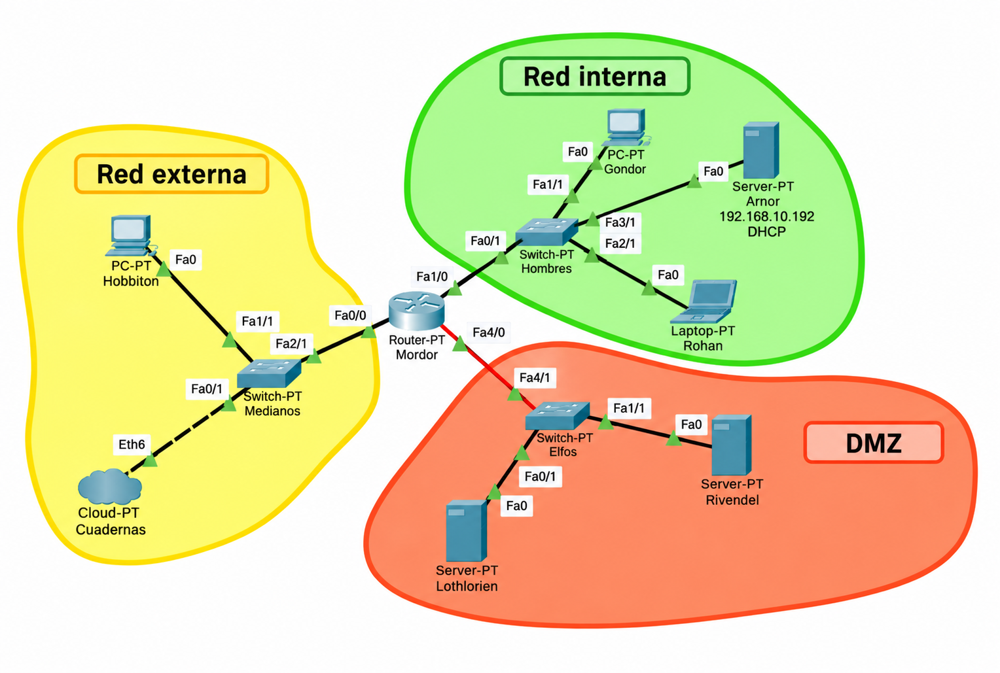

# Anexo XIX · Arquitectura de laboratorio v6.5.7

## 1. Principio de continuidad

Las UT1–UT8 comparten una única infraestructura didáctica. Se añaden servicios; no se reinventa la red en cada unidad.



## 2. Tres zonas

| Zona | Red | Significado |
|---|---|---|
| 🟨 Red externa | `10.0.0.0/16` | red exterior / salida |
| 🟩 Red interna | `192.168.10.0/24` | clientes y administración |
| 🟧 DMZ | `192.168.20.0/24` | servidores |

## 3. Packet Tracer

| Equipo | Dirección | Función |
|---|---|---|
| Mordor Fa0/0 | `10.0.2.15/16` | gateway externa |
| Mordor Fa1/0 | `192.168.10.254/24` | gateway interna + DHCP CLI en UT2 |
| Mordor Fa4/0 | `192.168.20.254/24` | gateway DMZ |
| Hobbiton | `10.0.32.64/16` | cliente externo |
| Gondor | `192.168.10.64/24` | cliente / reserva DHCP |
| Rohan | `192.168.10.65/24` | cliente / reserva DHCP |
| Arnor | `192.168.10.192/24` | DHCP gráfico en UT2 |
| Lothlorien | `192.168.20.192/24` | DNS y servicios de la DMZ |
| Rivendel | `192.168.20.193/24` | servicios auxiliares |

## 4. VirtualBox

Las VMs son exactamente cinco:

```text
Mordor       → gateway + DHCP
Gondor       → cliente interno
Rohan        → cliente interno
Lothlorien   → servidor principal de servicios
Rivendel     → auxiliar / secundario / pruebas
```

En VirtualBox **no se configura Arnor**. El DHCP real del laboratorio se concentra en Mordor.

## 5. WSL

WSL se utiliza como cliente Linux, estación de diagnóstico, generador de tráfico y automatización. No se despliega en él un servidor DHCP.

## 6. Secuencia de servicios

```text
UT1  → red, routing, NAT, nftables
 ↓
UT2  → DHCP
 ↓
UT3  → DNS
 ↓
UT4  → transferencia de ficheros
 ↓
UT5  → web
 ↓
UT6  → correo
 ↓
UT7  → mensajería / listas / noticias
 ↓
UT8  → audio / vídeo / streaming
```

## 7. Regla de oro para cualquier servicio

1. **Ecosistema:** identifica zona, host, IP, gateway, DNS y dependencias.
2. **Ubicación:** indica el fichero real de configuración.
3. **Estructura:** explica si es YAML, JSON, Lua, XML, texto de directivas u otro formato.
4. **Ejemplo:** muestra una configuración mínima válida.
5. **Caso Tierra Media:** rellena la configuración con el servidor y dominio del laboratorio.
6. **Persistencia:** guarda cambios y habilita el servicio cuando corresponda.
7. **Prueba:** ejecuta batería funcional desde cliente y servidor.
8. **Sintaxis:** valida antes de recargar/reiniciar.
9. **Chuleta/glosario:** incorpora comandos nuevos al material de consulta.
10. **Webmin:** explica el módulo equivalente cuando exista; si no existe, declara explícitamente la ausencia y mantiene CLI como fuente de verdad.

## 8. Webmin: criterio común

Webmin es una capa de administración, no una abstracción que sustituya a los ficheros. Después de cualquier cambio desde Webmin, se debe volver a la CLI para:

```text
localizar → validar → recargar → comprobar → documentar
```

## 9. Evidencia común

Toda práctica de servicio debe poder entregar:

```text
[ ] topología / arquitectura
[ ] IP y rutas
[ ] fichero de configuración
[ ] validación de sintaxis
[ ] estado systemd
[ ] puertos en escucha
[ ] prueba desde cliente
[ ] logs o captura cuando sea relevante
[ ] persistencia tras reinicio
[ ] explicación del diagnóstico
```


## 10. Matriz UT × entorno

| UT | Packet Tracer | WSL | VirtualBox | Servidor principal |
|---|---|---|---|---|
| UT1 | routing/NAT | diagnóstico | red/router Linux + nftables | Mordor |
| UT2 | Arnor GUI → Mordor CLI | cliente/captura DHCP | Kea DHCP | Mordor |
| UT3 | DNS Server-PT | `dig`/captura | BIND9 | Lothlorien |
| UT4 | FTP/TFTP conceptual | FTP/SFTP/SCP cliente | OpenSSH/vsftpd | Lothlorien |
| UT5 | HTTP + topología | `curl`/TLS | Apache/Nginx | Lothlorien |
| UT6 | Email Server-PT | SMTP/IMAP/POP3 análisis | Postfix/Dovecot | Lothlorien |
| UT7 | conectividad/puertos | clientes y captura | Prosody/listas/NNTP | Lothlorien |
| UT8 | red/puertos | FFmpeg/VLC/captura | Icecast/Nginx RTMP/HLS | Lothlorien |

> La columna Packet Tracer indica el **alcance realista del simulador**. Cuando PT no implementa el daemon estudiado, se usa para demostrar la infraestructura de red y el modelo cliente/servidor, mientras que la implementación real se ejecuta en VirtualBox.
