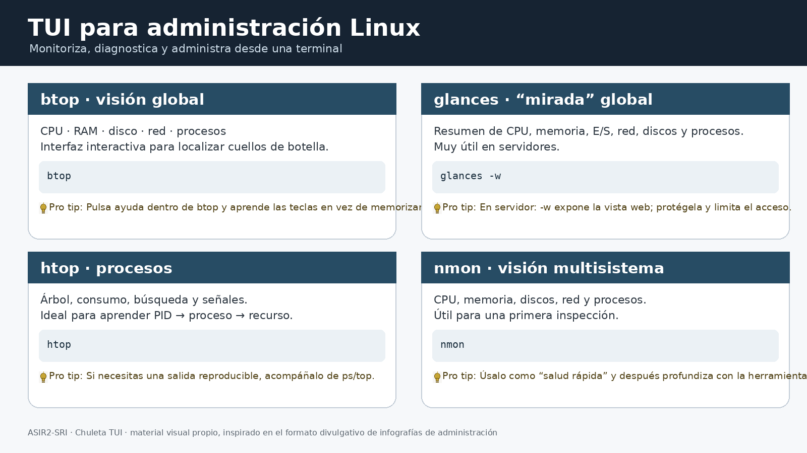
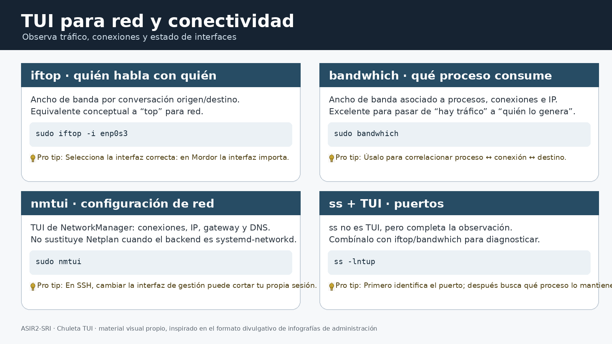
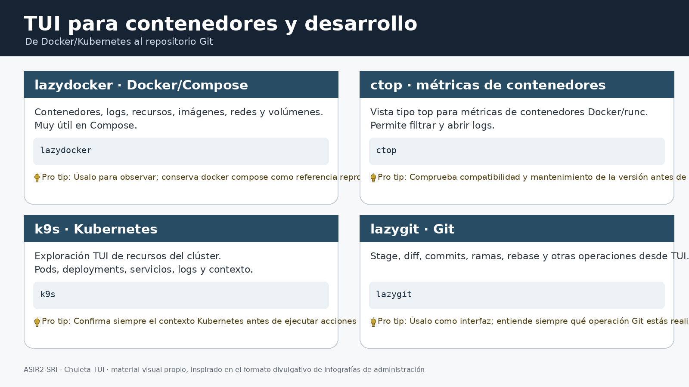
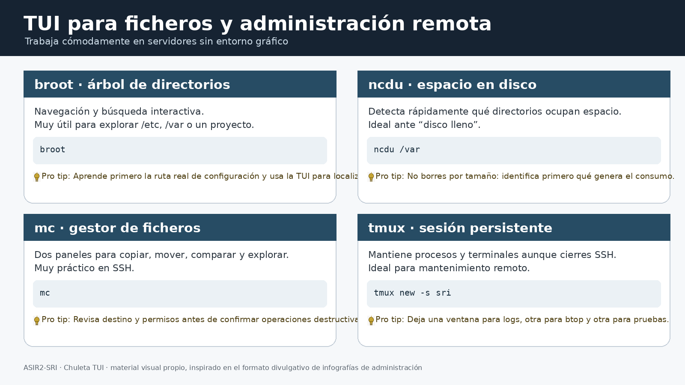

# Anexo XXI · Chuleta de utilidades TUI para administración de sistemas

## 1. Qué es una TUI y cuándo merece la pena

Una **TUI (Terminal User Interface)** es una interfaz interactiva que funciona dentro de una terminal: paneles, tablas, árboles, menús, filtros y atajos de teclado sin necesidad de un escritorio gráfico.

En administración de sistemas es especialmente útil cuando trabajamos:

- sobre un **servidor Ubuntu sin entorno gráfico**;
- mediante **SSH**;
- en una VM del laboratorio Tierra Media;
- cuando necesitamos observar muchos datos simultáneamente;
- cuando una herramienta CLI tradicional resulta demasiado poco visual.

> **Importante:** una TUI no sustituye al comando subyacente. Es una **capa interactiva para observar o administrar**. Hay que conocer también la CLI para automatizar, documentar y reproducir operaciones.

### TUI frente a CLI

```text
                 MISMO SISTEMA
                       │
          ┌────────────┴────────────┐
          ▼                         ▼
         CLI                       TUI
  reproducible/automatizable    interactiva/visual
          │                         │
          └────────────┬────────────┘
                       ▼
                  ADMINISTRACIÓN
```

### Regla de esta chuleta

Solo se incluyen como **TUI** herramientas que realmente presentan una interfaz interactiva en terminal. `systemctl`, `journalctl`, `ip`, `ss`, `docker` o `kubectl` **no son TUI** y se estudian en la [chuleta de comandos de red de Ubuntu](ANEXO-XVIII-Chuleta-Comandos-Red-Ubuntu.md) o en las UT correspondientes.

---

# 2. Mapa rápido por funcionalidad

| Área | Herramientas recomendadas | Para qué sirven |
|---|---|---|
| 🧠 Sistema y procesos | `btop`, `htop`, `glances`, `nmon`, `pstree` | CPU, RAM, procesos, carga y E/S |
| 🌐 Red | `iftop`, `bandwhich`, `nmtui` | Tráfico, conexiones y configuración |
| 📦 Contenedores | `lazydocker`, `ctop`, `k9s` | Docker/Compose y Kubernetes |
| 📁 Ficheros y disco | `broot`, `mc`, `ncdu` | Árboles, navegación y espacio |
| 🧾 Logs | `lnav` | Exploración interactiva de registros |
| 🌿 Git | `lazygit` | Git desde una TUI |
| 🔌 Sesiones remotas | `tmux`, `byobu` | Mantener sesiones SSH y varias vistas |

### ¿Qué abrir primero?

```text
Servidor lento          → btop / glances
Proceso sospechoso      → htop / pstree
Red saturada             → iftop / bandwhich
Disco lleno              → ncdu
Árbol de configuración   → broot
Logs                     → lnav
Docker                   → lazydocker / ctop
Kubernetes               → k9s
Git                      → lazygit
SSH largo/mantenimiento  → tmux / byobu
```

---

# 3. 🧠 Sistema y procesos

## 3.1. `btop` · la primera TUI que conviene aprender

`btop` proporciona una visión interactiva de CPU, memoria, swap, discos, red y procesos. Es una excelente herramienta para pasar de **«el servidor va lento»** a una primera hipótesis observable. TecMint lo presenta precisamente como un monitor moderno de recursos con procesos, CPU, memoria, disco y red.

Instalación en Ubuntu:

```bash
sudo apt update
sudo apt install btop
```

Uso:

```bash
btop
```

### Ejemplo Tierra Media

En Lothlorien:

```bash
ssh usuario@192.168.20.192
btop
```

Mientras se ejecuta una prueba DNS, HTTP o de otro servicio, observa si cambia CPU, memoria, disco o red.

> **💡 Pro tip:** no empieces matando procesos. Primero observa durante unos segundos, identifica el proceso y después contrasta con `ps`, `systemctl`, `ss` o los logs.



---

## 3.2. `htop` · procesos de forma pedagógica

```bash
sudo apt install htop
htop
```

Es especialmente apropiado para aprender la relación:

```text
PID → proceso → usuario → CPU/RAM → comando
```

Equivalentes CLI:

```bash
ps aux --sort=-%cpu | head
ps aux --sort=-%mem | head
pgrep -a NOMBRE
kill PID
```

> **💡 Pro tip:** `htop` es excelente para explorar; `ps` es mejor cuando quieres guardar el resultado de una práctica o incluirlo en un script.

---

## 3.3. `glances` · una «mirada» global

`glances` reúne en una pantalla información de CPU, carga, memoria, red, discos, E/S y procesos. Es una buena herramienta para una **primera inspección transversal**.

```bash
sudo apt install glances
glances
```

### ⭐ Pro tip para servidores: `-w`

Glances puede ejecutarse en modo servidor web:

```bash
glances -w
```

La documentación actual de Glances muestra el acceso mediante navegador en `http://IP_DEL_SERVIDOR:61208`.

Ejemplo:

```text
┌────────────── servidor Lothlorien ──────────────┐
│ glances -w                                      │
└──────────────────────┬───────────────────────────┘
                       │ HTTP
                       ▼
              navegador del técnico
```

**Seguridad:** no expongas indiscriminadamente la interfaz a Internet. Usa red de administración, firewall y, cuando proceda, autenticación. Glances permite configurar usuario y contraseña.

> **💡 Pro tip:** `glances -w` es especialmente interesante para una VM servidor porque permite observarla desde otro equipo sin instalar una interfaz gráfica en el servidor.

---

## 3.4. `nmon` · salud general

```bash
sudo apt install nmon
nmon
```

Permite observar CPU, memoria, discos, red y procesos en una interfaz compacta.

> **💡 Pro tip:** úsalo como «panel de salud»; si detectas un problema, cambia a una herramienta especializada (`btop`, `iftop`, `ncdu`, etc.).

---

## 3.5. `pstree` · quién ha lanzado a quién

`pstree` es una herramienta CLI con presentación en árbol, no una TUI completa, pero es demasiado útil para dejarla fuera de esta chuleta.

```bash
pstree -ap
```

Ejemplo conceptual:

```text
systemd
├─ sshd
│  └─ sshd
│     └─ bash
│        └─ btop
├─ docker
│  ├─ containerd
│  └─ dockerd
└─ named
```

> **💡 Pro tip:** cuando un servicio parece «desaparecer», identifica primero su proceso padre y su cadena de procesos antes de concluir que el servicio está roto.

---

# 4. 🌐 Red

## 4.1. `iftop` · «¿quién está hablando con quién?»

`iftop` muestra en tiempo real las conversaciones y el ancho de banda que atraviesa una interfaz. Es conceptualmente el equivalente de `top` para el tráfico de red. Está disponible como paquete de Ubuntu.

```bash
sudo apt install iftop
sudo iftop -i enp0s3
```

En Mordor, selecciona conscientemente la interfaz que quieres estudiar:

```bash
ip -br addr
```

y después:

```bash
sudo iftop -i INTERFAZ
```

> **💡 Pro tip:** no uses `iftop` «a ciegas». Primero identifica la interfaz con `ip -br addr`; en un router con varias redes, elegir la interfaz correcta es parte del diagnóstico.

---

## 4.2. `bandwhich` · «¿qué proceso está consumiendo la red?»

`bandwhich` relaciona utilización de red con **proceso, conexión e IP/host remoto**. El proyecto oficial advierte actualmente que se encuentra en mantenimiento pasivo, por lo que conviene comprobar su estado y versión antes de incorporarlo a un entorno productivo.

```bash
sudo bandwhich
```

O una interfaz concreta:

```bash
sudo bandwhich -i enp0s3
```

El proyecto requiere privilegios para capturar tráfico; ofrece como alternativas `sudo` o capacidades Linux específicas.

> **💡 Pro tip:** `iftop` responde mejor a «¿qué conversaciones generan tráfico?»; `bandwhich` a «¿qué proceso lo está generando?».



---

## 4.3. `nmtui` · configuración de NetworkManager

`nmtui` sí es una TUI:

```bash
sudo nmtui
```

Permite trabajar con conexiones, IP, gateway y DNS **cuando NetworkManager es el gestor de red**.

En nuestro laboratorio hay que recordar:

```text
Netplan
   ↓
backend de red
   ↓
interfaces + rutas + DNS
```

Por tanto, `nmtui` **no sustituye Netplan** cuando el backend es `systemd-networkd`.

> **⚠️ Pro tip:** en una sesión SSH, modificar la interfaz por la que estás conectado puede cortar tu propia sesión. En una VM local el riesgo es mucho menor.

---

# 5. 📦 Contenedores

## 5.1. `lazydocker` · Docker y Compose

`lazydocker` es una TUI para Docker y Docker Compose. Permite observar contenedores, logs, recursos y el despliegue desde una interfaz única. El proyecto se describe explícitamente como una TUI para Docker y Docker Compose.

```bash
lazydocker
```

En un proyecto Compose:

```bash
cd proyecto/
lazydocker
```

Equivalentes CLI:

```bash
docker compose ps
docker compose logs -f
docker stats
docker inspect CONTENEDOR
```

> **💡 Pro tip:** utiliza `lazydocker` para **observar y explorar** y conserva `docker compose` como referencia declarativa y reproducible.

---

## 5.2. `ctop` · contenedores como un `top`

El proyecto original de `ctop` proporciona una vista compacta de métricas en tiempo real para múltiples contenedores, con soporte para Docker y runC.

```bash
ctop
```

También permite una vista individual y acciones como filtrado, ordenación y consulta de logs.

> **⚠️ Pro tip:** comprueba siempre la procedencia y mantenimiento de la versión que instales. En una chuleta docente interesa conocer la herramienta; en producción interesa además conocer su ciclo de mantenimiento y el origen del paquete.

---

## 5.3. `k9s` · Kubernetes

`k9s` es la TUI específica para explorar y administrar recursos de Kubernetes: pods, deployments, servicios, logs y otros recursos del clúster.

```bash
k9s
```

No debe confundirse con Docker:

```text
Docker / Compose → lazydocker / ctop
Kubernetes       → k9s
```

> **⚠️ Pro tip:** antes de ejecutar acciones en `k9s`, comprueba el **contexto Kubernetes** activo. Una TUI hace que una operación peligrosa sea cómoda; no la hace menos peligrosa.



---

# 6. 📁 Ficheros, árboles y almacenamiento

## 6.1. `broot` · explorar árboles

```bash
broot
```

Es especialmente útil para localizar rápidamente estructuras como:

```text
/etc
├── bind
├── nginx
├── ssh
├── systemd
└── netplan
```

> **💡 Pro tip:** primero aprende la ruta real de configuración; después utiliza `broot` para localizarla rápidamente. La TUI ayuda a explorar, pero no sustituye conocer la arquitectura del sistema.

## 6.2. `mc` · Midnight Commander

```bash
mc
```

Dos paneles para navegar, copiar, mover y comparar ficheros.

> **⚠️ Pro tip:** su comodidad aumenta también el riesgo de equivocarse. Revisa destino, usuario, grupo y permisos antes de confirmar una operación destructiva.

## 6.3. `ncdu` · ¿qué está llenando el disco?

```bash
ncdu /
```

En un servidor suele ser más eficiente empezar por:

```bash
ncdu /var
ncdu /home
```

Equivalentes CLI:

```bash
df -h
sudo du -xh /var | sort -h | tail
```

> **💡 Pro tip:** «ocupa mucho» no significa «se puede borrar». Identifica qué genera el consumo antes de eliminar nada.



---

# 7. 🧾 Logs: `lnav`

`lnav` proporciona una interfaz interactiva para explorar registros.

```bash
lnav /var/log/
```

Resulta especialmente útil cuando se dispone de ficheros de log convencionales.

Para servicios gestionados por `systemd`, la herramienta de referencia sigue siendo `journalctl`, que **no es una TUI** y está documentada en el [Anexo XVIII · Chuleta de comandos de red de Ubuntu](ANEXO-XVIII-Chuleta-Comandos-Red-Ubuntu.md).

```text
servicio → systemctl
logs de systemd → journalctl
logs de ficheros → lnav
```

---

# 8. 🌿 Git: `lazygit`

`lazygit` es una TUI para operaciones Git: cambios, staging, commits, ramas, historial, diffs y otras operaciones. El proyecto oficial lo define como una interfaz de terminal para Git.

```bash
cd repositorio/
lazygit
```

Equivalentes conceptuales:

```text
lazygit
  ├─ cambios       → git status / git diff
  ├─ staging       → git add
  ├─ commit        → git commit
  ├─ ramas         → git branch / git switch
  └─ historial     → git log
```

> **💡 Pro tip:** aprende primero la operación Git y utiliza `lazygit` como acelerador. Una interfaz visual no debe ocultar el modelo de objetos de Git.

---

# 9. 🔌 Administración remota: `tmux` y `byobu`

## 9.1. `tmux`

En una conexión SSH, cerrar el terminal puede terminar la sesión interactiva. `tmux` permite mantenerla en el servidor:

```bash
tmux new -s sri
```

Dentro podemos abrir, por ejemplo:

```text
ventana 0 → btop
ventana 1 → logs
ventana 2 → pruebas de red
```

Desconectar sin destruir la sesión:

```text
Ctrl+b  d
```

Volver:

```bash
tmux attach -t sri
```

Listar sesiones:

```bash
tmux ls
```

### Esquema

```text
PC técnico
    │
    │ SSH
    ▼
Servidor Ubuntu
    │
    └── tmux
         ├── btop
         ├── journalctl
         └── pruebas
```

> **💡 Pro tip:** para mantenimiento remoto largo, crea una sesión `tmux` antes de iniciar tareas que no quieras perder por una desconexión SSH.

## 9.2. `byobu`

`byobu` proporciona una experiencia más amigable sobre multiplexores como `tmux` o `screen`:

```bash
byobu
```

Es una buena puerta de entrada para alumnado que todavía no domina los atajos de `tmux`.

---

# 10. Diagnóstico guiado: elegir la TUI correcta

No se trata de abrir herramientas al azar. Selecciona la herramienta según la pregunta.

```text
┌─────────────────────────────────────────────┐
│ ¿QUÉ QUIERO SABER?                          │
├─────────────────────────────────────────────┤
│ CPU/RAM/procesos       → btop / htop       │
│ visión global          → glances / nmon    │
│ árbol de procesos      → pstree            │
│ tráfico entre hosts    → iftop             │
│ proceso que usa red   → bandwhich          │
│ configuración de red   → nmtui             │
│ contenedores Docker    → lazydocker / ctop │
│ Kubernetes             → k9s               │
│ espacio de disco       → ncdu              │
│ directorios            → broot / mc        │
│ logs de ficheros       → lnav              │
│ Git                    → lazygit           │
│ sesión SSH persistente → tmux / byobu     │
└─────────────────────────────────────────────┘
```

### Secuencia profesional

```text
1. OBSERVAR
      ↓
2. FORMULAR HIPÓTESIS
      ↓
3. AISLAR EL COMPONENTE
      ↓
4. CONTRASTAR CON CLI
      ↓
5. CAMBIAR UNA COSA
      ↓
6. VOLVER A MEDIR
      ↓
7. DOCUMENTAR
```

Esto conecta directamente con la metodología de diagnóstico de las UT: **observar → formular hipótesis → cambiar una cosa → probar → documentar**.

---

# 11. Aplicación al laboratorio Tierra Media

Las TUI no crean una arquitectura paralela. Se aplican sobre las mismas máquinas y redes.

```text
                  MORDOR
             3 interfaces / router
                    │
        ┌───────────┼───────────┐
        │           │           │
     GONDOR       ROHAN    LOTHLORIEN
     .64           .65        .192
        │                       │
        │                    RIVENDEL
        │                       .193
        └────── administración ┘
```

### Ejemplo 1 · Lothlorien está lento

```bash
ssh usuario@192.168.20.192
btop
```

Si aparece un proceso sospechoso:

```bash
pstree -ap
ps aux --sort=-%cpu | head
```

Después, consulta el servicio y los registros mediante las herramientas CLI del [Anexo XVIII](ANEXO-XVIII-Chuleta-Comandos-Red-Ubuntu.md).

### Ejemplo 2 · Mordor consume mucho ancho de banda

```bash
ssh usuario@10.0.2.15
sudo iftop -i INTERFAZ
```

Si necesitamos saber qué proceso genera el tráfico:

```bash
sudo bandwhich -i INTERFAZ
```

### Ejemplo 3 · servidor con disco lleno

```bash
ssh usuario@192.168.20.192
ncdu /var
```

### Ejemplo 4 · mantenimiento largo

```bash
ssh usuario@192.168.20.192
tmux new -s mantenimiento
```

Después, una ventana puede ejecutar `btop`, otra `journalctl` y otra las pruebas del servicio.

### Ejemplo 5 · Docker Compose

```bash
ssh usuario@SERVIDOR
cd proyecto/
lazydocker
```

### Ejemplo 6 · Kubernetes

```bash
ssh usuario@SERVIDOR-K8S
k9s
```

---

# 12. Instalación: criterio docente

No todas las herramientas tienen la misma disponibilidad en los repositorios de Ubuntu.

| Herramienta | Instalación habitual | Observación |
|---|---|---|
| `btop` | `sudo apt install btop` | Repositorios Ubuntu |
| `htop` | `sudo apt install htop` | Repositorios Ubuntu |
| `glances` | `sudo apt install glances` | Repositorios Ubuntu |
| `nmon` | `sudo apt install nmon` | Repositorios Ubuntu |
| `iftop` | `sudo apt install iftop` | `universe` en Ubuntu |
| `nmtui` | `sudo apt install network-manager` | Solo tiene sentido con NetworkManager |
| `ncdu` | `sudo apt install ncdu` | Repositorios Ubuntu |
| `mc` | `sudo apt install mc` | Repositorios Ubuntu |
| `lnav` | `sudo apt install lnav` | Comprobar disponibilidad en la versión usada |
| `lazydocker` | paquete/release del proyecto | Revisar fuente y versión |
| `ctop` | paquete/release del proyecto | Revisar mantenimiento/origen |
| `k9s` | release/paquete del proyecto | Herramienta para Kubernetes |
| `lazygit` | paquete/release del proyecto | Debian/Ubuntu dependen de versión |
| `bandwhich` | release/cargo/paquete según distribución | Requiere privilegios/capacidades para captura |
| `broot` | paquete/release según distribución | Comprobar disponibilidad |
| `tmux` | `sudo apt install tmux` | Muy recomendable en SSH |
| `byobu` | `sudo apt install byobu` | Interfaz sobre multiplexor |

> **Criterio de laboratorio:** primero se priorizan los paquetes oficiales de Ubuntu; si una herramienta se instala desde un release externo, se documentan **origen, versión, arquitectura y procedimiento de actualización**.

---

# 13. Pro tips de seguridad y administración

1. **Una TUI no elimina el riesgo.** Si puede matar procesos, reiniciar contenedores o modificar recursos, una mala pulsación puede tener consecuencias reales.
2. **En remoto, usa `tmux`.** Evita perder trabajos largos por una desconexión SSH.
3. **En Kubernetes, revisa el contexto.** Antes de actuar con `k9s`.
4. **En red, selecciona la interfaz.** `iftop -i` y `bandwhich -i` son mucho más útiles cuando sabes qué segmento estás observando.
5. **No confundas observación con diagnóstico.** Una TUI muestra síntomas; la CLI y los logs permiten demostrar la causa.
6. **No uses privilegios elevados por costumbre.** Usa `sudo` cuando la herramienta realmente lo necesita.
7. **Verifica el origen de herramientas externas.** Especialmente para binarios descargados fuera de los repositorios de Ubuntu.
8. **Aprende la CLI equivalente.** La TUI debe acelerar el trabajo, no crear dependencia de una interfaz concreta.

---

## Fuentes y referencias técnicas

- `btop`: documentación y proyecto; visión general de monitorización.
- `glances`: documentación oficial, modo TUI y modo web `-w`.
- `iftop`: paquete disponible en Ubuntu 24.04 LTS y documentación de uso.
- `bandwhich`: proyecto oficial y requisitos de privilegios/capacidades.
- `lazydocker`: proyecto oficial.
- `ctop`: proyecto oficial original.
- `lazygit`: proyecto oficial.
- `Cap.zip`: material visual aportado por el usuario, utilizado únicamente como **referencia de estilo y organización**; las infografías incluidas en este anexo son material visual propio en castellano.
