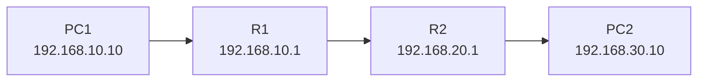

> 🔬 **VERSIÓN V2 · REVISIÓN TÉCNICA 2026-09-18**
>
> Se ha realizado una segunda pasada sobre los bloques de código y las configuraciones prácticas. Corregido un placeholder (`<gateway>`) que se interpretaba como redirección de shell; se usa la puerta de enlace del laboratorio.
>
> ⚠️ La validación automática cubre sintaxis y configuraciones aisladas; la validación extremo a extremo > de Cisco Packet Tracer, WSL2 y una VM real de Ubuntu 26.04 Server requiere ejecutar el laboratorio en esos entornos.

::: {align="center"}
# 🌐⚡ UT1 · CONCEPTOS BÁSICOS DE TCP/IP ⚡🌐

### 🖧 De los paquetes a los servicios de red

``` text
╔══════════════════════════════════════════════════════════════════╗
║                                                                  ║
║        🌐  TCP/IP  ·  IPv4  ·  ROUTING  ·  TCP/UDP  🌐          ║
║                                                                  ║
║             🔄 NAT / PAT     🐧 LINUX     🧪 LABS                ║
║                                                                  ║
╚══════════════════════════════════════════════════════════════════╝
```

**SERVICIOS DE RED E INTERNET · CFGS ASIR**

`Packet Tracer` · `WSL2 + Ubuntu 26.04` ·
`VirtualBox + Ubuntu 26.04 Server`

**Material docente actualizado · 2026.09**
:::

------------------------------------------------------------------------

> 🎯 **MISIÓN DE LA UT**
>
> Comprender cómo se direccionan, encaminan y transportan los datos en
> una red TCP/IP, y aprender a **observar y diagnosticar ese
> funcionamiento** mediante herramientas reales y simuladas.

> 🧭 **MAPA DE LA UNIDAD**
>
> ``` text
>                         🌐 REDES TCP/IP
>                               │
>              ┌────────────────┼────────────────┐
>              │                │                │
>          🏠 IPv4          🚦 Routing       🔌 TCP/UDP
>              │                │                │
>              └───────────────┬┴───────────────┘
>                              │
>                         🔄 NAT / PAT
>                              │
>                 ┌────────────┼────────────┐
>                 │            │            │
>              🧪 Packet     🐧 WSL2     🖥️ VirtualBox
>              Tracer       + Ubuntu     + Ubuntu Server
> ```
>
> 💡 **Idea guía:** no estudiaremos la red solo para memorizar
> conceptos. Aprenderemos a **observar qué está haciendo realmente el
> sistema** y a demostrarlo mediante comandos, tablas de rutas,
> simulaciones y capturas de tráfico.

------------------------------------------------------------------------

## 🎯 0. Objetivos

Al finalizar esta unidad el alumnado deberá ser capaz de:

-   Explicar la arquitectura TCP/IP y relacionarla con el modelo OSI.
-   Diferenciar aplicación, transporte, red y acceso a red.
-   Explicar el modelo cliente/servidor.
-   Interpretar una dirección IPv4 y su máscara.
-   Trabajar con CIDR y calcular redes, hosts y broadcast.
-   Distinguir direcciones públicas, privadas, loopback, enlace local y
    multicast.
-   Explicar cómo un host decide si un destino es local o remoto.
-   Interpretar una tabla de encaminamiento.
-   Diferenciar ruta conectada, ruta estática y ruta por defecto.
-   Explicar las diferencias funcionales entre TCP y UDP.
-   Interpretar puertos TCP y UDP.
-   Comprender el funcionamiento de NAT y PAT.
-   Explicar qué ocurre con una conexión cuando atraviesa un dispositivo
    NAT.
-   Comprender las diferencias entre NAT, red interna, adaptador puente
    y red solo-anfitrión en VirtualBox.
-   Utilizar herramientas reales para observar la configuración y el
    tráfico:
    -   `ip`
    -   `ss`
    -   `ping`
    -   `traceroute` / `tracepath`
    -   `tcpdump`
    -   `curl`
    -   `nmap`
    -   Wireshark
-   Configurar y verificar redes sencillas en Packet Tracer.
-   Configurar redes estáticas y encaminamiento en Ubuntu Server.

------------------------------------------------------------------------

# 🚀 1. Introducción

Los servicios de red no funcionan de manera aislada. Para que un
navegador pueda acceder a un servidor web, para que un cliente pueda
consultar DNS o para que un equipo pueda conectarse mediante SSH,
intervienen diferentes protocolos y niveles de la arquitectura de red.

Esta unidad establece los conocimientos necesarios para comprender el
resto del módulo SRI.

El objetivo no es memorizar una lista de protocolos, sino responder
preguntas como:

-   ¿Cómo sabe un equipo dónde está otro equipo?
-   ¿Cómo decide si un destino está en su propia red?
-   ¿Cuándo necesita utilizar una puerta de enlace?
-   ¿Cómo sabe el sistema operativo qué proceso debe recibir un segmento
    TCP?
-   ¿Qué diferencia existe entre una comunicación TCP y una UDP?
-   ¿Qué cambia cuando un paquete atraviesa un router que realiza NAT?
-   ¿Qué podemos observar realmente en un sistema Linux?

------------------------------------------------------------------------

# 🧱 2. Arquitectura TCP/IP

## 2.1. El modelo TCP/IP

La arquitectura TCP/IP puede representarse mediante cuatro capas
funcionales:

  -----------------------------------------------------------------------
  Capa                    Función principal       Ejemplos
  ----------------------- ----------------------- -----------------------
  Aplicación              Servicios utilizados    HTTP, DNS, SSH, SMTP,
                          por las aplicaciones    DHCP

  Transporte              Comunicación extremo a  TCP, UDP
                          extremo entre procesos  

  Internet                Direccionamiento y      IPv4, IPv6, ICMP
                          encaminamiento de       
                          paquetes                

  Acceso a red            Transmisión sobre una   Ethernet, Wi-Fi
                          tecnología concreta     
  -----------------------------------------------------------------------

El modelo es conceptual. Un protocolo de una capa utiliza los servicios
de la capa inferior.

Por ejemplo, una petición HTTP puede utilizar:

``` text
HTTP
 ↓
TCP
 ↓
IPv4
 ↓
Ethernet
```

En el receptor se produce el proceso inverso:

``` text
Ethernet
 ↓
IPv4
 ↓
TCP
 ↓
HTTP
```

Este proceso se denomina **encapsulación** y **desencapsulación**.

💡 **Clave de examen:** TCP/IP y OSI son modelos de referencia. No
conviene confundir una correspondencia aproximada de capas con una
equivalencia uno-a-uno de protocolos.

## 2.2. TCP/IP frente al modelo OSI

El modelo OSI utiliza siete capas:

1.  Física
2.  Enlace de datos
3.  Red
4.  Transporte
5.  Sesión
6.  Presentación
7.  Aplicación

TCP/IP agrupa varias de ellas:

``` text
OSI                         TCP/IP

Aplicación       ┐
Presentación     ├───────>  Aplicación
Sesión           ┘

Transporte       ────────>  Transporte

Red              ────────>  Internet

Enlace           ┐
Física           ┴───────>  Acceso a red
```

No debe interpretarse que un modelo sea una implementación concreta. Son
modelos de referencia que ayudan a organizar las funciones de
comunicación.

------------------------------------------------------------------------

# 🖥️ 3. Modelo cliente/servidor

El modelo cliente/servidor describe una relación entre procesos.

-   El **cliente** inicia normalmente una petición.
-   El **servidor** proporciona un servicio y permanece preparado para
    atender solicitudes.
-   La comunicación se realiza mediante protocolos de red.

Ejemplo:

``` text
Cliente                          Servidor web

 navegador                       nginx
    │                               │
    │────── petición HTTP ─────────>│
    │                               │
    │<──── respuesta HTTP ──────────│
```

Un mismo equipo puede actuar simultáneamente como cliente y servidor.

Por ejemplo, un servidor Linux puede:

-   actuar como servidor SSH;
-   actuar como cliente DNS;
-   actuar como cliente NTP;
-   actuar como servidor web;
-   conectarse como cliente a otro servicio.

## 3.1. Servicio, aplicación y protocolo

No deben confundirse estos conceptos.

**Aplicación:** programa que utiliza o proporciona un servicio.

**Servicio:** funcionalidad ofrecida a otros sistemas o procesos.

**Protocolo:** conjunto de reglas que determina cómo se comunican dos
extremos.

Ejemplo:

``` text
Servicio web
    │
    ├── servidor: nginx / Apache
    ├── cliente: navegador
    └── protocolo: HTTP/HTTPS
```

------------------------------------------------------------------------

# 🌐 4. IPv4: direccionamiento en la capa de Internet

## 4.1. La dirección IPv4

Una dirección IPv4 tiene 32 bits.

Se representa habitualmente mediante cuatro octetos:

``` text
192.168.10.25
```

Cada octeto tiene 8 bits:

``` text
192       168       10        25
11000000  10101000  00001010  00011001
```

Por tanto:

``` text
4 × 8 = 32 bits
```

El valor de cada octeto está entre:

``` text
0 y 255
```

## 4.2. Dirección y prefijo

Una dirección IPv4 no debe analizarse de forma aislada. Necesitamos
conocer el prefijo de red.

Ejemplo:

``` text
192.168.10.25/24
```

El `/24` indica que los primeros 24 bits identifican la red.

``` text
11111111.11111111.11111111.00000000
```

equivalente a:

``` text
255.255.255.0
```

La parte restante identifica hosts dentro de esa red.

------------------------------------------------------------------------

# 🎭 5. Máscaras de red

## 5.1. Máscara tradicional

La máscara permite separar:

-   identificador de red;
-   identificador de host.

Ejemplo:

``` text
IP:       192.168.10.25
Máscara:  255.255.255.0
```

En binario:

``` text
IP:       11000000.10101000.00001010.00011001
Máscara:  11111111.11111111.11111111.00000000
```

La operación AND permite obtener la dirección de red:

``` text
11000000.10101000.00001010.00011001
AND
11111111.11111111.11111111.00000000
=
11000000.10101000.00001010.00000000
```

Resultado:

``` text
192.168.10.0
```

## 5.2. CIDR

CIDR expresa directamente el número de bits utilizados para la red.

Ejemplos:

    CIDR Máscara             Hosts totales
  ------ ----------------- ---------------
      /8 255.0.0.0              16 777 216
     /16 255.255.0.0                65 536
     /24 255.255.255.0                 256
     /25 255.255.255.128               128
     /26 255.255.255.192                64
     /27 255.255.255.224                32
     /28 255.255.255.240                16
     /29 255.255.255.248                 8
     /30 255.255.255.252                 4

En una red IPv4 convencional, la cantidad de direcciones utilizables
para hosts suele ser:

``` text
2^(32-prefijo) - 2
```

El descuento corresponde a la dirección de red y a la dirección de
broadcast.

> **Importante:** existen excepciones y usos especiales, por lo que esta
> fórmula no debe aplicarse mecánicamente a todos los prefijos.

------------------------------------------------------------------------

# 📍 6. Direcciones IPv4 especiales

## 6.1. Loopback

La red:

``` text
127.0.0.0/8
```

se utiliza para comunicaciones internas del propio host.

La dirección más habitual es:

``` text
127.0.0.1
```

Ejemplo:

``` bash
ping 127.0.0.1
```

La comunicación no sale por la interfaz física.

------------------------------------------------------------------------

## 6.2. Direcciones privadas

Los principales rangos privados IPv4 son:

``` text
10.0.0.0/8
172.16.0.0/12
192.168.0.0/16
```

Estas direcciones no son enrutable directamente en Internet público.

Son habituales en redes locales.

Ejemplo:

``` text
192.168.1.0/24
```

------------------------------------------------------------------------

## 6.3. Link-local

En IPv4:

``` text
169.254.0.0/16
```

se utiliza para direccionamiento local cuando un host no dispone de una
configuración IPv4 válida mediante otros mecanismos.

Una dirección `169.254.x.x` **no significa que Internet esté
funcionando**.

------------------------------------------------------------------------

## 6.4. Broadcast

En una red IPv4 se puede utilizar una dirección de broadcast para enviar
tráfico a todos los hosts de una red.

Por ejemplo, en:

``` text
192.168.10.0/24
```

la dirección de broadcast es:

``` text
192.168.10.255
```

------------------------------------------------------------------------

## 6.5. Multicast

El rango IPv4 multicast es:

``` text
224.0.0.0/4
```

Permite enviar tráfico a un grupo de receptores.

No debe confundirse:

``` text
unicast   → un receptor
broadcast → todos los receptores de una red
multicast → miembros de un grupo
```

------------------------------------------------------------------------

# 📦 7. Cómo decide un host dónde enviar un paquete

Supongamos:

``` text
Host A
IP: 192.168.10.20/24
Gateway: 192.168.10.1
```

y queremos acceder a:

``` text
192.168.10.50
```

Ambas direcciones pertenecen a:

``` text
192.168.10.0/24
```

Por tanto, el destino es local.

Si queremos acceder a:

``` text
8.8.8.8
```

el destino no pertenece a la red local.

El host debe utilizar su **puerta de enlace predeterminada**.

``` text
                 Internet
                    │
                    │
             192.168.10.1
                 Router
                    │
                    │
             192.168.10.0/24
              │             │
        192.168.10.20   192.168.10.50
```

La puerta de enlace no es "Internet". Es un dispositivo de capa 3 al que
el host entrega los paquetes destinados a redes que no conoce
directamente.

------------------------------------------------------------------------

# 🗺️ 8. Tabla de encaminamiento

Cada host dispone de información que le permite decidir por dónde enviar
un paquete.

En Linux podemos consultar:

``` bash
ip route
```

Ejemplo:

``` text
default via 192.168.10.1 dev enp0s3
192.168.10.0/24 dev enp0s3 proto kernel scope link src 192.168.10.20
```

Interpretación:

``` text
default
    cualquier destino que no coincida con una ruta más específica

via 192.168.10.1
    siguiente salto

dev enp0s3
    interfaz de salida

192.168.10.0/24
    red directamente conectada

src 192.168.10.20
    dirección de origen preferida
```

## 8.1. Ruta por defecto

La ruta:

``` text
default via 192.168.10.1
```

equivale conceptualmente a:

> "Si no existe una ruta más específica, utiliza 192.168.10.1."

------------------------------------------------------------------------

# 🚦 9. Encaminamiento

Un router recibe un paquete IP y consulta su tabla de encaminamiento.

Ejemplo:



R1 puede necesitar una ruta hacia:

``` text
192.168.30.0/24
```

por R2.

Una ruta estática podría ser:

``` text
192.168.30.0/24 via 192.168.20.2
```

## 9.1. Ruta conectada

Aparece automáticamente cuando una interfaz está configurada con una
red.

Por ejemplo:

``` text
IP: 192.168.10.1/24
```

genera una red directamente conectada:

``` text
192.168.10.0/24
```

## 9.2. Ruta estática

Es configurada explícitamente por el administrador.

Ventajas:

-   sencilla en redes pequeñas;
-   comportamiento predecible;
-   no necesita protocolo de routing.

Inconvenientes:

-   mantenimiento manual;
-   no se adapta automáticamente a cambios de topología;
-   escala mal.

## 9.3. Encaminamiento dinámico

Los routers pueden intercambiar información de encaminamiento mediante
protocolos específicos.

Ejemplos:

-   OSPF
-   BGP
-   RIP

En ASIR es importante distinguir el concepto de **routing** del de
**protocolo de routing**.

------------------------------------------------------------------------

# 🐧 10. Comandos Linux para estudiar el encaminamiento

## 🌐 Mostrar interfaces

``` bash
ip addr
```

Forma abreviada:

``` bash
ip a
```

## 🗺️ Mostrar rutas

``` bash
ip route
```

## 🎯 Consultar cómo se alcanzaría un destino

``` bash
ip route get 8.8.8.8
```

Ejemplo:

``` text
8.8.8.8 via 192.168.10.1 dev enp0s3 src 192.168.10.20
```

## 🔗 Ver vecinos ARP/NDP

``` bash
ip neigh
```

## 🔌 Ver sockets

``` bash
ss -tulpen
```

## 📶 Comprobar conectividad

``` bash
ping -c 4 192.168.10.1
```

## 🧭 Seguir el camino

``` bash
tracepath 8.8.8.8
```

Si `tracepath` no está instalado:

``` bash
sudo apt install iputils-tracepath
```

------------------------------------------------------------------------

# 🚚 11. Nivel de transporte

IP proporciona comunicación entre hosts, pero una máquina puede tener
simultáneamente muchos procesos comunicándose.

Por ejemplo:

``` text
192.168.10.20
 ├── navegador
 ├── SSH
 ├── DNS
 └── servidor web
```

Los **puertos** permiten identificar servicios y procesos de red.

Un extremo de una comunicación puede representarse mediante:

``` text
IP + puerto + protocolo
```

Ejemplo:

``` text
192.168.10.20:22/TCP
```

------------------------------------------------------------------------

# 🔌 12. Puertos TCP y UDP

Un puerto es un valor de 16 bits:

``` text
0 - 65535
```

De forma conceptual:

           Rango Denominación habitual
  -------------- -----------------------
         0--1023 puertos conocidos
     1024--49151 registrados
    49152--65535 dinámicos/efímeros

Los rangos y usos concretos dependen de las normas de IANA y del sistema
operativo.

Ejemplos frecuentes:

  Servicio        Protocolo     Puerto
  --------------- ----------- --------
  HTTP            TCP               80
  HTTPS           TCP              443
  SSH             TCP               22
  DNS             UDP/TCP           53
  DHCP servidor   UDP               67
  DHCP cliente    UDP               68

------------------------------------------------------------------------

# ⚡ 13. UDP

UDP es un protocolo de transporte sin conexión.

Características:

-   no establece una conexión previa;
-   no garantiza la entrega;
-   no garantiza el orden;
-   tiene poca sobrecarga;
-   permite que la aplicación gestione mecanismos adicionales cuando los
    necesita.

Ejemplos de uso:

-   DNS;
-   DHCP;
-   streaming y aplicaciones multimedia;
-   determinadas aplicaciones interactivas;
-   protocolos modernos que implementan fiabilidad en capas superiores.

UDP es adecuado cuando la aplicación prefiere baja sobrecarga o controla
sus propios mecanismos de recuperación.

------------------------------------------------------------------------

# 🔗 14. TCP

TCP proporciona un servicio orientado a conexión.

Entre sus características están:

-   establecimiento de conexión;
-   numeración de secuencia;
-   confirmaciones;
-   retransmisión;
-   control de flujo;
-   control de congestión;
-   entrega ordenada del flujo de datos.

Una conexión TCP se identifica mediante los extremos de la comunicación.

Por ejemplo:

``` text
Cliente
192.168.10.20:49152
        │
        │ TCP
        ▼
Servidor
192.168.10.30:443
```

------------------------------------------------------------------------

# 🤝 15. Establecimiento de una conexión TCP

El establecimiento clásico utiliza el **three-way handshake**:

``` text
Cliente                         Servidor

   SYN ──────────────────────────>

       <──────────────────── SYN/ACK

   ACK ──────────────────────────>

             conexión establecida
```

Después pueden transmitirse datos.

Para cerrar una conexión TCP intervienen normalmente segmentos FIN y
ACK.

------------------------------------------------------------------------

# 🔄 16. NAT y PAT

## 16.1. Motivación

Las redes privadas utilizan habitualmente direcciones RFC 1918.

Ejemplo:

``` text
192.168.1.0/24
```

Un router puede traducir estas direcciones para permitir la comunicación
con Internet.

NAT significa:

**Network Address Translation**

Cuando además se modifica el puerto para permitir que varios equipos
compartan una misma dirección pública, hablamos habitualmente de:

**PAT --- Port Address Translation**

------------------------------------------------------------------------

# 📤 17. NAT de salida

Supongamos:

``` text
Cliente:
192.168.1.10:51500

Router:
IP pública 203.0.113.20
```

El cliente quiere acceder a:

``` text
198.51.100.50:443
```

El router puede transformar:

``` text
192.168.1.10:51500
```

en:

``` text
203.0.113.20:40001
```

y mantener una asociación en su tabla NAT:

``` text
192.168.1.10:51500
        ↕
203.0.113.20:40001
```

La respuesta recibida en:

``` text
203.0.113.20:40001
```

puede asociarse con:

``` text
192.168.1.10:51500
```

------------------------------------------------------------------------

# ↪️ 18. Port forwarding

El tráfico iniciado desde Internet hacia un servicio interno no puede
resolverse únicamente con NAT de salida.

Puede configurarse una regla de redirección:

``` text
203.0.113.20:443
        ↓
192.168.1.20:443
```

Esto se denomina:

-   port forwarding;
-   DNAT en determinados contextos;
-   publicación de un servicio.

Debe distinguirse entre:

``` text
SNAT/PAT
    cambia principalmente el origen

DNAT
    cambia principalmente el destino
```

------------------------------------------------------------------------

# ⚠️ 19. Limitaciones y consecuencias del NAT

NAT no es simplemente un mecanismo de "seguridad".

Puede:

-   ocultar direcciones privadas;
-   permitir compartir una IP pública;
-   modificar puertos;
-   complicar determinadas comunicaciones extremo a extremo;
-   introducir estado en el dispositivo intermedio;
-   requerir mecanismos adicionales para determinadas aplicaciones.

No debe afirmarse que:

> "NAT es un firewall."

Un firewall filtra tráfico según reglas de seguridad. NAT realiza
traducción de direcciones y/o puertos.

Un mismo dispositivo puede realizar ambas funciones, pero son conceptos
distintos.

------------------------------------------------------------------------

# 🧩 20. Virtualización y redes virtuales

La virtualización permite ejecutar sistemas operativos invitados sobre
un sistema anfitrión.

En este módulo interesa especialmente porque permite construir
laboratorios completos sin disponer de varios equipos físicos.

Una arquitectura típica es:

``` text
Hardware físico
      │
      ▼
Sistema anfitrión
      │
      ▼
VirtualBox
      │
      ├── Ubuntu Server 26.04 — router
      ├── Ubuntu Server 26.04 — servidor
      └── Ubuntu Server 26.04 — cliente
```

------------------------------------------------------------------------

# 🖧 21. Modos de red en VirtualBox

VirtualBox proporciona distintos modos de conexión.

Los más importantes para SRI son:

  Modo                Uso didáctico
  ------------------- -----------------------------------------------------
  NAT                 Salida sencilla de la VM hacia el exterior
  NAT Network         Varias VMs en una red NAT gestionada por VirtualBox
  Bridged Adapter     La VM aparece en la red física como otro equipo
  Host-only Adapter   Comunicación entre anfitrión y VMs
  Internal Network    Comunicación entre VMs de la misma red virtual

La documentación de VirtualBox distingue explícitamente estos modos,
incluyendo NAT, bridge, red interna y host-only.
citeturn1search33turn1search7

### Recomendación para prácticas

Para construir una topología de routing:

``` text
             NAT
              │
              │
        [Router Ubuntu]
          │          │
          │          │
      LAN-A        LAN-B
       │              │
    Cliente A      Servidor B
```

En VirtualBox:

-   adaptador 1 del router → NAT;
-   adaptador 2 → `SRI-LAN-A`;
-   adaptador 3 → `SRI-LAN-B`;
-   cliente → `SRI-LAN-A`;
-   servidor → `SRI-LAN-B`.

------------------------------------------------------------------------

# 🛠️ 22. Ubuntu Server 26.04 y Netplan

Ubuntu 26.04 LTS utiliza Netplan para la configuración de red y
actualiza Netplan a la serie 1.2. citeturn2search0turn2search4

Una configuración estática sencilla puede ser:

``` yaml
network:
  version: 2
  ethernets:
    enp0s3:
      addresses:
        - 192.168.10.1/24
```

Aplicación:

``` bash
sudo netplan try
```

Si la configuración es correcta:

``` bash
sudo netplan apply
```

Comprobación:

``` bash
ip addr
ip route
```

> En un servidor remoto, `netplan try` es especialmente útil porque
> permite validar la configuración antes de dejarla aplicada de forma
> permanente.

------------------------------------------------------------------------

# 🐧 23. WSL2 como entorno de aprendizaje

WSL2 permite ejecutar una distribución Linux integrada con Windows sin
utilizar una VM tradicional completa. Microsoft recomienda
`wsl --install` para instalaciones actuales y las nuevas instalaciones
se configuran normalmente como WSL 2. citeturn0search0turn0search7

Instalación:

``` powershell
wsl --install
```

Comprobación:

``` powershell
wsl --status
wsl --list --verbose
```

Debe comprobarse que la distribución utiliza:

``` text
VERSION 2
```

Ubuntu 26.04 LTS dispone de soporte/documentación específica para WSL.
citeturn2search10

## 23.1. Qué prácticas son adecuadas para WSL2

WSL2 es especialmente útil para:

-   aprender comandos Linux;
-   estudiar interfaces y rutas;
-   analizar sockets;
-   trabajar con SSH;
-   ejecutar servidores;
-   usar `curl`, `wget`, `ss`, `ip`, `ping`, `tcpdump`, etc.;
-   practicar Bash y automatización.

No debe utilizarse como sustituto de una topología de routers completa.
Para eso resulta más apropiado Packet Tracer o varias VMs.

------------------------------------------------------------------------

# 🔎 24. Herramientas fundamentales

## `ip`

``` bash
ip addr
ip link
ip route
ip neigh
```

Es la herramienta principal para consultar y modificar configuración de
red en Linux moderno.

## `ping`

``` bash
ping -c 4 192.168.1.1
```

Permite comprobar conectividad IP utilizando ICMP.

Un ping correcto demuestra una determinada conectividad ICMP; **no
demuestra que todos los servicios de aplicación estén funcionando**.

## `ss`

``` bash
ss -tulpen
```

Permite observar sockets TCP y UDP.

## `curl`

``` bash
curl -I https://www.example.com
```

Permite probar servicios HTTP/HTTPS desde la perspectiva de una
aplicación.

## `tcpdump`

``` bash
sudo tcpdump -ni any
```

Ejemplo filtrando ICMP:

``` bash
sudo tcpdump -ni any icmp
```

Ejemplo TCP:

``` bash
sudo tcpdump -ni any tcp
```

## `nmap`

``` bash
nmap -sT 192.168.1.10
```

Debe utilizarse únicamente sobre equipos y redes en los que tengamos
autorización.

------------------------------------------------------------------------

# 🧪 25. PRÁCTICA 1 --- IPv4 y encaminamiento con Cisco Packet Tracer

## Objetivo

Construir una red con dos subredes y un router.

## Topología

``` text
PC-A
192.168.10.10/24
GW 192.168.10.1
        │
        │
   G0/0 R1
   192.168.10.1
      R1
   192.168.20.1
   G0/1
        │
        │
PC-B
192.168.20.10/24
GW 192.168.20.1
```

## Configuración de R1

``` text
enable
configure terminal

interface gigabitEthernet 0/0
 ip address 192.168.10.1 255.255.255.0
 no shutdown
exit

interface gigabitEthernet 0/1
 ip address 192.168.20.1 255.255.255.0
 no shutdown
exit

end
write memory
```

## Configuración de PC-A

``` text
IP:       192.168.10.10
Mask:     255.255.255.0
Gateway:  192.168.10.1
```

## Configuración de PC-B

``` text
IP:       192.168.20.10
Mask:     255.255.255.0
Gateway:  192.168.20.1
```

## Comprobaciones

Desde PC-A:

``` text
ping 192.168.10.1
ping 192.168.20.1
ping 192.168.20.10
```

## Preguntas

1.  ¿Por qué PC-A necesita una puerta de enlace para alcanzar PC-B?
2.  ¿Qué red está directamente conectada a G0/0?
3.  ¿Qué red está directamente conectada a G0/1?
4.  ¿Qué ocurriría si PC-A tuviera como gateway `192.168.10.254`?
5.  ¿Qué tabla de routing tiene R1?

------------------------------------------------------------------------

# 🧪 26. PRÁCTICA 2 --- Inspección de red con WSL2 + Ubuntu 26.04

## Objetivo

Observar la configuración real del sistema.

## 26.1. Identificar interfaces

``` bash
ip addr
```

Localiza:

-   interfaz Ethernet virtual;
-   dirección IPv4;
-   prefijo;
-   loopback.

## 26.2. Consultar rutas

``` bash
ip route
```

Identifica:

-   ruta por defecto;
-   interfaz utilizada;
-   gateway;
-   red directamente conectada.

## 26.3. Preguntar al kernel cómo alcanzará un destino

``` bash
ip route get 1.1.1.1
```

Repite:

``` bash
ip route get 192.168.1.1
ip route get 8.8.8.8
```

Compara los resultados.

## 26.4. Consultar vecinos

``` bash
ip neigh
```

Relaciona las entradas con ARP.

## 26.5. Observar sockets

``` bash
ss -tulpen
```

Localiza:

-   puertos TCP en escucha;
-   puertos UDP;
-   procesos asociados.

## 26.6. Capturar tráfico

Instalar:

``` bash
sudo apt update
sudo apt install tcpdump
```

Capturar ICMP:

``` bash
sudo tcpdump -ni any icmp
```

En otra terminal:

``` bash
ping -c 4 1.1.1.1
```

Analiza los paquetes capturados.

### Resultado esperado

El alumnado debe ser capaz de relacionar:

``` text
ping
  ↓
ICMP
  ↓
IPv4
  ↓
interfaz
  ↓
ruta
```

------------------------------------------------------------------------

# 🧪 27. PRÁCTICA 3 --- Red en VirtualBox con Ubuntu Server 26.04

## Objetivo

Crear una topología de tres máquinas:

``` text
                         Internet
                            │
                           NAT
                            │
                     ┌─────────────┐
                     │ Router-Ubuntu│
                     │   26.04     │
                     └─────┬───┬───┘
                           │   │
                    SRI-LAN-A SRI-LAN-B
                       │          │
                 ┌─────┴──┐  ┌───┴─────┐
                 │ Cliente │  │ Servidor│
                 │  .10    │  │  .10    │
                 └─────────┘  └─────────┘
```

## Direccionamiento

### LAN-A

``` text
192.168.10.0/24
Router:  192.168.10.1
Cliente: 192.168.10.10
```

### LAN-B

``` text
192.168.20.0/24
Router:  192.168.20.1
Servidor:192.168.20.10
```

## Configuración del router

Identificar interfaces:

``` bash
ip link
```

Crear `/etc/netplan/01-sri.yaml`:

``` yaml
network:
  version: 2
  ethernets:
    enp0s3:
      dhcp4: true

    enp0s8:
      addresses:
        - 192.168.10.1/24

    enp0s9:
      addresses:
        - 192.168.20.1/24
```

Aplicar:

``` bash
sudo netplan try
sudo netplan apply
```

Comprobar:

``` bash
ip addr
ip route
```

## Activar encaminamiento IPv4

Comprobar:

``` bash
sysctl net.ipv4.ip_forward
```

Activar temporalmente:

``` bash
sudo sysctl -w net.ipv4.ip_forward=1
```

Para hacerlo persistente:

``` bash
echo 'net.ipv4.ip_forward=1' | sudo tee /etc/sysctl.d/99-sri-router.conf
sudo sysctl --system
```

## Configurar el cliente

``` yaml
network:
  version: 2
  ethernets:
    enp0s3:
      addresses:
        - 192.168.10.10/24
      routes:
        - to: default
          via: 192.168.10.1
```

## Configurar el servidor

``` yaml
network:
  version: 2
  ethernets:
    enp0s3:
      addresses:
        - 192.168.20.10/24
      routes:
        - to: default
          via: 192.168.20.1
```

## Verificación

Desde el cliente:

``` bash
ping -c 4 192.168.10.1
ping -c 4 192.168.20.1
ping -c 4 192.168.20.10
```

Desde el servidor:

``` bash
ping -c 4 192.168.10.10
```

## Análisis

Ejecutar en el router:

``` bash
ip route
ip neigh
```

Y en el cliente:

``` bash
ip route get 192.168.20.10
```

Explicar por qué el tráfico pasa por:

``` text
192.168.10.1
```

------------------------------------------------------------------------

# 🧪 28. PRÁCTICA 4 --- NAT en Ubuntu Server

Partimos de la práctica anterior.

El router dispone de:

``` text
WAN:     DHCP
LAN-A:   192.168.10.1/24
LAN-B:   192.168.20.1/24
```

El objetivo es que los equipos de la red privada puedan acceder al
exterior.

## Comprobación inicial

En el router:

``` bash
ip route
```

Debe existir una ruta por defecto proporcionada por la interfaz WAN.

## NAT con nftables

Ubuntu moderno utiliza Netfilter y dispone de `nftables` como
infraestructura de filtrado.

Instalar:

``` bash
sudo apt install nftables
```

Ejemplo conceptual de NAT:

``` nft
table ip nat {
    chain postrouting {
        type nat hook postrouting priority srcnat;
        oifname "enp0s3" ip saddr 192.168.10.0/24 masquerade
        oifname "enp0s3" ip saddr 192.168.20.0/24 masquerade
    }
}
```

**No copies esta configuración sin comprobar antes el nombre real de la
interfaz WAN.**

Identificarla:

``` bash
ip route | grep default
```

La infraestructura de filtrado de Ubuntu se basa en Netfilter; `ufw` es
la herramienta de firewall de alto nivel habitual, mientras que
`nftables` permite trabajar de forma más directa con las reglas.
citeturn2search8

## Comprobación

Desde un cliente:

``` bash
ping -c 4 1.1.1.1
```

Después:

``` bash
curl -4 https://example.com
```

Capturar tráfico en el router:

``` bash
sudo tcpdump -ni enp0s3 host 1.1.1.1
```

Analizar qué dirección de origen observa la interfaz WAN.

------------------------------------------------------------------------

# 🧪 29. PRÁCTICA 5 --- Comparación de los tres entornos

## Objetivo

Resolver la misma cuestión de red en tres plataformas.

### Escenario

Tenemos:

``` text
192.168.10.0/24
```

y queremos comprobar la conectividad entre dos hosts.

  Tarea                  Packet Tracer               WSL2                         Ubuntu Server + VirtualBox
  ---------------------- --------------------------- ---------------------------- ----------------------------
  Configurar IP          GUI/CLI Cisco               `ip` / entorno WSL           Netplan
  Ver interfaces         `show ip interface brief`   `ip addr`                    `ip addr`
  Ver rutas              `show ip route`             `ip route`                   `ip route`
  Ping                   `ping`                      `ping`                       `ping`
  Routing                Router Cisco                Limitado como laboratorio    Router Linux
  NAT                    Router Cisco                No es el entorno principal   Router Linux
  Captura                Simulation Mode             `tcpdump`                    `tcpdump` / Wireshark
  Topologías complejas   Excelente                   Limitado                     Excelente

------------------------------------------------------------------------

# 📡 30. Actividad de análisis de tráfico

## Objetivo

Relacionar las capas TCP/IP con paquetes reales.

Instalar Wireshark en el sistema apropiado o realizar la captura con:

``` bash
sudo tcpdump -ni any -w ut1.pcap
```

Generar tráfico:

``` bash
ping -c 4 1.1.1.1
```

y:

``` bash
curl -I https://example.com
```

Abrir posteriormente:

``` text
ut1.pcap
```

Analizar:

### ICMP

Identificar:

-   dirección origen;
-   dirección destino;
-   tipo;
-   código.

### TCP

Identificar:

-   SYN;
-   SYN/ACK;
-   ACK;
-   puertos;
-   números de secuencia.

### HTTP/HTTPS

Identificar:

-   IP origen/destino;
-   TCP;
-   puerto 443;
-   establecimiento de conexión.

------------------------------------------------------------------------

# 🩺 31. Actividad de diagnóstico

Ante el siguiente problema:

``` text
PC
 │
 ├── IP: 192.168.10.20/24
 ├── GW: 192.168.20.1
 └── DNS: 8.8.8.8
```

el equipo no tiene conectividad.

Establecer un procedimiento de diagnóstico:

``` text
1. ¿La interfaz está activa?
        ↓
2. ¿Tiene IP correcta?
        ↓
3. ¿La máscara es correcta?
        ↓
4. ¿Existe ruta?
        ↓
5. ¿La puerta de enlace responde?
        ↓
6. ¿Existe conectividad IP externa?
        ↓
7. ¿Funciona DNS?
        ↓
8. ¿Funciona la aplicación?
```

Comandos:

``` bash
ip link
ip addr
ip route
ping -c 4 192.168.10.1
ip route get 1.1.1.1
ping -c 4 1.1.1.1
resolvectl status
curl -I https://example.com
```

------------------------------------------------------------------------

# 🚨 32. Errores frecuentes

## Error 1 --- Confundir IP con puerta de enlace

La puerta de enlace no es la dirección IP del host.

Incorrecto:

``` text
Host: 192.168.10.20
Gateway: 192.168.10.20
```

En una red convencional la puerta de enlace será otra interfaz del
segmento.

------------------------------------------------------------------------

## Error 2 --- Pensar que `/24` significa 24 hosts

`/24` indica:

``` text
24 bits de red
8 bits restantes
```

No significa 24 hosts.

------------------------------------------------------------------------

## Error 3 --- Pensar que ping prueba un servicio

``` bash
ping servidor
```

comprueba ICMP.

No demuestra que:

``` text
SSH
HTTP
DNS
SMTP
```

estén funcionando.

------------------------------------------------------------------------

## Error 4 --- Confundir NAT con firewall

NAT traduce direcciones/puertos.

Un firewall aplica políticas de filtrado.

Pueden coexistir.

------------------------------------------------------------------------

## Error 5 --- Usar `ifconfig` como herramienta principal

En sistemas Linux actuales debe priorizarse:

``` bash
ip addr
ip route
ip link
ip neigh
```

`ifconfig` pertenece al conjunto de herramientas tradicional
`net-tools`.

------------------------------------------------------------------------

## Error 6 --- Modificar alegremente la red de WSL2

WSL2 no debe tratarse como si fuera una VM tradicional.

Primero se debe observar:

``` bash
ip addr
ip route
```

y entender la red proporcionada por WSL.

Para topologías con varios routers e interfaces se utilizará
preferentemente:

-   Packet Tracer;
-   varias máquinas virtuales.

------------------------------------------------------------------------

> 🧩 **De concepto a evidencia:** en esta UT cada idea importante debe
> poder relacionarse con una dirección, una ruta, un puerto, un paquete
> o una configuración observable.

# 📝 33. Resumen

En esta unidad hemos estudiado:

-   la arquitectura TCP/IP;
-   el modelo cliente/servidor;
-   las funciones de las capas;
-   IPv4;
-   máscaras y CIDR;
-   direccionamiento especial;
-   redes públicas y privadas;
-   encaminamiento;
-   tablas de rutas;
-   puertas de enlace;
-   puertos;
-   TCP;
-   UDP;
-   NAT;
-   PAT;
-   port forwarding;
-   virtualización;
-   redes de VirtualBox;
-   herramientas de diagnóstico Linux.

La idea fundamental es:

> **Una comunicación de red es el resultado de la interacción de varias
> capas y varios dispositivos. Para diagnosticarla debemos analizar cada
> nivel de forma sistemática.**

------------------------------------------------------------------------

# ❓ 34. Cuestiones de autoevaluación

1.  ¿Qué funciones corresponden a la capa Internet de TCP/IP?
2.  ¿Qué diferencias fundamentales existen entre TCP/IP y OSI?
3.  ¿Qué diferencia existe entre una aplicación y un protocolo?
4.  ¿Qué función desempeña un puerto?
5.  ¿Cuántos bits tiene una dirección IPv4?
6.  ¿Qué representa `/24`?
7.  ¿Cuál es la máscara correspondiente a `/27`?
8.  ¿Cuál es la dirección de red de `192.168.10.37/24`?
9.  ¿Cuál es el broadcast de `192.168.10.37/24`?
10. ¿Cuántas direcciones totales contiene una red `/26`?
11. ¿Qué rangos IPv4 son privados?
12. ¿Para qué sirve `127.0.0.1`?
13. ¿Qué significa una dirección `169.254.x.x`?
14. ¿Qué diferencia existe entre unicast, broadcast y multicast?
15. ¿Qué es una ruta directamente conectada?
16. ¿Qué es una ruta por defecto?
17. ¿Qué comando Linux permite consultar la tabla de routing?
18. ¿Qué comando permite saber qué ruta utilizará Linux para un destino?
19. ¿Qué diferencia fundamental existe entre TCP y UDP?
20. ¿Qué es el three-way handshake?
21. ¿Qué información identifica un extremo TCP?
22. ¿Qué problema pretende resolver NAT?
23. ¿Qué diferencia existe entre NAT y PAT?
24. ¿Qué es port forwarding?
25. ¿Por qué NAT no debe considerarse un firewall?
26. ¿Qué diferencia existe entre una red NAT y una red interna de
    VirtualBox?
27. ¿Qué ventaja tiene una red host-only?
28. ¿Qué utilidad tiene una interfaz puente?
29. ¿Qué papel desempeña Netplan en Ubuntu Server?
30. ¿Qué información proporcionan `ip addr` e `ip route`?
31. ¿Qué diferencia existe entre `ping` y `curl` como herramientas de
    diagnóstico?
32. ¿Qué información permite observar `ss -tulpen`?
33. ¿Para qué utilizarías `tcpdump`?
34. ¿Qué entorno elegirías para simular tres routers Cisco y por qué?
35. ¿Qué entorno elegirías para estudiar la tabla de rutas real de Linux
    y por qué?
36. ¿Qué entorno elegirías para montar un router Linux real con dos
    redes y por qué?

------------------------------------------------------------------------

## ✅ Solucionario de la autoevaluación

> 📌 **Cómo usarlo:** intenta resolver primero las 36 cuestiones sin
> consultar esta sección. Después, utiliza el solucionario para
> comprobar el razonamiento, no solo para verificar una palabra
> concreta.

1.  **Capa Internet:** proporciona direccionamiento lógico y
    encaminamiento de paquetes entre redes. En IPv4 intervienen
    principalmente IP y, en el modelo TCP/IP, también protocolos
    asociados como ICMP.

2.  **TCP/IP frente a OSI:** OSI es un modelo de referencia de siete
    capas; TCP/IP utiliza normalmente cuatro capas funcionales. La
    correspondencia no es estrictamente uno-a-uno: varias funciones de
    OSI se agrupan en las capas TCP/IP.

3.  **Aplicación vs. protocolo:** una aplicación es el programa o
    servicio que utiliza la red; un protocolo es el conjunto de reglas
    que permite que dos extremos se comuniquen. Por ejemplo, un
    navegador es una aplicación y HTTP es un protocolo.

4.  **Puerto:** identifica un servicio o proceso dentro de un host junto
    con la dirección IP y el protocolo de transporte. Permite distinguir
    diferentes comunicaciones dirigidas al mismo equipo.

5.  **IPv4:** una dirección IPv4 tiene **32 bits**, normalmente escritos
    como cuatro octetos en decimal, por ejemplo `192.168.10.25`.

6.  **`/24`:** indica que los primeros **24 bits** corresponden al
    prefijo de red y quedan **8 bits** para la parte de host. La máscara
    es `255.255.255.0`.

7.  **`/27`:** la máscara es **`255.255.255.224`**.

8.  **Red de `192.168.10.37/24`:** **`192.168.10.0`**.

9.  **Broadcast de `192.168.10.37/24`:** **`192.168.10.255`**.

10. **Red `/26`:** contiene **64 direcciones totales** (`2^6`). En una
    red IPv4 convencional, 62 pueden utilizarse como direcciones de host
    porque la dirección de red y el broadcast tienen usos reservados.

11. **Rangos privados IPv4:**

    -   `10.0.0.0/8`
    -   `172.16.0.0/12`
    -   `192.168.0.0/16`

12. **`127.0.0.1`:** es una dirección de **loopback**. Hace referencia
    al propio host a través de la interfaz de bucle local.

13. **`169.254.x.x`:** pertenece al rango IPv4 **link-local**
    (`169.254.0.0/16`). En un contexto típico de cliente IPv4, puede
    aparecer cuando no se ha obtenido correctamente una configuración
    DHCP.

14. **Unicast / broadcast / multicast:**

    -   **Unicast:** un emisor → un receptor.
    -   **Broadcast:** un emisor → todos los hosts del dominio de
        broadcast correspondiente.
    -   **Multicast:** un emisor → un grupo de receptores suscritos.

15. **Ruta directamente conectada:** ruta que el host conoce porque una
    de sus interfaces está configurada en esa red. No necesita enviar el
    paquete a un router intermedio para alcanzar ese prefijo.

16. **Ruta por defecto:** ruta utilizada cuando no existe una ruta más
    específica que coincida con el destino. En un host suele apuntar a
    la puerta de enlace predeterminada.

17. **Tabla de routing en Linux:** `ip route`.

18. **Ruta que utilizará Linux para un destino:**
    `ip route get DESTINO`, por ejemplo `ip route get 8.8.8.8`.

19. **TCP vs. UDP:** TCP es orientado a conexión y proporciona
    mecanismos como entrega ordenada, retransmisión y control de flujo.
    UDP es no orientado a conexión y tiene una sobrecarga menor, dejando
    más funciones a protocolos o aplicaciones superiores.

20. **Three-way handshake:** proceso habitual de establecimiento de una
    conexión TCP mediante los segmentos **SYN → SYN/ACK → ACK**.

21. **Extremo TCP:** se identifica mediante la combinación de
    **dirección IP, puerto y protocolo de transporte**. Una conexión TCP
    completa queda determinada por el conjunto de origen y destino:
    IP/puerto origen + IP/puerto destino.

22. **Problema que resuelve NAT:** permite traducir direcciones entre
    distintos espacios de direccionamiento, por ejemplo haciendo posible
    que hosts con direcciones privadas accedan a redes externas mediante
    una dirección pública del dispositivo NAT.

23. **NAT vs. PAT:** NAT puede traducir direcciones IP; **PAT** añade la
    traducción de puertos para permitir que múltiples conexiones
    privadas compartan una misma dirección IP externa.

24. **Port forwarding:** regla que publica o redirige tráfico recibido
    en una dirección/puerto del lado externo hacia una dirección/puerto
    concreto de una red interna.

25. **NAT no es un firewall:** la traducción de direcciones y puertos no
    sustituye a una política explícita de filtrado. Un firewall decide
    qué tráfico se permite o se bloquea según reglas de seguridad.

26. **NAT vs. red interna de VirtualBox:** una red **NAT** proporciona
    conectividad hacia el exterior mediante el mecanismo NAT de
    VirtualBox; una **red interna** conecta máquinas entre sí dentro de
    una red virtual aislada de las redes externas, salvo que se añada un
    router o mecanismo específico que proporcione esa conectividad.

27. **Host-only:** permite crear una red privada entre el sistema
    anfitrión y las máquinas virtuales, sin necesidad de exponerlas
    directamente a la red física externa.

28. **Adaptador puente:** conecta virtualmente la máquina virtual a la
    red física mediante la interfaz del anfitrión, de forma que la VM
    puede comportarse como otro equipo de esa red, según la
    configuración y servicios disponibles.

29. **Netplan:** proporciona la configuración declarativa de red de
    Ubuntu. Permite definir interfaces, direcciones, rutas, DNS y otros
    parámetros y aplicar posteriormente esa configuración.

30. **`ip addr` e `ip route`:**

    -   `ip addr` muestra interfaces y direcciones configuradas.
    -   `ip route` muestra las rutas conocidas por el kernel.

31. **`ping` vs. `curl`:** `ping` permite comprobar conectividad
    mediante ICMP Echo cuando ese tráfico está permitido. `curl` genera
    peticiones a servicios de aplicación, por ejemplo HTTP/HTTPS, por lo
    que permite comprobar además aspectos del servicio accesible.

32. **`ss -tulpen`:** permite observar sockets y puertos en uso,
    incluyendo servicios TCP/UDP en escucha y, según las opciones y
    permisos, información del proceso asociado.

33. **`tcpdump`:** se utiliza para **capturar y analizar tráfico de
    red** en una interfaz, pudiendo observar protocolos, direcciones,
    puertos, flags y otros campos de los paquetes.

34. **Entorno para simular tres routers Cisco:** **Cisco Packet
    Tracer**, porque está diseñado específicamente para construir
    topologías de red Cisco y practicar configuración y encaminamiento
    sin disponer del hardware físico.

35. **Entorno para estudiar la tabla de rutas real de Linux:** **WSL2 +
    Ubuntu 26.04** resulta apropiado para observar el stack de red Linux
    en un entorno ligero; **VirtualBox + Ubuntu 26.04 Server** permite
    además trabajar con una topología Linux más completa y controlada.

36. **Entorno para montar un router Linux con dos redes:** **Ubuntu
    Server 26.04 + VirtualBox**, porque permite disponer de varias
    interfaces virtuales, configurar Netplan, activar forwarding,
    definir rutas y aplicar NAT en un escenario reproducible.

> 🧠 **Regla de oro para diagnosticar una red**
>
> ``` text
> 1️⃣ ¿Tengo interfaz?
>        ↓
> 2️⃣ ¿Tengo dirección IP?
>        ↓
> 3️⃣ ¿Tengo ruta?
>        ↓
> 4️⃣ ¿Tengo gateway cuando lo necesito?
>        ↓
> 5️⃣ ¿Responde el destino?
>        ↓
> 6️⃣ ¿Está escuchando el servicio?
>        ↓
> 7️⃣ ¿El firewall/NAT está modificando o bloqueando algo?
> ```

# 🏆 35. Reto final

Construye la siguiente infraestructura:

``` text
                         Internet
                            │
                           NAT
                            │
                      Router Linux
                    ┌───────┴───────┐
                    │               │
              192.168.10.1   192.168.20.1
                    │               │
                 Cliente         Servidor
              .10/24            .10/24
```

## Requisitos

1.  El cliente debe poder alcanzar al servidor.
2.  El servidor debe poder alcanzar al cliente.
3.  El router debe tener salida a Internet.
4.  El cliente debe utilizar el router como gateway.
5.  El servidor debe utilizar el router como gateway.
6.  Debe existir routing IPv4 en el router.
7.  Debe existir NAT para la salida a Internet.
8.  Debes poder demostrar el funcionamiento mediante:
    -   `ip addr`;
    -   `ip route`;
    -   `ip neigh`;
    -   `ping`;
    -   `ip route get`;
    -   `tcpdump`.

## Entregables

``` text
01-topologia.png
02-configuracion-router.md
03-configuracion-cliente.md
04-configuracion-servidor.md
05-pruebas.md
06-capturas/
```

El informe debe explicar **qué ocurre con un paquete desde que sale del
cliente hasta que llega al servidor**, indicando:

-   dirección IP origen;
-   dirección IP destino;
-   gateway;
-   interfaz de salida;
-   rutas utilizadas;
-   cambios producidos por NAT cuando corresponda.

------------------------------------------------------------------------

# 🔄 36. Correspondencia entre el material original y la versión actualizada

  Contenido del manual              Tratamiento en esta UT
  --------------------------------- -------------------------------------------
  Arquitectura TCP/IP               Mantener y actualizar
  Cliente/servidor                  Mantener
  Servicios de red                  Mantener
  IPv4                              Mantener y ampliar con CIDR
  Clases IPv4                       Tratar como contexto histórico
  Direcciones especiales            Mantener y actualizar
  Encaminamiento                    Mantener y llevar a Linux/Cisco
  TCP/UDP                           Mantener y reforzar con análisis práctico
  NAT/PAT                           Mantener y actualizar
  Virtualización                    Mantener y adaptar a VirtualBox actual
  Prácticas con sistemas antiguos   Sustituir por Ubuntu 26.04
  Windows Server 2008               Eliminar como plataforma de laboratorio
  IPCop                             Eliminar como plataforma principal
  Wireshark                         Mantener
  Zentyal                           No necesario para esta UT
  Redes Cisco                       Incorporar Packet Tracer
  Linux                             Actualizar a Ubuntu 26.04
  WSL2                              Incorporar como tercer entorno

------------------------------------------------------------------------

# 📚 37. Referencias técnicas

-   [Ubuntu 26.04 LTS --- Release
    Notes](https://documentation.ubuntu.com/release-notes/26.04/)
-   [Ubuntu Server ---
    documentación](https://documentation.ubuntu.com/server/)
-   [Microsoft Learn --- instalación de
    WSL](https://learn.microsoft.com/es-es/windows/wsl/install)
-   [Microsoft Learn --- comandos básicos de
    WSL](https://learn.microsoft.com/es-es/windows/wsl/basic-commands)
-   [Cisco Networking Academy --- Packet
    Tracer](https://www.netacad.com/resources/lab-downloads)
-   [Oracle VirtualBox --- User
    Manual](https://www.virtualbox.org/manual/)

------------------------------------------------------------------------

## Nota sobre la actualización

Esta UT conserva la **secuencia conceptual del capítulo 1 del manual**,
pero sustituye procedimientos dependientes de tecnologías antiguas por
prácticas basadas en herramientas actuales.

El capítulo original dedica una parte importante de sus prácticas a la
construcción de redes virtuales, configuración IP, routing, NAT y
comprobación de conectividad. La actualización mantiene esos objetivos,
pero los implementa mediante Packet Tracer, WSL2 y Ubuntu Server +
VirtualBox.


---

# 🐳 Laboratorio Docker Compose · Anexo IV

La práctica reproducible de cliente/servidor de esta UT puede ejecutarse también mediante [`docker/ut1`](docker/ut1/).

```bash
cd docker/ut1
docker compose up -d
docker compose exec client ping -c 3 server
docker compose exec client nc -vz server 8080
docker compose exec client curl http://server:8080/
```

> Packet Tracer continúa siendo el entorno para routing, NAT/PAT y simulación L2/L3. Docker proporciona aquí un laboratorio reproducible de transporte y servicios.
