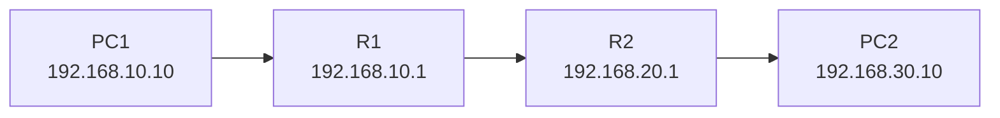

# 🌐⚡ Unidad de Trabajo 1 · CONCEPTOS BÁSICOS DE LA FAMILIA DE PROTOCOLOS DE INTERNET (TCP/IP) ⚡🌐

### Fundamentos de direccionamiento, transporte, encaminamiento, NAT/PAT y modelo cliente/servidor.

> **SERVICIOS DE RED E INTERNET · CFGS ASIR · Material docente integral · 2026**
>
> Material autónomo actualizado para el perfil profesional de Técnico Superior en Administración de Sistemas Informáticos en Red. Laboratorio de referencia: **Cisco Packet Tracer**, **WSL + Ubuntu 26.04**, **VirtualBox + Ubuntu 26.04 Server** y **Docker Compose**.
>
> ### 🎯 Función curricular
>
> Unidad de fundamentos y prerrequisitos para interpretar los resultados de aprendizaje del módulo.

### Correspondencia curricular

UT1 es una **unidad de fundamentación transversal** para el módulo 0375. No se asigna artificialmente a un RA concreto: sus contenidos de TCP/IP, direccionamiento, routing, forwarding, NAT y preparación del laboratorio sirven de base para RA1–RA8. La correspondencia curricular específica comienza en UT2.

---
> 🧭 **Arquitectura común v6.6:** [Tierra Media · Packet Tracer · WSL · VirtualBox](ANEXO-XIX-Arquitectura-Laboratorio-v6.6.md). La práctica de esta UT se construye sobre el estado alcanzado en la UT anterior.


> 🧭 **ANTES DE UTILIZAR TCP/IP, IP, TCP, UDP, CIDR Y NAT/PAT**
>
> **TCP/IP** es la familia de protocolos que utilizaremos para explicar la comunicación en redes. **IP (Internet Protocol)** se ocupa del direccionamiento y encaminamiento; **TCP (Transmission Control Protocol)** proporciona transporte fiable y orientado a conexión; **UDP (User Datagram Protocol)** proporciona un transporte más simple y sin conexión. **CIDR (Classless Inter-Domain Routing)** permite expresar una red mediante dirección y longitud de prefijo, por ejemplo `/24`. **NAT (Network Address Translation)** modifica direcciones al atravesar un dispositivo intermedio y **PAT (Port Address Translation)** permite diferenciar conexiones mediante puertos.

> 🎯 **MISIÓN DE LA UT**
>
> Comprender cómo se direccionan, encaminan y transportan los datos en
> una red TCP/IP, y aprender a **observar y diagnosticar ese
> funcionamiento** mediante herramientas reales y simuladas.

> 🧭 **MAPA DE LA UNIDAD**
>
> ```text
>                         🌐 REDES TCP/IP
>                                │
>              ┌─────────────────┼─────────────────┐
>              │                 │                 │
>           🏠 IP          🚦 Encaminamiento   🔌 TCP / UDP
>              │                 │                 │
>              └─────────────────┼─────────────────┘
>                                │
>                           🔄 NAT / PAT
>                                │
>          ┌───────────────┬─────┴─────┬────────────────┐
>          │               │           │                │
>       Entorno I       Entorno II  Entorno III     Entorno IV
>    Packet Tracer       WSL +     VirtualBox +    Docker Compose
>                        Ubuntu     Ubuntu Server
>          │               │           │                │
>          └───────────────┴───────────┴────────────────┘
>                                │
>                                ▼
>                         🌐 SERVICIOS SRI
> ```
>
> 💡 **Idea guía:** no estudiaremos la red solo para memorizar conceptos. Aprenderemos a observar qué está haciendo realmente el sistema y a demostrarlo mediante comandos, simulaciones y capturas de tráfico.


------------------------------------------------------------------------

> 🧪 **LOS CUATRO ENTORNOS DE PRÁCTICAS**
>
> **I · Cisco Packet Tracer** — simulación de red y protocolos.  
> **II · WSL + Ubuntu 26.04** — herramientas, clientes y diagnóstico.  
> **III · VirtualBox + Ubuntu 26.04 Server** — administración de servidores completos.  
> **IV · Docker Compose** — infraestructura reproducible y multicontenedor.

### 🧪 Entornos hermanos de esta UT

Las cuatro opciones son **entornos hermanos**. Cambia la herramienta, no el modelo mental: **necesidad → protocolo → servicio → configuración → evidencia → diagnóstico**.

| Entorno | Función didáctica | Uso recomendado |
|---|---|---|
| **Entorno I · Cisco Packet Tracer** | Simulación de topologías y comportamiento de red | Fundamentos, routing, direccionamiento y DHCP cuando proceda |
| **Entorno II · WSL + Ubuntu 26.04** | CLI, clientes, scripts y diagnóstico | `curl`, `dig`, `ss`, `tcpdump` y pruebas |
| **Entorno III · VirtualBox + Ubuntu 26.04 Server** | Administración de servidores | Instalación, configuración, permisos, servicios y logs |
| **Entorno IV · Docker Compose** | Despliegue reproducible | Redes, puertos, volúmenes y healthchecks cuando sea portable |

> 🧠 **Transferencia:** no todas las prácticas deben ejecutarse en los cuatro entornos; la elección se justifica por el objetivo didáctico y la naturaleza técnica del servicio.


> 🏠 **ANALOGÍA · UNA RED COMO UNA CIUDAD**
>
> Imagina una ciudad. Cada vivienda necesita una dirección para recibir correo; las calles permiten desplazarse de una dirección a otra; los cruces deciden por qué camino continuar y el portal de un edificio distingue qué vecino debe recibir el paquete. En una red ocurre algo parecido: la **dirección IP** identifica el destino, el **encaminamiento** decide por dónde viajar y los **puertos** ayudan a entregar los datos al servicio correcto. Esta analogía no sustituye la definición técnica, pero ayuda a recordar qué problema resuelve cada elemento.


> 🏙️ **ANALOGÍA · UNA CIUDAD Y SU SISTEMA DE DIRECCIONES**
>
> Piensa en una ciudad con calles, números de portal y oficinas. La dirección IP permite localizar el edificio; la ruta es el recorrido por las calles; el puerto identifica la oficina dentro del edificio. El cartero puede conocer el barrio y el portal sin conocer la actividad concreta que ocurre dentro de cada oficina. Esta imagen mental ayuda a separar direccionamiento, encaminamiento y servicios.

## 🧪 0.1 Preparación común del laboratorio

La **preparación del entorno** se realiza una sola vez en la UT1. Las prácticas posteriores parten de este estado base y añaden únicamente sus requisitos específicos.

### 1. Identificar el puesto de trabajo

En Windows 11 recoge, como mínimo, nombre del equipo, interfaces, IPv4, máscara/prefijo, puerta de enlace, DNS y MAC. Puedes obtener los datos con:

```powershell
ipconfig /all
hostname
```

Conviene conservarlos en la **ficha del puesto** del laboratorio. Esa ficha sustituye al inventario informal y permite reconstruir una incidencia.

### 2. Preparar VirtualBox + Ubuntu Server 26.04 LTS

Crea una VM base con recursos suficientes para el laboratorio. Como punto de partida razonable: **2 vCPU, 2-4 GB de RAM y 20-30 GB de disco dinámico**. Ajusta los valores al equipo anfitrión y a la práctica.

Configura al menos una interfaz de administración y, cuando la práctica lo requiera, una segunda interfaz conectada a una red interna o solo-anfitrión.

Después de la instalación:

```bash
sudo apt update
sudo apt full-upgrade -y
sudo apt install -y openssh-server curl wget dnsutils net-tools tcpdump traceroute
```

Crea un **snapshot de estado limpio** antes de comenzar la primera práctica de administración de servicios.

### 3. Preparar Netplan

Localiza la configuración con:

```bash
ls -l /etc/netplan/
cat /etc/netplan/*.yaml
ip addr
ip route
```

Un cambio de red debe seguir siempre la secuencia:

```text
editar → validar → aplicar → comprobar → registrar
```

Nunca des por buena una configuración porque `netplan apply` termine sin mostrar un error: comprueba `ip addr`, `ip route` y, cuando proceda, DNS y conectividad desde otro host.

### 4. Preparar SSH

El laboratorio debe poder administrarse sin depender de la consola de VirtualBox. Desde Linux o Windows 11 utiliza OpenSSH. Para nuevas claves se recomienda **Ed25519**; RSA 4096 puede mantenerse como alternativa de compatibilidad.

```bash
ssh-keygen -t ed25519
ssh-copy-id usuario@IP_DEL_SERVIDOR
ssh usuario@IP_DEL_SERVIDOR
```

La clave privada **no se comparte**. La evidencia que se entrega es la configuración pública y la prueba de acceso, nunca la clave privada.

### 5. WSL + Ubuntu 26.04

WSL se utiliza como entorno cliente y de diagnóstico: `ip`, `ss`, `dig`, `curl`, `tcpdump`, scripts y automatización. No sustituye a VirtualBox para las prácticas que necesiten varias interfaces, routers o topologías completas.

### 6. Cisco Packet Tracer

Se reserva para simulación de topologías, direccionamiento, routing, VLAN y aquellas prácticas donde el objetivo sea observar el comportamiento de la red sin desplegar un servidor completo.

### 7. Docker Compose

El **Entorno IV** se mantiene al mismo nivel que los demás. Antes de usar Compose, comprueba:

```bash
docker version
docker compose version
```

El material usa Compose para reproducibilidad, redes de servicio, puertos, volúmenes y healthchecks; la preparación profunda está en el Anexo II y el Anexo VI.

### 8. Webmin como capa de apoyo

Webmin puede ser útil para relacionar una directiva con su representación gráfica, pero no sustituye la administración CLI.

> **Si puedes cambiarlo desde Webmin, debes poder localizar el cambio en el sistema y comprobarlo desde la terminal.**

**Material visual:** no se utilizan capturas sintéticas. Cuando una práctica necesite una pantalla de Webmin, se debe usar una captura real de la versión instalada o consultar la documentación oficial.

- [Webmin · documentación general](https://webmin.com/docs/)
- [Webmin · Network Configuration](https://webmin.com/docs/modules/network-configuration/)
- [Webmin · BIND DNS Server](https://webmin.com/docs/modules/bind-dns-server/)

### 9. Estado base verificable

Antes de pasar a UT2, el alumno debería poder demostrar:

```bash
ip addr
ip route
ss -lntup
systemctl --failed
hostnamectl
```

**Evidencia de preparación:** ficha del puesto, topología, estado de la VM, prueba SSH y captura de la configuración de red. A partir de aquí, cada práctica añade solo su configuración específica.

## 🎯 0. Objetivos

## 🧭 Guía de aprendizaje de la UT

**Objetivo principal:** Explicar y demostrar el recorrido de un paquete.

### 🚪 Antes de empezar

Responde sin consultar la teoría. No es una nota: sirve para decidir qué prerrequisitos recuperar.

1. ¿Qué concepto previo necesitas dominar?
2. ¿Qué problema resuelve la UT?
3. ¿Qué evidencia demostraría que funciona?
4. ¿Qué herramienta usarías primero para diagnosticar?
5. ¿Qué cambiarías solo después de obtener evidencia?

### 🎯 Lo que debes aprender

| Debes dominar | Evidencia observable |
|---|---|
| **IP/MAC y CIDR** | Explicación, comando, diagrama o evidencia verificable. |
| **rutas y siguiente salto** | Explicación, comando, diagrama o evidencia verificable. |
| **TCP/UDP y puertos** | Explicación, comando, diagrama o evidencia verificable. |
| **NAT/PAT** | Explicación, comando, diagrama o evidencia verificable. |

### ✅ Al terminar deberás poder

- Debes poder calcular una red.
- Debes poder demostrar una ruta.
- Debes poder relacionar puerto y proceso.
- Debes poder aislar un fallo por capas.

### 🔗 Para qué te sirve

- Conecta con IPv6.
- Conecta con namespaces de red.
- Conecta con observabilidad de red.

### 🧯 Regla de diagnóstico

**Predice → observa → formula hipótesis → cambia una sola variable → valida → documenta → revierte si procede.** Una incidencia no se considera cerrada hasta que puedes explicar su causa y reproducir la verificación.

## 🧭 Ruta de aprendizaje

> 🧠 **Cómo trabajar esta unidad**
>
> Esta unidad está pensada como una escalera: cada peldaño aporta una herramienta que necesitarás en el siguiente. Si un término, comando o procedimiento no te resulta familiar, no lo memorices a ciegas. Busca primero la explicación inmediata anterior, realiza el ejemplo mínimo y comprueba el resultado antes de continuar.

### 🟢 Nivel 1 · Comprender

Identifica el problema que resuelve el servicio, los componentes que participan y el recorrido básico de una comunicación.

### 🔵 Nivel 2 · Reproducir

Sigue una práctica guiada y consigue un funcionamiento verificable. Cada cambio debe ir acompañado de una comprobación.

### 🟣 Nivel 3 · Diagnosticar

Introduce o analiza un fallo, formula una hipótesis y utiliza evidencias —estado, configuración, puertos, red y registros— para localizar la causa.

### 🔴 Nivel 4 · Transferir

Resuelve un escenario nuevo utilizando el mismo modelo mental en otro entorno o con otra herramienta.


> 🧭 **PREPARACIÓN COMÚN DE LAS PRÁCTICAS**
>
> Todas las prácticas utilizan la misma rutina profesional: **situarse en el escenario → comprobar prerrequisitos → formular una predicción → cambiar una sola variable → validar → probar desde un cliente → recoger evidencias → diagnosticar si falla → documentar y, cuando proceda, revertir**. Esta guía común se explica una sola vez en la UT. Cada práctica añade únicamente las pistas que son propias de su objetivo.

### 🧪 Escalera de práctica

> 🔎 **PISTAS ESPECÍFICAS · 🧪 Escalera de práctica**
>
> **Qué debes fijar:** Explicita qué comportamiento debe observarse al finalizar y qué dato objetivo demostrará que el servicio está funcionando.
>
> **Evidencia:** Usa como evidencia principal el artefacto que mejor demuestre el objetivo de esta práctica; evita capturas sin contexto y conserva comando, salida y fecha de la prueba.
>
> **Pista de troubleshooting:** si el resultado no coincide con tu predicción, vuelve al último punto demostrado, conserva la evidencia y modifica una sola variable antes de repetir la prueba.

- **Práctica guiada:** sigue la secuencia completa y utiliza los comandos de comprobación indicados.
- **Práctica semiguiada:** se mantiene el objetivo y la arquitectura, pero debes decidir parte de la configuración y las pruebas.
- **Práctica autónoma:** recibes requisitos y restricciones; decides la implementación y debes justificarla.

Cuando una práctica admita estas tres modalidades, empieza por la guiada y elimina progresivamente las pistas. Esa retirada de apoyos convierte el mismo laboratorio en entrenamiento y, después, en evaluación auténtica.


### 🧪 Evidencia mínima de aprendizaje

Al cerrar una práctica debes poder enseñar **qué cambiaste, dónde lo cambiaste, cómo lo validaste, qué prueba demuestra que funciona y qué harías primero si volviera a fallar**.


Al finalizar esta unidad el alumnado deberá ser capaz de:

-   Explicar la arquitectura TCP/IP y relacionarla con el modelo OSI.
-   Diferenciar aplicación, transporte, red y acceso a red.
-   Explicar el modelo cliente/servidor.
-   Interpretar una dirección IP y su máscara.
-   Trabajar con CIDR y calcular redes, hosts y broadcast.
-   Distinguir direcciones públicas, privadas, loopback, enlace local y
    multicast.
-   Explicar cómo un host decide si un destino es local o remoto.
-   Interpretar una tabla de encaminamiento.
-   Diferenciar ruta conectada, ruta estática y ruta por defecto.
-   Explicar las diferencias funcionales entre TCP y UDP.
-   Interpretar puertos TCP y UDP.
-   Comprender el funcionamiento de NAT y PAT.
-   Explicar qué ocurre con una conexión cuando atraviesa un dispositivo
    NAT.
-   Comprender las diferencias entre NAT, red interna, adaptador puente
    y red solo-anfitrión en VirtualBox.
-   Utilizar herramientas reales para observar la configuración y el
    tráfico:
    -   `ip`
    -   `ss`
    -   `ping`
    -   `traceroute` / `tracepath`
    -   `tcpdump`
    -   `curl`
    -   `nmap`
    -   Wireshark
-   Configurar y verificar redes sencillas en Packet Tracer.
-   Configurar redes estáticas y encaminamiento en Ubuntu Server.

------------------------------------------------------------------------

# 🚀 1. Introducción

Los servicios de red no funcionan de manera aislada. Para que un
navegador pueda acceder a un servidor web, para que un cliente pueda
consultar DNS o para que un equipo pueda conectarse mediante SSH,
intervienen diferentes protocolos y niveles de la arquitectura de red.

Esta unidad establece los conocimientos necesarios para comprender el
resto del módulo SRI.

El objetivo no es memorizar una lista de protocolos, sino responder
preguntas como:

-   ¿Cómo sabe un equipo dónde está otro equipo?
-   ¿Cómo decide si un destino está en su propia red?
-   ¿Cuándo necesita utilizar una puerta de enlace?
-   ¿Cómo sabe el sistema operativo qué proceso debe recibir un segmento
    TCP?
-   ¿Qué diferencia existe entre una comunicación TCP y una UDP?
-   ¿Qué cambia cuando un paquete atraviesa un router que realiza NAT?
-   ¿Qué podemos observar realmente en un sistema Linux?

------------------------------------------------------------------------

# 🧱 2. Arquitectura TCP/IP

> 🧭 **ANTES DE EMPEZAR · Modelo por capas**
>
> Antes de estudiar TCP/IP conviene entender una idea que aparecerá durante todo el módulo: una comunicación de red se divide en **capas**, y cada capa ofrece servicios a la superior. No necesitamos memorizar todavía todos los detalles del modelo OSI; basta con entender que esta separación permite analizar una comunicación por partes.

## 2.1. El modelo TCP/IP

La arquitectura TCP/IP puede representarse mediante cuatro capas
funcionales:

| Capa | Función principal | Ejemplos |
|---|---|---|
| Aplicación | Servicios utilizados por las aplicaciones | HTTP, DNS, SSH, SMTP, DHCP |
| Transporte | Comunicación extremo a extremo entre procesos | TCP, UDP |
| Internet | Direccionamiento y encaminamiento de paquetes | IP, IPv6, ICMP |

  Acceso a red            Transmisión sobre una   Ethernet, Wi-Fi
                          tecnología concreta     
  -----------------------------------------------------------------------

El modelo es conceptual. Un protocolo de una capa utiliza los servicios
de la capa inferior.

Por ejemplo, una petición HTTP puede utilizar:

```text
HTTP
 ↓
TCP
 ↓
IP
 ↓
Ethernet
```

En el receptor se produce el proceso inverso:

```text
Ethernet
 ↓
IP
 ↓
TCP
 ↓
HTTP
```

Este proceso se denomina **encapsulación** y **desencapsulación**.

💡 **Clave de examen:** TCP/IP y OSI son modelos de referencia. No
conviene confundir una correspondencia aproximada de capas con una
equivalencia uno-a-uno de protocolos.

## 2.2. TCP/IP frente al modelo OSI

El modelo OSI utiliza siete capas:

1.  Física
2.  Enlace de datos
3.  Red
4.  Transporte
5.  Sesión
6.  Presentación
7.  Aplicación

TCP/IP agrupa varias de ellas:

```text
OSI                         TCP/IP

Aplicación       ┐
Presentación     ├───────>  Aplicación
Sesión           ┘

Transporte       ────────>  Transporte

Red              ────────>  Internet

Enlace           ┐
Física           ┴───────>  Acceso a red
```

No debe interpretarse que un modelo sea una implementación concreta. Son
modelos de referencia que ayudan a organizar las funciones de
comunicación.

------------------------------------------------------------------------

# 🖥️ 3. Modelo cliente/servidor

El modelo cliente/servidor describe una relación entre procesos.

-   El **cliente** inicia normalmente una petición.
-   El **servidor** proporciona un servicio y permanece preparado para
    atender solicitudes.
-   La comunicación se realiza mediante protocolos de red.

Ejemplo:

```text
Cliente                          Servidor web

 navegador                       nginx
    │                               │
    │────── petición HTTP ─────────>│
    │                               │
    │<──── respuesta HTTP ──────────│
```

Un mismo equipo puede actuar simultáneamente como cliente y servidor.

Por ejemplo, un servidor Linux puede:

-   actuar como servidor SSH;
-   actuar como cliente DNS;
-   actuar como cliente NTP;
-   actuar como servidor web;
-   conectarse como cliente a otro servicio.

## 3.1. Servicio, aplicación y protocolo

No deben confundirse estos conceptos.

**Aplicación:** programa que utiliza o proporciona un servicio.

**Servicio:** funcionalidad ofrecida a otros sistemas o procesos.

**Protocolo:** conjunto de reglas que determina cómo se comunican dos
extremos.

Ejemplo:

```text
Servicio web
    │
    ├── servidor: nginx / Apache
    ├── cliente: navegador
    └── protocolo: HTTP/HTTPS
```

------------------------------------------------------------------------

# 🌐 4. IP: direccionamiento en la capa de Internet

## 4.1. La dirección IP

Una dirección IP tiene 32 bits.

Se representa habitualmente mediante cuatro octetos:

```text
192.168.10.25
```

Cada octeto tiene 8 bits:

```text
192       168       10        25
11000000  10101000  00001010  00011001
```

Por tanto:

```text
4 × 8 = 32 bits
```

El valor de cada octeto está entre:

```text
0 y 255
```

## 4.2. Dirección y prefijo

Una dirección IP no debe analizarse de forma aislada. Necesitamos
conocer el prefijo de red.

Ejemplo:

```text
192.168.10.25/24
```

El `/24` indica que los primeros 24 bits identifican la red.

```text
11111111.11111111.11111111.00000000
```

equivalente a:

```text
255.255.255.0
```

La parte restante identifica hosts dentro de esa red.

------------------------------------------------------------------------

# 🎭 5. Máscaras de red

## 5.1. Máscara tradicional

La máscara permite separar:

-   identificador de red;
-   identificador de host.

Ejemplo:

```text
IP:       192.168.10.25
Máscara:  255.255.255.0
```

En binario:

```text
IP:       11000000.10101000.00001010.00011001
Máscara:  11111111.11111111.11111111.00000000
```

La operación AND permite obtener la dirección de red:

```text
11000000.10101000.00001010.00011001
AND
11111111.11111111.11111111.00000000
=
11000000.10101000.00001010.00000000
```

Resultado:

```text
192.168.10.0
```

## 5.2. CIDR

CIDR expresa directamente el número de bits utilizados para la red.

Ejemplos:

| CIDR | Máscara | Hosts totales |
|---:|---|---:|
| /8 | 255.0.0.0 | 16 777 216 |
| /16 | 255.255.0.0 | 65 536 |
| /24 | 255.255.255.0 | 256 |
| /25 | 255.255.255.128 | 128 |
| /26 | 255.255.255.192 | 64 |
| /27 | 255.255.255.224 | 32 |
| /28 | 255.255.255.240 | 16 |
| /29 | 255.255.255.248 | 8 |
| /30 | 255.255.255.252 | 4 |

En una red IP convencional, la cantidad de direcciones utilizables
para hosts suele ser:

```text
2^(32-prefijo) - 2
```

El descuento corresponde a la dirección de red y a la dirección de
broadcast.

> **Importante:** existen excepciones y usos especiales, por lo que esta
> fórmula no debe aplicarse mecánicamente a todos los prefijos.

------------------------------------------------------------------------

# 📍 6. Direcciones IP especiales

## 6.1. Loopback

La red:

```text
127.0.0.0/8
```

se utiliza para comunicaciones internas del propio host.

La dirección más habitual es:

```text
127.0.0.1
```

Ejemplo:

``` bash
ping 127.0.0.1
```

La comunicación no sale por la interfaz física.

------------------------------------------------------------------------

## 6.2. Direcciones privadas

Los principales rangos privados IP son:

```text
10.0.0.0/8
172.16.0.0/12
192.168.0.0/16
```

Estas direcciones no son enrutable directamente en Internet público.

Son habituales en redes locales.

Ejemplo:

```text
192.168.1.0/24
```

------------------------------------------------------------------------

## 6.3. Link-local

En IP:

```text
169.254.0.0/16
```

se utiliza para direccionamiento local cuando un host no dispone de una
configuración IP válida mediante otros mecanismos.

Una dirección `169.254.x.x` **no significa que Internet esté
funcionando**.

------------------------------------------------------------------------

## 6.4. Broadcast

En una red IP se puede utilizar una dirección de broadcast para enviar
tráfico a todos los hosts de una red.

Por ejemplo, en:

```text
192.168.10.0/24
```

la dirección de broadcast es:

```text
192.168.10.255
```

------------------------------------------------------------------------

## 6.5. Multicast

El rango IP multicast es:

```text
224.0.0.0/4
```

Permite enviar tráfico a un grupo de receptores.

No debe confundirse:

```text
unicast   → un receptor
broadcast → todos los receptores de una red
multicast → miembros de un grupo
```

------------------------------------------------------------------------

# 📦 7. Cómo decide un host dónde enviar un paquete

Supongamos:

```text
Host A
IP: 192.168.10.20/24
Gateway: 192.168.10.1
```

y queremos acceder a:

```text
192.168.10.50
```

Ambas direcciones pertenecen a:

```text
192.168.10.0/24
```

Por tanto, el destino es local.

Si queremos acceder a:

```text
8.8.8.8
```

el destino no pertenece a la red local.

El host debe utilizar su **puerta de enlace predeterminada**.

```text
                 Internet
                    │
                    │
             192.168.10.1
                 Router
                    │
                    │
             192.168.10.0/24
              │             │
        192.168.10.20   192.168.10.50
```

La puerta de enlace no es "Internet". Es un dispositivo de capa 3 al que
el host entrega los paquetes destinados a redes que no conoce
directamente.

------------------------------------------------------------------------

> 🧭 **ANTES DE EMPEZAR · Tabla de encaminamiento**
>
> Un host no envía todos los paquetes directamente a su destino. Consulta una **tabla de rutas** para decidir por qué interfaz y hacia qué siguiente salto debe enviar cada paquete. Este concepto será imprescindible en DHCP relay, DNS, servidores y máquinas virtuales.

# 🗺️ 8. Tabla de encaminamiento

Cada host dispone de información que le permite decidir por dónde enviar
un paquete.

En Linux podemos consultar:

``` bash
ip route
```

Ejemplo:

```text
default via 192.168.10.1 dev enp0s3
192.168.10.0/24 dev enp0s3 proto kernel scope link src 192.168.10.20
```

Interpretación:

```text
default
    cualquier destino que no coincida con una ruta más específica

via 192.168.10.1
    siguiente salto

dev enp0s3
    interfaz de salida

192.168.10.0/24
    red directamente conectada

src 192.168.10.20
    dirección de origen preferida
```

## 8.1. Ruta por defecto

La ruta:

```text
default via 192.168.10.1
```

equivale conceptualmente a:

> "Si no existe una ruta más específica, utiliza 192.168.10.1."

------------------------------------------------------------------------

# 🚦 9. Encaminamiento

Un router recibe un paquete IP y consulta su tabla de encaminamiento.

Ejemplo:



R1 puede necesitar una ruta hacia:

```text
192.168.30.0/24
```

por R2.

Una ruta estática podría ser:

```text
192.168.30.0/24 via 192.168.20.2
```

## 9.1. Ruta conectada

Aparece automáticamente cuando una interfaz está configurada con una
red.

Por ejemplo:

```text
IP: 192.168.10.1/24
```

genera una red directamente conectada:

```text
192.168.10.0/24
```

## 9.2. Ruta estática

Es configurada explícitamente por el administrador.

Ventajas:

-   sencilla en redes pequeñas;
-   comportamiento predecible;
-   no necesita protocolo de routing.

Inconvenientes:

-   mantenimiento manual;
-   no se adapta automáticamente a cambios de topología;
-   escala mal.

## 9.3. Encaminamiento dinámico

Los routers pueden intercambiar información de encaminamiento mediante
protocolos específicos.

Ejemplos:

-   OSPF
-   BGP
-   RIP

En ASIR es importante distinguir el concepto de **routing** del de
**protocolo de routing**.

------------------------------------------------------------------------

# 🐧 10. Comandos Linux para estudiar el encaminamiento
### 📊 Tabla rápida de diagnóstico de red

| Necesidad | Comando | Qué observar |
|---|---|---|
| Interfaces y direcciones | `ip addr` | Interfaces, estado e IP/IPv6 |
| Tabla de rutas | `ip route` | Red destino, gateway e interfaz |
| Ruta hacia un destino | `ip route get IP` | Interfaz y siguiente salto elegidos |
| Vecinos | `ip neigh` | ARP/NDP y estado de vecinos |
| Sockets | `ss -lntup` | Procesos escuchando y protocolos |
| Conectividad | `ping IP` | Alcance IP y latencia |
| Camino | `tracepath IP` | Saltos y MTU |
| Captura | `sudo tcpdump -ni INTERFAZ` | Paquetes que realmente circulan |


## 🌐 Mostrar interfaces

``` bash
ip addr
```

Forma abreviada:

``` bash
ip a
```

## 🗺️ Mostrar rutas

``` bash
ip route
```

## 🎯 Consultar cómo se alcanzaría un destino

``` bash
ip route get 8.8.8.8
```

Ejemplo:

```text
8.8.8.8 via 192.168.10.1 dev enp0s3 src 192.168.10.20
```

## 🔗 Ver vecinos ARP/NDP

``` bash
ip neigh
```

## 🔌 Ver sockets

``` bash
ss -tulpen
```

## 📶 Comprobar conectividad

``` bash
ping -c 4 192.168.10.1
```

## 🧭 Seguir el camino

``` bash
tracepath 8.8.8.8
```

Si `tracepath` no está instalado:

``` bash
sudo apt install iputils-tracepath
```

------------------------------------------------------------------------

> 🧭 **ANTES DE EMPEZAR · Transporte**
>
> Hasta ahora hemos hablado de equipos y direcciones IP. Ahora introducimos una segunda dimensión: un mismo equipo puede ofrecer muchos servicios simultáneamente. Los **puertos TCP y UDP** permiten identificar esos servicios.

# 🚚 11. Nivel de transporte

IP proporciona comunicación entre hosts, pero una máquina puede tener
simultáneamente muchos procesos comunicándose.

Por ejemplo:

```text
192.168.10.20
 ├── navegador
 ├── SSH
 ├── DNS
 └── servidor web
```

Los **puertos** permiten identificar servicios y procesos de red.

Un extremo de una comunicación puede representarse mediante:

```text
IP + puerto + protocolo
```

Ejemplo:

```text
192.168.10.20:22/TCP
```

------------------------------------------------------------------------

# 🔌 12. Puertos TCP y UDP

Un puerto es un valor de 16 bits:

```text
0 - 65535
```

De forma conceptual:

           Rango Denominación habitual
  -------------- -----------------------
         0--1023 puertos conocidos
     1024--49151 registrados
    49152--65535 dinámicos/efímeros

Los rangos y usos concretos dependen de las normas de IANA y del sistema
operativo.

Ejemplos frecuentes:

| Servicio | Protocolo | Puerto |
|---|---|---:|
| HTTP | TCP | 80 |
| HTTPS | TCP | 443 |
| SSH | TCP | 22 |
| DNS | UDP/TCP | 53 |
| DHCP servidor | UDP | 67 |
| DHCP cliente | UDP | 68 |

------------------------------------------------------------------------

# ⚡ 13. UDP

UDP es un protocolo de transporte sin conexión.

Características:

-   no establece una conexión previa;
-   no garantiza la entrega;
-   no garantiza el orden;
-   tiene poca sobrecarga;
-   permite que la aplicación gestione mecanismos adicionales cuando los
    necesita.

Ejemplos de uso:

-   DNS;
-   DHCP;
-   streaming y aplicaciones multimedia;
-   determinadas aplicaciones interactivas;
-   protocolos modernos que implementan fiabilidad en capas superiores.

UDP es adecuado cuando la aplicación prefiere baja sobrecarga o controla
sus propios mecanismos de recuperación.

------------------------------------------------------------------------

# 🔗 14. TCP

TCP proporciona un servicio orientado a conexión.

Entre sus características están:

-   establecimiento de conexión;
-   numeración de secuencia;
-   confirmaciones;
-   retransmisión;
-   control de flujo;
-   control de congestión;
-   entrega ordenada del flujo de datos.

Una conexión TCP se identifica mediante los extremos de la comunicación.

Por ejemplo:

```text
Cliente
192.168.10.20:49152
        │
        │ TCP
        ▼
Servidor
192.168.10.30:443
```

------------------------------------------------------------------------

# 🤝 15. Establecimiento de una conexión TCP

El establecimiento clásico utiliza el **three-way handshake**:

```text
Cliente                         Servidor

   SYN ──────────────────────────>

       <──────────────────── SYN/ACK

   ACK ──────────────────────────>

             conexión establecida
```

Después pueden transmitirse datos.

Para cerrar una conexión TCP intervienen normalmente segmentos FIN y
ACK.

------------------------------------------------------------------------

> 🧭 **ANTES DE EMPEZAR · NAT/PAT**
>
> NAT modifica información de direccionamiento cuando un paquete atraviesa un dispositivo intermedio. PAT amplía esta idea permitiendo que múltiples conexiones compartan una dirección mediante la identificación de puertos. Este concepto será útil para comprender redes domésticas, VirtualBox y acceso a servicios.

> 🏠 **ANALOGÍA · UN EDIFICIO CON UNA SOLA DIRECCIÓN POSTAL**
>
> Un bloque de viviendas puede tener una única dirección postal visible desde la calle y, al mismo tiempo, muchas puertas interiores. Desde fuera se ve una dirección común; dentro, la portería debe saber a qué vivienda corresponde cada entrega. NAT y PAT permiten que muchos equipos de una red privada compartan una dirección pública y que las conversaciones puedan distinguirse mediante puertos.

# 🔄 16. NAT y PAT

## 16.1. Motivación

Las redes privadas utilizan habitualmente direcciones RFC 1918.

Ejemplo:

```text
192.168.1.0/24
```

Un router puede traducir estas direcciones para permitir la comunicación
con Internet.

NAT significa:

**Network Address Translation**

Cuando además se modifica el puerto para permitir que varios equipos
compartan una misma dirección pública, hablamos habitualmente de:

**PAT --- Port Address Translation**

------------------------------------------------------------------------

# 📤 17. NAT de salida

Supongamos:

```text
Cliente:
192.168.1.10:51500

Router:
IP pública 203.0.113.20
```

El cliente quiere acceder a:

```text
198.51.100.50:443
```

El router puede transformar:

```text
192.168.1.10:51500
```

en:

```text
203.0.113.20:40001
```

y mantener una asociación en su tabla NAT:

```text
192.168.1.10:51500
        ↕
203.0.113.20:40001
```

La respuesta recibida en:

```text
203.0.113.20:40001
```

puede asociarse con:

```text
192.168.1.10:51500
```

------------------------------------------------------------------------

# ↪️ 18. Port forwarding

El tráfico iniciado desde Internet hacia un servicio interno no puede
resolverse únicamente con NAT de salida.

Puede configurarse una regla de redirección:

```text
203.0.113.20:443
        ↓
192.168.1.20:443
```

Esto se denomina:

-   port forwarding;
-   DNAT en determinados contextos;
-   publicación de un servicio.

Debe distinguirse entre:

```text
SNAT/PAT
    cambia principalmente el origen

DNAT
    cambia principalmente el destino
```

------------------------------------------------------------------------

# ⚠️ 19. Limitaciones y consecuencias del NAT

NAT no es simplemente un mecanismo de "seguridad".

Puede:

-   ocultar direcciones privadas;
-   permitir compartir una IP pública;
-   modificar puertos;
-   complicar determinadas comunicaciones extremo a extremo;
-   introducir estado en el dispositivo intermedio;
-   requerir mecanismos adicionales para determinadas aplicaciones.

No debe afirmarse que:

> "NAT es un firewall."

Un firewall filtra tráfico según reglas de seguridad. NAT realiza
traducción de direcciones y/o puertos.

Un mismo dispositivo puede realizar ambas funciones, pero son conceptos
distintos.

------------------------------------------------------------------------

> 🧭 **ANTES DE EMPEZAR · Redes virtuales**
>
> Una máquina virtual no está obligada a aparecer en la red de la misma forma que el equipo físico. El hipervisor puede crear diferentes modos de conexión —NAT, puente o red privada— que determinan qué puede alcanzar la máquina virtual y qué equipos pueden alcanzarla.

# 🧩 20. Virtualización y redes virtuales

La virtualización permite ejecutar sistemas operativos invitados sobre
un sistema anfitrión.

En este módulo interesa especialmente porque permite construir
laboratorios completos sin disponer de varios equipos físicos.

Una arquitectura típica es:

```text
Hardware físico
      │
      ▼
Sistema anfitrión
      │
      ▼
VirtualBox
      │
      ├── Ubuntu Server 26.04 — router
      ├── Ubuntu Server 26.04 — servidor
      └── Ubuntu Server 26.04 — cliente
```

------------------------------------------------------------------------

# 🖧 21. Modos de red en VirtualBox

VirtualBox proporciona distintos modos de conexión.

Los más importantes para SRI son:

| Modo | Uso didáctico |
|---|---|
| NAT | Salida sencilla de la VM hacia el exterior |
| NAT Network | Varias VMs en una red NAT gestionada por VirtualBox |
| Bridged Adapter | La VM aparece en la red física como otro equipo |
| Host-only Adapter | Comunicación entre anfitrión y VMs |
| Internal Network | Comunicación entre VMs de la misma red virtual |

La documentación de VirtualBox distingue explícitamente estos modos,
incluyendo NAT, bridge, red interna y host-only.


### Recomendación para prácticas

Para construir una topología de routing:

```text
             NAT
              │
              │
        [Router Ubuntu]
          │          │
          │          │
      LAN-A        LAN-B
       │              │
    Cliente A      Servidor B
```

En VirtualBox:

-   adaptador 1 del router → NAT;
-   adaptador 2 → `SRI-LAN-A`;
-   adaptador 3 → `SRI-LAN-B`;
-   cliente → `SRI-LAN-A`;
-   servidor → `SRI-LAN-B`.

------------------------------------------------------------------------

# 🛠️ 22. Ubuntu Server 26.04 y Netplan

Ubuntu 26.04 LTS utiliza Netplan para la configuración de red y
actualiza Netplan a la serie 1.2. 

Una configuración estática sencilla puede ser:

``` yaml
network:
  version: 2
  ethernets:
    enp0s3:
      addresses:
        - 192.168.10.1/24
```

Aplicación:

``` bash
sudo netplan try
```

Si la configuración es correcta:

``` bash
sudo netplan apply
```

Comprobación:

``` bash
ip addr
ip route
```

> En un servidor remoto, `netplan try` es especialmente útil porque
> permite validar la configuración antes de dejarla aplicada de forma
> permanente.

------------------------------------------------------------------------

# 🐧 23. WSL como entorno de aprendizaje

WSL permite ejecutar una distribución Linux integrada con Windows sin
utilizar una VM tradicional completa. Microsoft recomienda
`wsl --install` para instalaciones actuales y las nuevas instalaciones
se configuran normalmente como WSL 2. 

Instalación:

``` powershell
wsl --install
```

Comprobación:

``` powershell
wsl --status
wsl --list --verbose
```

Debe comprobarse que la distribución utiliza:

```text
CONFIGURACIÓN DE REFERENCIA
```

Ubuntu 26.04 LTS dispone de soporte/documentación específica para WSL.


## 23.1. Qué prácticas son adecuadas para WSL

WSL es especialmente útil para:

-   aprender comandos Linux;
-   estudiar interfaces y rutas;
-   analizar sockets;
-   trabajar con SSH;
-   ejecutar servidores;
-   usar `curl`, `wget`, `ss`, `ip`, `ping`, `tcpdump`, etc.;
-   practicar Bash y automatización.

No debe utilizarse como sustituto de una topología de routers completa.
Para eso resulta más apropiado Packet Tracer o varias VMs.

------------------------------------------------------------------------

# 🔎 24. Herramientas fundamentales

## `ip`

``` bash
ip addr
ip link
ip route
ip neigh
```

Es la herramienta principal para consultar y modificar configuración de
red en Linux moderno.

## `ping`

``` bash
ping -c 4 192.168.1.1
```

Permite comprobar conectividad IP utilizando ICMP.

Un ping correcto demuestra una determinada conectividad ICMP; **no
demuestra que todos los servicios de aplicación estén funcionando**.

## `ss`

``` bash
ss -tulpen
```

Permite observar sockets TCP y UDP.

## `curl`

``` bash
curl -I https://www.juandecolonia.jc
```

Permite probar servicios HTTP/HTTPS desde la perspectiva de una
aplicación.

## `tcpdump`

``` bash
sudo tcpdump -ni any
```

Ejemplo filtrando ICMP:

``` bash
sudo tcpdump -ni any icmp
```

Ejemplo TCP:

``` bash
sudo tcpdump -ni any tcp
```

## `nmap`

``` bash
nmap -sT 192.168.1.10
```

Debe utilizarse únicamente sobre equipos y redes en los que tengamos
autorización.

------------------------------------------------------------------------


---

# 🗂️ Antes de las prácticas · dónde vive la configuración de red

Antes de tocar una red conviene saber **dónde está escrita su configuración**. Un técnico no trabaja a ciegas: primero localiza el fichero, después lo inspecciona, modifica lo mínimo y finalmente valida el resultado. Piensa en ello como buscar primero el cuadro eléctrico de una casa antes de cambiar un interruptor.

### 🐧 Entorno II · WSL + Ubuntu 26.04

```text
/etc/
├── resolv.conf                 → resolución DNS efectiva o gestionada
├── hosts                        → resolución local nombre ↔ IP
└── netplan/                     → configuración persistente cuando la distribución la utiliza

Comandos de inspección:
sudo find /etc/netplan -maxdepth 1 -type f -print
sudo sed -n '1,220p' /etc/netplan/*.yaml
ip addr
ip route
resolvectl status
```

En WSL parte de la red es gestionada por el propio subsistema. Por ello, para estudiar topologías completas con varias interfaces y routers utilizaremos preferentemente VirtualBox o Packet Tracer.

### 🖥️ Entorno III · VirtualBox + Ubuntu 26.04 Server

```text
/etc/netplan/*.yaml        → direccionamiento, rutas y DNS
/etc/hosts                  → nombres locales
/etc/systemd/resolved.conf  → comportamiento de systemd-resolved

Inspección rápida:
sudo ls -la /etc/netplan
sudo sed -n '1,220p' /etc/netplan/01-netcfg.yaml
ip addr
ip route
resolvectl status
```

**Regla profesional:** después de modificar Netplan, valida antes de dar por buena la configuración y comprueba siempre `ip addr`, `ip route` y resolución DNS.

### 🖥️ Desde Webmin

Webmin puede presentar parte de la configuración de red mediante sus módulos de **Networking**, pero no sustituye la comprensión de los ficheros y comandos. La práctica debe poder repetirse desde CLI aunque se haya utilizado la interfaz gráfica.


> 💡 **Idea clave:** Webmin es un panel de administración; `/etc` y las herramientas del sistema siguen siendo la fuente técnica que debemos saber localizar.


> 👨‍🏫 **Criterio de corrección de las prácticas**
>
> La solución de referencia no se reduce a una configuración final. Se valoran el proceso, la capacidad para localizar ficheros, validar la sintaxis, comprobar puertos y conectividad, interpretar logs y justificar técnicamente cada decisión. Cuando el ejercicio admita varias soluciones, cualquier solución equivalente y correctamente justificada es válida.
# 🧪 25. PRÁCTICA 1 --- IPv4 y encaminamiento con Cisco Packet Tracer · Tierra Media

## Objetivo

Construir y verificar una topología de tres redes IPv4 utilizando un único router Cisco, **Mordor**, como dispositivo de encaminamiento. La práctica sustituye el ejemplo genérico de dos LAN por una topología común que se reutilizará progresivamente en UT2 (DHCP) y UT3 (DNS).

### Topología de referencia


La topología está organizada en tres LAN:

``` text
                         MORDOR
              ┌────────────┼────────────┐
              │            │            │
        Fa0/0 │      Fa1/0 │      Fa4/0 │
        10.0.2.15     192.168.10.254  192.168.20.254
              │            │            │
        MEDIANOS       HOMBRES        ELFOS
              │            │            │
          Hobbiton    Gondor  Rohan  Lothlorien  Rivendel
          10.0.32.64  .64    .65     .192        .193
```

## 25.1. Plan de direccionamiento

| Zona | Red | Máscara | Gateway/router | Equipos principales |
|---|---|---|---|---|
| Comarca / Medianos | `10.0.0.0/16` | `255.255.0.0` | `10.0.2.15` | Hobbiton `10.0.32.64` |
| Hombres | `192.168.10.0/24` | `255.255.255.0` | `192.168.10.254` | Gondor `192.168.10.64`, Rohan `192.168.10.65`, Arnor `192.168.10.192` |
| Elfos / DMZ | `192.168.20.0/24` | `255.255.255.0` | `192.168.20.254` | Lothlorien `192.168.20.192`, Rivendel `192.168.20.193` |

En esta primera práctica las direcciones se configuran **manualmente**. En UT2, Gondor y Rohan pasarán a obtener su configuración mediante DHCP, conservando esas direcciones mediante reservas. En UT3, Lothlorien proporcionará el servicio DNS para el dominio `tierramedia.jc`.

> ⚠️ `10.0.32.64/16` pertenece a la red `10.0.0.0/16`, no a `10.0.32.0/24`. Es importante mantener esta máscara para que Hobbiton pueda comunicarse con la interfaz `10.0.2.15` de Mordor como parte de la misma LAN.

## 25.2. Configuración del router Mordor

En la CLI de Mordor:

``` text
enable
configure terminal
hostname Mordor

interface FastEthernet0/0
 ip address 10.0.2.15 255.255.0.0
 no shutdown
exit

interface FastEthernet1/0
 ip address 192.168.10.254 255.255.255.0
 no shutdown
exit

interface FastEthernet4/0
 ip address 192.168.20.254 255.255.255.0
 no shutdown
exit

end
write memory
```

Comprobar:

``` text
Mordor# show ip interface brief
Mordor# show ip route
Mordor# show running-config
```

Se deben observar tres redes directamente conectadas (`C`) en la tabla de routing:

``` text
10.0.0.0/16
192.168.10.0/24
192.168.20.0/24
```

## 25.3. Configuración de switches y enlaces de capa 2

Los tres switches son dispositivos de capa 2 y, en esta práctica, **no necesitan configuración de VLAN ni de routing**: todos sus puertos utilizados permanecen en la VLAN por defecto. Basta con conservar las conexiones de la topología y asignarles los nombres indicados:

Si se desea configurar el nombre desde CLI:

``` text
enable
configure terminal
hostname Medianos
end
write memory
```

Repetir con `hostname Hombres` y `hostname Elfos` en los otros dos switches.

| Switch | Zona | Enlaces principales de la imagen | Configuración IP necesaria |
|---|---|---|---|
| `Medianos` | Comarca | Mordor `Fa0/0` ↔ `Fa2/1`; Hobbiton `Fa0` ↔ `Fa1/1`; Cloud `Eth6` ↔ `Fa0/1` | Ninguna |
| `Hombres` | Hombres | Mordor `Fa1/0` ↔ `Fa0/1`; Gondor `Fa0` ↔ `Fa1/1`; Rohan `Fa0` ↔ `Fa2/1` | Ninguna |
| `Elfos` | Elfos | Mordor `Fa4/0` ↔ `Fa4/1`; Lothlorien `Fa0`; Rivendel `Fa0` | Ninguna |

> La topología mostrada utiliza switches como elementos de concentración. No es necesario asignarles una dirección IP para que reenvíen tráfico Ethernet. Una IP de gestión sería una ampliación independiente y no forma parte de esta práctica.

`Cloud-PT Cudernas` tampoco necesita configuración IP para demostrar el routing interno solicitado. Puede mantenerse como elemento gráfico de una futura ampliación hacia otra red.

## 25.4. Configuración de los equipos

### Hobbiton

**Desktop → IP Configuration → Static**:

``` text
IP Address:      10.0.32.64
Subnet Mask:     255.255.0.0
Default Gateway: 10.0.2.15
DNS Server:      192.168.20.192
```

### Gondor

``` text
IP Address:      192.168.10.64
Subnet Mask:     255.255.255.0
Default Gateway: 192.168.10.254
DNS Server:      192.168.20.192
```

### Rohan

``` text
IP Address:      192.168.10.65
Subnet Mask:     255.255.255.0
Default Gateway: 192.168.10.254
DNS Server:      192.168.20.192
```

### Lothlorien

Servidor DNS de la infraestructura:

``` text
IP Address:      192.168.20.192
Subnet Mask:     255.255.255.0
Default Gateway: 192.168.20.254
DNS Server:      192.168.20.192
```

### Rivendel

``` text
IP Address:      192.168.20.193
Subnet Mask:     255.255.255.0
Default Gateway: 192.168.20.254
DNS Server:      192.168.20.192
```

## 25.5. Comprobación progresiva

Desde Mordor:

``` text
Mordor# ping 10.0.32.64
Mordor# ping 192.168.10.64
Mordor# ping 192.168.10.65
Mordor# ping 192.168.20.192
Mordor# ping 192.168.20.193
```

Desde Hobbiton:

``` text
C:\> ping 10.0.2.15
C:\> ping 192.168.10.64
C:\> ping 192.168.10.65
C:\> ping 192.168.20.192
C:\> ping 192.168.20.193
```

Desde Gondor o Rohan:

``` text
C:\> ping 192.168.10.254
C:\> ping 10.0.32.64
C:\> ping 192.168.20.192
C:\> ping 192.168.20.193
```

Desde Lothlorien:

``` text
C:\> ping 192.168.20.254
C:\> ping 192.168.10.64
C:\> ping 192.168.10.65
C:\> ping 10.0.32.64
```

## 25.6. Diagnóstico

Si falla un ping, seguir este orden:

``` text
1. Estado de la interfaz       → show ip interface brief
2. Dirección y máscara         → IP/máscara del host
3. Puerta de enlace             → gateway correcto
4. Tabla de routing             → show ip route
5. ARP                          → arp -a
6. Ping al gateway              → conectividad local
7. Ping a una red remota        → encaminamiento
```

## 25.7. Preguntas

1. ¿Por qué `10.0.32.64/16` pertenece a `10.0.0.0/16`?
2. ¿Por qué Mordor necesita tres interfaces?
3. ¿Qué redes aparecen como directamente conectadas en `show ip route`?
4. ¿Qué ocurre si Hobbiton utiliza `/24` en lugar de `/16`?
5. ¿Por qué Gondor necesita como gateway `192.168.10.254`?
6. ¿Qué función tendrá Lothlorien en UT3?
7. ¿Qué diferencia existe entre alcanzar una IP del mismo segmento y alcanzar una IP de otra red?

# 🧪 26. PRÁCTICA 2 --- Inspección de red con WSL + Ubuntu 26.04

> 🔎 **PISTAS ESPECÍFICAS · -- Inspección de red con WSL + Ubuntu 26.04**
>
> **Qué debes fijar:** Empieza por observar antes de modificar: identifica interlocutores, puertos, protocolo y resultado esperado. Formula qué campo o paquete debería confirmar tu hipótesis.
>
> **Evidencia:** Usa como evidencia principal el artefacto que mejor demuestre el objetivo de esta práctica; evita capturas sin contexto y conserva comando, salida y fecha de la prueba.
>
> **Pista de troubleshooting:** si el resultado no coincide con tu predicción, vuelve al último punto demostrado, conserva la evidencia y modifica una sola variable antes de repetir la prueba.


## Objetivo

Observar la configuración real del sistema.

## 26.1. Identificar interfaces

``` bash
ip addr
```

Localiza:

-   interfaz Ethernet virtual;
-   dirección IP;
-   prefijo;
-   loopback.

## 26.2. Consultar rutas

``` bash
ip route
```

Identifica:

-   ruta por defecto;
-   interfaz utilizada;
-   gateway;
-   red directamente conectada.

## 26.3. Preguntar al kernel cómo alcanzará un destino

``` bash
ip route get 1.1.1.1
```

Repite:

``` bash
ip route get 192.168.1.1
ip route get 8.8.8.8
```

Compara los resultados.

## 26.4. Consultar vecinos

``` bash
ip neigh
```

Relaciona las entradas con ARP.

## 26.5. Observar sockets

``` bash
ss -tulpen
```

Localiza:

-   puertos TCP en escucha;
-   puertos UDP;
-   procesos asociados.

## 26.6. Capturar tráfico

Instalar:

``` bash
sudo apt update
sudo apt install tcpdump
```

Capturar ICMP:

``` bash
sudo tcpdump -ni any icmp
```

En otra terminal:

``` bash
ping -c 4 1.1.1.1
```

Analiza los paquetes capturados.

### Resultado esperado

El alumnado debe ser capaz de relacionar:

```text
ping
  ↓
ICMP
  ↓
IP
  ↓
interfaz
  ↓
ruta
```

------------------------------------------------------------------------


### 🧭 Guía de resolución y comprobación

Esta práctica se considera resuelta cuando puedes **explicar y demostrar** el resultado, no solo cuando el comando termina sin errores. Sigue siempre esta secuencia:

1. **Identifica el estado inicial.** Anota interfaces, direcciones, rutas y servicios que ya estaban activos.
2. **Aplica el cambio mínimo.** No modifiques varias cosas a la vez: si algo falla, necesitas saber qué cambio lo provocó.
3. **Valida inmediatamente.** Comprueba la sintaxis o el estado del servicio antes de probar desde el cliente.
4. **Prueba desde el punto de vista del usuario.** Una configuración correcta debe producir el comportamiento esperado desde el cliente, no solo desde el servidor.
5. **Observa evidencias.** Conserva la salida de comandos, logs, capturas de tráfico y capturas de pantalla que demuestren el resultado.

**Comandos de referencia para esta práctica:**

- `ip addr`
- `ip route`
- `ss -lntup`
- `journalctl -b --no-pager`
- `ping <destino>`

> 💡 **Si algo falla:** no empieces reiniciando. Compara primero **estado → configuración → logs → puertos → red → cliente**. Un reinicio puede ocultar la causa y hacer más difícil aprender de la incidencia.

### 🧪 Rúbrica de evaluación

| Criterio | Puntos | Evidencia esperada |
|---|---:|---|
| Comprensión del objetivo y del protocolo | 2 | Explica qué servicio/protocolo está utilizando y por qué. |
| Preparación y configuración | 2 | Ficheros, comandos o topología correctamente preparados. |
| Verificación funcional | 2 | Demuestra el resultado desde un cliente o herramienta adecuada. |
| Diagnóstico y razonamiento | 2 | Utiliza evidencias para justificar la solución. |
| Documentación técnica | 1 | Incluye comandos, configuraciones y capturas relevantes. |
| Seguridad y buenas prácticas | 1 | Aplica permisos, exposición de puertos y credenciales con criterio. |
| **Total** | **10** | **Superación recomendada: ≥ 5 puntos y práctica funcional.** |


# 🧪 27. PRÁCTICA 3 --- Tierra Media en VirtualBox: Mordor como router Linux

> 🔎 **PISTAS ESPECÍFICAS · -- Tierra Media en VirtualBox**
>
> **Qué debes fijar:** no construyas una red nueva para esta práctica. Parte del **ecosistema Tierra Media común** y reproduce en VirtualBox las mismas tres zonas que ya has utilizado en Packet Tracer.
>
> **Evidencia:** entrega el esquema de red, la asignación de adaptadores de las cinco VMs, `ip addr`, `ip route`, las pruebas de conectividad y una breve explicación de por qué cada paquete utiliza una determinada interfaz.
>
> **Pista de troubleshooting:** si una prueba falla, comprueba en este orden: adaptador VirtualBox → enlace → IP/máscara → ruta → forwarding de Mordor → firewall/NAT → servicio de destino.

## 1. Partimos del ecosistema Tierra Media

La infraestructura de VirtualBox **no es una topología alternativa**: es la versión Linux de la misma arquitectura didáctica que ya has construido en Packet Tracer.

```text
                         🟨 RED EXTERNA
                          10.0.0.0/16
                               │
                         ┌─────┴─────┐
                         │   MORDOR  │
                         │ Linux     │
                         │  ROUTER   │
                         └──┬─────┬──┘
                            │     │
             🟩 INTERNA     │     │     🟧 DMZ
             192.168.10.0/24│     │     192.168.20.0/24
                            │     │
                 ┌──────────┼─┐ ┌─┼──────────┐
                 │          │ │ │ │          │
              Gondor      Rohan│ │ Lothlorien Rivendel
              .64          .65 │ │   .192       .193
                               │ │
                         (servicios)
```

La correspondencia con Packet Tracer es:

| Zona | Red | Gateway Mordor | Equipos principales |
|---|---|---|---|
| 🟨 Externa | `10.0.0.0/16` | `10.0.2.15` en PT | Hobbiton `10.0.32.64` |
| 🟩 Interna | `192.168.10.0/24` | `192.168.10.254` | Gondor `.64`, Rohan `.65` |
| 🟧 DMZ | `192.168.20.0/24` | `192.168.20.254` | Lothlorien `.192`, Rivendel `.193` |

> **Importante:** `10.0.2.15` es la dirección de Mordor en el escenario de Packet Tracer. En VirtualBox la interfaz externa puede obtener otra dirección mediante DHCP. **No copies mecánicamente la IP externa de Packet Tracer**; conserva, en cambio, la función de la zona y el direccionamiento interno/DMZ del ecosistema.

## 2. Las cinco VMs del laboratorio

La arquitectura de VirtualBox queda fijada así:

| VM | Zona | Dirección | Función |
|---|---|---|---|
| **Mordor** | Externa + interna + DMZ | `192.168.10.254`, `192.168.20.254` + IP externa | router/gateway Linux y, posteriormente, DHCP |
| **Gondor** | Interna | `192.168.10.64/24` | cliente interno |
| **Rohan** | Interna | `192.168.10.65/24` | cliente interno |
| **Lothlorien** | DMZ | `192.168.20.192/24` | servidor principal de servicios y DNS |
| **Rivendel** | DMZ | `192.168.20.193/24` | servidor auxiliar, secundario y de pruebas |

**Arnor no forma parte de las cinco VMs de VirtualBox.** Se utiliza en Packet Tracer para la primera fase pedagógica de DHCP y después el servicio DHCP real se concentra en Mordor.

## 3. Diseñar primero las redes de VirtualBox

Antes de arrancar Ubuntu, representa mentalmente las tres zonas:

```text
VirtualBox
│
├── Adaptador externo de Mordor
│      └── salida hacia la red exterior
│
├── Red interna TIERRAMEDIA-INTERNA
│      ├── Mordor
│      ├── Gondor
│      └── Rohan
│
└── Red interna TIERRAMEDIA-DMZ
       ├── Mordor
       ├── Lothlorien
       └── Rivendel
```

Una configuración didáctica habitual es:

- adaptador externo de **Mordor** → NAT de VirtualBox o el mecanismo de salida definido por el laboratorio;
- red `TIERRAMEDIA-INTERNA` → conectada a Mordor, Gondor y Rohan;
- red `TIERRAMEDIA-DMZ` → conectada a Mordor, Lothlorien y Rivendel.

> **Regla:** Gondor/Rohan no necesitan un adaptador externo. Lothlorien/Rivendel tampoco. **Mordor es el único equipo que une las tres zonas.**

## 4. Configurar Mordor con Netplan

Primero descubre los nombres reales de las interfaces:

```bash
ip -br link
ip -br addr
```

Supongamos, únicamente como ejemplo, que:

```text
enp0s3 → externa
 enp0s8 → interna
 enp0s9 → DMZ
```

Crea `/etc/netplan/01-mordor.yaml`:

```yaml
network:
  version: 2
  ethernets:
    enp0s3:
      dhcp4: true

    enp0s8:
      addresses:
        - 192.168.10.254/24

    enp0s9:
      addresses:
        - 192.168.20.254/24
```

Observa la idea clave: **solo la interfaz externa necesita una ruta por defecto obtenida del exterior**. Las interfaces interna y DMZ son redes directamente conectadas a Mordor.

Validar y aplicar:

```bash
sudo netplan generate
sudo netplan try
sudo netplan apply
```

Comprobar:

```bash
ip -br addr
ip route
```

Debes reconocer tres piezas en la tabla de rutas:

```text
red externa      → obtenida por la interfaz externa
192.168.10.0/24  → conectada directamente a Mordor
192.168.20.0/24  → conectada directamente a Mordor
```

## 5. Convertir Mordor en router

Un router no es simplemente un equipo con tres tarjetas de red: debe **permitir el reenvío de paquetes entre interfaces**.

Comprobar:

```bash
sysctl net.ipv4.ip_forward
```

Activar temporalmente:

```bash
sudo sysctl -w net.ipv4.ip_forward=1
```

Hacerlo persistente:

```bash
printf 'net.ipv4.ip_forward=1\n' | sudo tee /etc/sysctl.d/99-sri-router.conf
sudo sysctl --system
```

Volver a comprobar:

```bash
sysctl net.ipv4.ip_forward
```

> **Analogía:** las tres interfaces son las tres puertas de Mordor; `ip_forward=1` permite que Mordor actúe como **aduana de tránsito**, no solo como destino final.

## 6. Configurar los equipos de la red interna

### Gondor

```yaml
network:
  version: 2
  ethernets:
    enp0s3:
      addresses:
        - 192.168.10.64/24
      routes:
        - to: default
          via: 192.168.10.254
```

### Rohan

```yaml
network:
  version: 2
  ethernets:
    enp0s3:
      addresses:
        - 192.168.10.65/24
      routes:
        - to: default
          via: 192.168.10.254
```

## 7. Configurar la DMZ

### Lothlorien

```yaml
network:
  version: 2
  ethernets:
    enp0s3:
      addresses:
        - 192.168.20.192/24
      routes:
        - to: default
          via: 192.168.20.254
```

### Rivendel

```yaml
network:
  version: 2
  ethernets:
    enp0s3:
      addresses:
        - 192.168.20.193/24
      routes:
        - to: default
          via: 192.168.20.254
```

En esta fase **no configures todavía DHCP en VirtualBox ni en los clientes**. La finalidad es demostrar primero que entiendes y controlas el direccionamiento y el encaminamiento. DHCP se introduce posteriormente en UT2.

## 8. Batería de pruebas progresiva

### Nivel 1 · cada equipo llega a su gateway

Desde Gondor:

```bash
ping -c 4 192.168.10.254
```

Desde Lothlorien:

```bash
ping -c 4 192.168.20.254
```

### Nivel 2 · Mordor llega a ambas redes

En Mordor:

```bash
ping -c 4 192.168.10.64
ping -c 4 192.168.10.65
ping -c 4 192.168.20.192
ping -c 4 192.168.20.193
```

### Nivel 3 · routing entre zonas

Desde Gondor:

```bash
ping -c 4 192.168.20.192
ping -c 4 192.168.20.193
```

Desde Lothlorien:

```bash
ping -c 4 192.168.10.64
ping -c 4 192.168.10.65
```

### Nivel 4 · salida exterior

Solo cuando los niveles anteriores funcionen:

```bash
ping -c 4 1.1.1.1
```

Si este último nivel falla pero los anteriores funcionan, **no vuelvas a tocar Netplan sin motivo**: el problema ya está probablemente en la salida, el forwarding, el filtrado o el NAT. Esa distinción prepara la práctica siguiente.

## 9. Qué debes ser capaz de explicar

Al finalizar, debes poder responder sin mirar los comandos:

1. ¿Por qué Gondor usa `192.168.10.254` como gateway?
2. ¿Por qué Lothlorien usa `192.168.20.254`?
3. ¿Por qué Mordor necesita tres interfaces?
4. ¿Por qué una interfaz interna no debe recibir una puerta de enlace adicional?
5. ¿Qué diferencia hay entre tener una ruta hacia una red y permitir el forwarding?
6. ¿Qué parte de esta arquitectura es idéntica a Packet Tracer y qué parte cambia al pasar a Ubuntu/VirtualBox?

------------------------------------------------------------------------

### 🧭 Guía de resolución y comprobación

Esta práctica se considera resuelta cuando puedes **explicar y demostrar** el resultado, no solo cuando el comando termina sin errores. Sigue siempre esta secuencia:

1. **Identifica el estado inicial.** Anota adaptadores de VirtualBox, interfaces, direcciones y rutas.
2. **Compara con el esquema Tierra Media.** No inventes una red nueva para solucionar un fallo.
3. **Aplica el cambio mínimo.** No modifiques varias cosas a la vez.
4. **Valida inmediatamente.** Comprueba sintaxis y estado antes de continuar.
5. **Prueba por capas.** Gateway → red remota → salida exterior.
6. **Observa evidencias.** Conserva salidas de `ip`, `ping`, `tracepath` y logs cuando sean relevantes.

> 💡 **Si algo falla:** vuelve al último nivel demostrado. Si Gondor llega a Mordor pero no a Lothlorien, no empieces comprobando Internet: céntrate en forwarding/rutas/firewall entre las dos zonas internas.

### 🧪 Rúbrica de evaluación

| Criterio | Puntos | Evidencia esperada |
|---|---:|---|
| Comprensión del ecosistema | 2 | Relaciona las cinco VMs con las tres zonas y explica el papel de Mordor. |
| Preparación y configuración | 2 | Adaptadores VirtualBox, Netplan y forwarding correctamente preparados. |
| Verificación funcional | 2 | Demuestra gateway, routing entre zonas y salida cuando corresponda. |
| Diagnóstico y razonamiento | 2 | Aísla la capa donde aparece un fallo y justifica el diagnóstico. |
| Documentación técnica | 1 | Incluye esquema, comandos, configuración y evidencias. |
| Seguridad y buenas prácticas | 1 | Mantiene separadas las zonas y evita configuraciones innecesarias. |
| **Total** | **10** | **Superación recomendada: ≥ 5 puntos y práctica funcional.** |

# 🧪 28. PRÁCTICA 4 --- NAT en Ubuntu Server con nftables

> 🔎 **PISTAS ESPECÍFICAS · -- NAT y nftables en Tierra Media**
>
> **Qué debes fijar:** NAT y firewall son conceptos relacionados, pero **no son lo mismo**. En esta práctica debes ser capaz de explicar qué hace cada uno antes de escribir una regla.
>
> **Evidencia:** entrega el recorrido de un paquete de Gondor hacia Internet, el ruleset utilizado y las pruebas que demuestran qué ocurre antes y después de aplicar NAT.
>
> **Pista de troubleshooting:** primero demuestra routing; después forwarding; después filtrado; finalmente NAT. No intentes resolver con `masquerade` un problema que en realidad sea una ruta ausente.

## 1. Volvemos al esquema Tierra Media

La práctica parte **exactamente de la red construida en el punto 27**:

```text
                       INTERNET
                           ▲
                           │
                    🟨 EXTERNA
                           │
                     ┌─────┴─────┐
                     │   MORDOR  │
                     │ nftables  │
                     └──┬─────┬──┘
                        │     │
              🟩 INTERNA     🟧 DMZ
            192.168.10.0/24 192.168.20.0/24
                 │                 │
          Gondor / Rohan     Lothlorien / Rivendel
```

El problema que queremos resolver es:

> **¿Cómo puede Gondor, cuya dirección `192.168.10.64` pertenece a una red privada, salir a Internet a través de Mordor sin que Internet necesite una ruta de retorno hacia `192.168.10.0/24`?**

La respuesta combina **routing + forwarding + NAT**.

## 2. Antes de nftables: tres conceptos que no debes mezclar

### Routing: «¿por qué puerta debe salir?»

El routing decide el **camino**.

Analogía: Gondor quiere enviar una caravana fuera de Tierra Media. La tabla de rutas indica que debe dirigirse a **Mordor**, porque Mordor es la puerta de salida de la red.

En Gondor:

```bash
ip route
```

Debes encontrar una ruta por defecto semejante a:

```text
default via 192.168.10.254
```

### Forwarding: «¿Mordor permite que la caravana atraviese su territorio?»

Mordor recibe un paquete que **no está destinado a Mordor**. Debe decidir si lo reenvía por otra interfaz.

```bash
sysctl net.ipv4.ip_forward
```

Debe estar a `1`.

### NAT: «¿qué dirección presenta la caravana al salir?»

Gondor utiliza una dirección privada:

```text
192.168.10.64
```

Internet no debe recibir esa dirección como origen de una comunicación normal de salida. NAT modifica la información de dirección para que el tráfico salga utilizando la dirección de la interfaz externa de Mordor.

En Linux, para este escenario utilizaremos **masquerade**, una forma de NAT especialmente útil cuando la dirección externa puede cambiar.

> **Idea clave:** routing decide **por dónde**, forwarding decide **si se puede atravesar Mordor** y NAT decide **con qué dirección sale hacia el exterior**.

## 3. ¿Qué es nftables? Una analogía con Mordor

Piensa en Mordor como una fortaleza con distintos accesos.

```text
                 MORDOR
        ┌──────────────────────┐
        │ 📖 REGLAMENTO        │ ← table
        │                      │
        │ 🚪 Puerta de entrada│ ← input
        │ 🔀 Aduana de tránsito│ ← forward
        │ 🚪 Puerta de salida │ ← output
        │                      │
        │ 🏷️ Reescritura      │ ← NAT/postrouting
        └──────────────────────┘
```

`nftables` es el mecanismo con el que escribimos las reglas que determinan **qué tráfico se acepta, qué tráfico se rechaza y qué transformación se aplica**.

### La jerarquía

```text
table
  └── chain
       └── rule
```

Piensa en ello así:

- **tabla** → un **reglamento** para una familia de tráfico;
- **chain (cadena)** → un **puesto de control** donde se examina el tráfico;
- **rule (regla)** → una **instrucción concreta**: «si ocurre X, haz Y».

No confundas esta jerarquía con una configuración YAML o JSON: `/etc/nftables.conf` utiliza la **sintaxis propia de nftables**.

## 4. ¿Dónde se aplican las cadenas?

Las cadenas principales de un router se entienden mejor siguiendo el recorrido real de un paquete. Primero entra en el sistema, después Linux decide si el destino es el propio Mordor o si debe reenviarlo.

```text
                    llega a Mordor
                          │
                    PREROUTING
                          │
                   decisión de ruta
                    ┌─────┴─────┐
                    │           │
              destino local   otro destino
                    │           │
                 input       forward
                    │           │
                 Mordor       │
                                ▼
                          postrouting
                                │
                         interfaz de salida
                                │
                             exterior
```

Simplificación pedagógica: `input` trata tráfico destinado al propio Mordor, `forward` trata tráfico que **atraviesa** Mordor y `postrouting` permite realizar transformaciones de salida como `masquerade`. `output` se aplica al tráfico generado por el propio Mordor.

> **Idea importante:** un paquete de Gondor destinado a `1.1.1.1` **no entra en `input` para después pasar a `forward`**. Como el destino no es Mordor, la decisión de encaminamiento lo lleva por `forward`. Esta distinción evita una confusión muy habitual al comenzar con Netfilter.

## 5. El viaje de Gondor a Internet, paso a paso

Supongamos que Gondor hace:

```bash
ping -c 4 1.1.1.1
```

El paquete comienza conceptualmente así:

```text
Gondor
192.168.10.64
      │
      │ destino 1.1.1.1
      ▼
Mordor · 192.168.10.254
      │
      │ FORWARD
      ▼
Mordor · interfaz externa
      │
      │ POSTROUTING + MASQUERADE
      ▼
Internet
```

Antes de NAT, el origen es:

```text
192.168.10.64 → 1.1.1.1
```

Después de NAT, el origen visible desde el exterior será la **dirección externa de Mordor**.

La respuesta vuelve por la interfaz externa. El seguimiento de estado de Netfilter permite asociarla a la conexión original y deshacer la traducción para entregar la respuesta a Gondor.

> 🎓 **Pregunta para comprobar que lo has entendido:** si eliminas la regla `masquerade` pero mantienes routing y forwarding, ¿por qué puede llegar el paquete hasta Internet y, sin embargo, la comunicación de vuelta no funcionar correctamente?

## 6. Instalar y localizar nftables

En Mordor:

```bash
sudo apt update
sudo apt install nftables
```

El fichero persistente del laboratorio es:

```text
/etc/nftables.conf
```

Pero **no empieces editando el fichero**. Primero observa qué hay activo:

```bash
sudo nft list ruleset
```

También identifica las interfaces reales:

```bash
ip -br addr
ip route
```

## 7. Primera regla: permitir el tránsito de las redes de Tierra Media

En esta práctica suponemos como ejemplo:

```text
enp0s3 → externa
 enp0s8 → interna 192.168.10.0/24
 enp0s9 → DMZ 192.168.20.0/24
```

**Comprueba los nombres con `ip -br addr` y sustitúyelos si son diferentes.**

Un ruleset didáctico inicial puede ser:

```nft
#!/usr/sbin/nft -f

flush ruleset

table inet filter {
    chain input {
        type filter hook input priority 0; policy drop;

        iif "lo" accept
        ct state established,related accept
        ip protocol icmp accept
        iifname "enp0s8" tcp dport 22 accept
    }

    chain forward {
        type filter hook forward priority 0; policy drop;

        ct state established,related accept
        iifname "enp0s8" oifname "enp0s3" accept
        iifname "enp0s9" oifname "enp0s3" accept
    }

    chain output {
        type filter hook output priority 0; policy accept;
    }
}
```

> ⚠️ **Compatibilidad con Webmin:** en una cadena base, mantén `type`, `hook`, `priority` y `policy` en la **misma línea**. La sintaxis de `nftables` permite escribir `policy` en una línea independiente, pero el módulo **Linux Firewall (nftables)** de Webmin puede interpretarla como si fuese una regla. Por ello, en este material se adopta deliberadamente la forma `type filter hook input priority 0; policy drop;`.

### Leer una regla en lenguaje humano

Esta línea:

```nft
iifname "enp0s8" oifname "enp0s3" accept
```

significa:

> «Si el paquete entra por la red interna de Tierra Media y va a salir por la interfaz externa, **permítelo**».

Y esta:

```nft
ct state established,related accept
```

significa, de forma simplificada:

> «Si este paquete pertenece a una comunicación que ya está permitida o está relacionada con ella, permite su retorno».

## 8. Añadir NAT: la etiqueta de salida de Mordor

Ahora añadimos una segunda tabla. Su función no es decidir si el tráfico está permitido, sino **transformar la dirección de origen cuando sale**.

```nft
table ip nat {
    chain postrouting {
        type nat hook postrouting priority srcnat; policy accept;

        oifname "enp0s3" ip saddr {
            192.168.10.0/24,
            192.168.20.0/24
        } masquerade
    }
}
```

La regla se puede leer como:

> «Si tráfico de la red interna o de la DMZ sale por la interfaz externa, traduce su dirección de origen usando `masquerade`».

Observa la separación conceptual:

```text
inet filter  → ¿puede pasar?
ip nat        → ¿cómo sale su dirección?
```

## 9. Flujo completo de trabajo: primero temporal, después persistente

### Paso 1 · inspeccionar

```bash
sudo nft list ruleset
```

### Paso 2 · hacer una prueba temporal

Puedes crear una tabla de laboratorio para entender la estructura:

```bash
sudo nft add table inet prueba
sudo nft add chain inet prueba input '{ type filter hook input priority 0; policy accept; }'
sudo nft list ruleset
```

Eliminarla:

```bash
sudo nft delete table inet prueba
```

### Paso 3 · editar el fichero persistente

```bash
sudo nano /etc/nftables.conf
```

### Paso 4 · comprobar sintaxis sin aplicar

```bash
sudo nft -c -f /etc/nftables.conf
```

Si no aparecen errores, cargar:

```bash
sudo nft -f /etc/nftables.conf
```

### Paso 5 · verificar el estado real

```bash
sudo nft list ruleset
sudo nft list table inet filter
sudo nft list table ip nat
```

### Paso 6 · comprobar la persistencia

```bash
sudo systemctl enable nftables
sudo systemctl restart nftables
sudo systemctl status nftables --no-pager
```

> **Regla didáctica fundamental:** primero aprende qué hace una regla en el **estado activo**, después la documentas en `/etc/nftables.conf` y finalmente compruebas que sobrevive al reinicio. No confundas «está cargada ahora» con «está configurada para el próximo arranque».

## 10. Verificación desde Tierra Media

Desde Gondor:

```bash
ping -c 4 192.168.10.254
ping -c 4 192.168.20.192
ping -c 4 1.1.1.1
```

Desde Lothlorien:

```bash
ping -c 4 192.168.20.254
ping -c 4 192.168.10.64
ping -c 4 1.1.1.1
```

En Mordor:

```bash
sudo nft list ruleset
ip route
```

Para observar el tránsito:

```bash
sudo tcpdump -ni enp0s3 host 1.1.1.1
```

> **Actividad de análisis:** captura una petición de Gondor hacia `1.1.1.1` y explica qué dirección de origen aparece antes de salir por Mordor y cuál se observa en la interfaz externa.

## 11. Webmin: la misma arquitectura, otra interfaz

Webmin dispone de un módulo **Linux Firewall (nftables)** dentro de **Networking**. Puede utilizarse para visualizar y gestionar tablas, cadenas y reglas.

La pedagogía debe seguir esta correspondencia:

```text
CLI nftables                         Webmin
────────────────────────────────────────────────
table                              → tabla
chain                              → cadena
rule                               → regla
Apply / cargar ruleset             → Apply Changes
nft list ruleset                   → comprobar estado
/etc/nftables.conf                → referencia persistente
```

Antes de aplicar un ruleset editado a mano, valida siempre su sintaxis:

```bash
sudo nft -c -f /etc/nftables.conf
```

En Webmin, comprueba especialmente que `policy` aparece como **política de la cadena** y no como una regla independiente. Si la interfaz muestra una política como regla, revisa la definición de la cadena y vuelve a dejar `type`, `hook`, `priority` y `policy` en una única línea.

Después de cualquier cambio realizado desde Webmin, vuelve a la CLI para comprobar el resultado:

```bash
sudo nft list ruleset
sudo nft -c -f /etc/nftables.conf
```

**No mezcles varios gestores de firewall sin saber cuál mantiene el estado activo.** En este laboratorio, `nftables` y su ruleset son la referencia técnica.

## 12. Preguntas de comprensión

1. ¿Por qué Gondor necesita a Mordor como gateway?
2. ¿Qué diferencia hay entre routing y forwarding?
3. ¿Qué problema resuelve `masquerade` que no resuelve una ruta?
4. ¿Por qué `forward` es más importante que `input` para un paquete que atraviesa Mordor?
5. ¿Qué representa una tabla? ¿Y una cadena? ¿Y una regla?
6. ¿Qué diferencia hay entre una regla cargada con `nft` y una regla guardada en `/etc/nftables.conf`?
7. ¿Por qué `nft -c -f /etc/nftables.conf` debe ejecutarse antes de recargar el servicio?
8. Si Gondor puede hacer ping a `192.168.20.192` pero no a `1.1.1.1`, ¿en qué parte del camino empezarías a investigar y por qué?

------------------------------------------------------------------------

### 🧭 Guía de resolución y comprobación

Esta práctica se considera resuelta cuando puedes **explicar y demostrar** el resultado, no solo cuando el comando termina sin errores. Sigue siempre esta secuencia:

1. **Estado:** `ip addr`, `ip route`, `nft list ruleset`.
2. **Routing:** demuestra que existe camino hacia el gateway y hacia el exterior.
3. **Forwarding:** demuestra `net.ipv4.ip_forward=1`.
4. **Filtrado:** identifica qué regla de `forward` permite o bloquea el tráfico.
5. **NAT:** comprueba la regla `postrouting` y `masquerade`.
6. **Persistencia:** valida `/etc/nftables.conf` y el servicio `nftables`.
7. **Evidencia:** conserva comandos, capturas y conclusiones.

> 💡 **Si algo falla:** no añadas reglas al azar. Formula primero una hipótesis: «el paquete no tiene ruta», «Mordor no reenvía», «el firewall lo bloquea» o «falta NAT». Después utiliza una evidencia que permita confirmar o descartar esa hipótesis.

### 🧪 Rúbrica de evaluación

| Criterio | Puntos | Evidencia esperada |
|---|---:|---|
| Comprensión de NAT/nftables | 2 | Explica routing, forwarding, filtrado y NAT sin confundirlos. |
| Configuración | 2 | Construye tablas, cadenas y reglas coherentes con Tierra Media. |
| Verificación funcional | 2 | Demuestra conectividad y salida mediante pruebas reproducibles. |
| Diagnóstico | 2 | Utiliza evidencias para localizar un fallo en el recorrido del paquete. |
| Documentación | 1 | Incluye fichero, sintaxis, comandos y explicación. |
| Buenas prácticas | 1 | Valida antes de aplicar y persiste solo después de probar. |
| **Total** | **10** | **Superación recomendada: ≥ 5 puntos y práctica funcional.** |

# 🧪 29. PRÁCTICA 5 --- Comparación de los cuatro entornos

> 🔎 **PISTAS ESPECÍFICAS · -- Comparación de los cuatro entornos**
>
> **Qué debes fijar:** Explicita qué comportamiento debe observarse al finalizar y qué dato objetivo demostrará que el servicio está funcionando. No compares por intuición: fija criterios comunes y utiliza la misma prueba para las alternativas.
>
> **Evidencia:** Usa como evidencia principal el artefacto que mejor demuestre el objetivo de esta práctica; evita capturas sin contexto y conserva comando, salida y fecha de la prueba.
>
> **Pista de troubleshooting:** si el resultado no coincide con tu predicción, vuelve al último punto demostrado, conserva la evidencia y modifica una sola variable antes de repetir la prueba.


## Objetivo

Resolver la misma cuestión de red en tres plataformas.

### Escenario

Tenemos:

```text
192.168.10.0/24
```

y queremos comprobar la conectividad entre dos hosts.

| Tarea | Packet Tracer | WSL | Ubuntu Server + VirtualBox |
|---|---|---|---|
| Configurar IP | GUI/CLI Cisco | `ip` / entorno WSL | Netplan |
| Ver interfaces | `show ip interface brief` | `ip addr` | `ip addr` |
| Ver rutas | `show ip route` | `ip route` | `ip route` |
| Ping | `ping` | `ping` | `ping` |
| Routing | Router Cisco | Limitado como laboratorio | Router Linux |
| NAT | Router Cisco | No es el entorno principal | Router Linux |
| Captura | Simulation Mode | `tcpdump` | `tcpdump` / Wireshark |
| Topologías complejas | Excelente | Limitado | Excelente |

------------------------------------------------------------------------

### 🧭 Guía de resolución y comprobación

Esta práctica se considera resuelta cuando puedes **explicar y demostrar** el resultado, no solo cuando el comando termina sin errores. Sigue siempre esta secuencia:

1. **Identifica el estado inicial.** Anota interfaces, direcciones, rutas y servicios que ya estaban activos.
2. **Aplica el cambio mínimo.** No modifiques varias cosas a la vez: si algo falla, necesitas saber qué cambio lo provocó.
3. **Valida inmediatamente.** Comprueba la sintaxis o el estado del servicio antes de probar desde el cliente.
4. **Prueba desde el punto de vista del usuario.** Una configuración correcta debe producir el comportamiento esperado desde el cliente, no solo desde el servidor.
5. **Observa evidencias.** Conserva la salida de comandos, logs, capturas de tráfico y capturas de pantalla que demuestren el resultado.

**Comandos de referencia para esta práctica:**

- `ip addr`
- `ip route`
- `ss -lntup`
- `journalctl -b --no-pager`
- `ping <destino>`

> 💡 **Si algo falla:** no empieces reiniciando. Compara primero **estado → configuración → logs → puertos → red → cliente**. Un reinicio puede ocultar la causa y hacer más difícil aprender de la incidencia.

### 🧪 Rúbrica de evaluación

| Criterio | Puntos | Evidencia esperada |
|---|---:|---|
| Comprensión del objetivo y del protocolo | 2 | Explica qué servicio/protocolo está utilizando y por qué. |
| Preparación y configuración | 2 | Ficheros, comandos o topología correctamente preparados. |
| Verificación funcional | 2 | Demuestra el resultado desde un cliente o herramienta adecuada. |
| Diagnóstico y razonamiento | 2 | Utiliza evidencias para justificar la solución. |
| Documentación técnica | 1 | Incluye comandos, configuraciones y capturas relevantes. |
| Seguridad y buenas prácticas | 1 | Aplica permisos, exposición de puertos y credenciales con criterio. |
| **Total** | **10** | **Superación recomendada: ≥ 5 puntos y práctica funcional.** |


# 📡 30. Actividad de análisis de tráfico

## Objetivo

Relacionar las capas TCP/IP con paquetes reales.

Instalar Wireshark en el sistema apropiado o realizar la captura con:

``` bash
sudo tcpdump -ni any -w ut1.pcap
```

Generar tráfico:

``` bash
ping -c 4 1.1.1.1
```

y:

``` bash
curl -I https://juandecolonia.jc
```

Abrir posteriormente:

```text
ut1.pcap
```

Analizar:

### ICMP

Identificar:

-   dirección origen;
-   dirección destino;
-   tipo;
-   código.

### TCP

Identificar:

-   SYN;
-   SYN/ACK;
-   ACK;
-   puertos;
-   números de secuencia.

### HTTP/HTTPS

Identificar:

-   IP origen/destino;
-   TCP;
-   puerto 443;
-   establecimiento de conexión.

------------------------------------------------------------------------

# 🩺 31. Actividad de diagnóstico

Ante el siguiente problema:

```text
PC
 │
 ├── IP: 192.168.10.20/24
 ├── GW: 192.168.20.1
 └── DNS: 8.8.8.8
```

el equipo no tiene conectividad.

Establecer un procedimiento de diagnóstico:

```text
1. ¿La interfaz está activa?
        ↓
2. ¿Tiene IP correcta?
        ↓
3. ¿La máscara es correcta?
        ↓
4. ¿Existe ruta?
        ↓
5. ¿La puerta de enlace responde?
        ↓
6. ¿Existe conectividad IP externa?
        ↓
7. ¿Funciona DNS?
        ↓
8. ¿Funciona la aplicación?
```

Comandos:

``` bash
ip link
ip addr
ip route
ping -c 4 192.168.10.1
ip route get 1.1.1.1
ping -c 4 1.1.1.1
resolvectl status
curl -I https://juandecolonia.jc
```

------------------------------------------------------------------------

# 🚨 32. Errores frecuentes

## Error 1 --- Confundir IP con puerta de enlace

La puerta de enlace no es la dirección IP del host.

Incorrecto:

```text
Host: 192.168.10.20
Gateway: 192.168.10.20
```

En una red convencional la puerta de enlace será otra interfaz del
segmento.

------------------------------------------------------------------------

## Error 2 --- Pensar que `/24` significa 24 hosts

`/24` indica:

```text
24 bits de red
8 bits restantes
```

No significa 24 hosts.

------------------------------------------------------------------------

## Error 3 --- Pensar que ping prueba un servicio

``` bash
ping servidor
```

comprueba ICMP.

No demuestra que:

```text
SSH
HTTP
DNS
SMTP
```

estén funcionando.

------------------------------------------------------------------------

## Error 4 --- Confundir NAT con firewall

NAT traduce direcciones/puertos.

Un firewall aplica políticas de filtrado.

Pueden coexistir.

------------------------------------------------------------------------

## Error 5 --- Usar `ifconfig` como herramienta principal

En sistemas Linux actuales debe priorizarse:

``` bash
ip addr
ip route
ip link
ip neigh
```

`ifconfig` pertenece al conjunto de herramientas tradicional
`net-tools`.

------------------------------------------------------------------------

## Error 6 --- Modificar alegremente la red de WSL

WSL no debe tratarse como si fuera una VM tradicional.

Primero se debe observar:

``` bash
ip addr
ip route
```

y entender la red proporcionada por WSL.

Para topologías con varios routers e interfaces se utilizará
preferentemente:

-   Packet Tracer;
-   varias máquinas virtuales.

------------------------------------------------------------------------

> 🧩 **De concepto a evidencia:** en esta UT cada idea importante debe
> poder relacionarse con una dirección, una ruta, un puerto, un paquete
> o una configuración observable.

## 📘 Glosario esencial de la UT

| Término | Definición |
|---|---|
| **CIDR** | Forma de expresar una red mediante dirección y longitud de prefijo, como `/24`. |
| **Gateway / puerta de enlace** | Dispositivo o dirección de siguiente salto usado para llegar a otras redes. |
| **IP** | Protocolo de la capa de Internet que proporciona direccionamiento y encaminamiento de paquetes. |
| **MAC** | Dirección de enlace asociada a una interfaz de red. |
| **MTU** | Unidad máxima de transmisión de una interfaz o camino de red. |
| **NAT** | Traducción de direcciones entre espacios de direccionamiento. |
| **PAT** | Forma de NAT que distingue múltiples flujos usando puertos. |
| **Puerto** | Identificador de extremo lógico usado por TCP o UDP para entregar tráfico a un proceso. |
| **Routing** | Proceso de decidir el siguiente salto de un paquete. |
| **TCP** | Protocolo de transporte orientado a conexión y con control de entrega. |
| **UDP** | Protocolo de transporte sin establecimiento de conexión y con mínima sobrecarga. |
| **NDP** | Neighbor Discovery Protocol de IPv6, usado entre otras funciones para descubrimiento de vecinos. |


## 🧩 Banco de ejercicios propuestos

Estos ejercicios complementan las prácticas. Se pueden utilizar para clase, trabajo autónomo, recuperación o examen práctico.

### 1. Explica por qué un host que conoce la IP del destino aún puede necesitar un gateway.

**Solución de referencia:** La tabla de rutas determina que el destino es remoto; el gateway es el siguiente salto elegido por la ruta adecuada.

### 2. Un servicio escucha en TCP/8080 pero `curl` no conecta. Diseña una secuencia de cinco comprobaciones.

**Solución de referencia:** Interfaz/ruta → `ss -lntp` → firewall → prueba local → prueba desde cliente; interpretar evidencia en cada paso.

### 3. Diseña una red con dos subredes y explica qué equipos necesitan una ruta estática.

**Solución de referencia:** Cada subred debe tener su prefijo, gateway y rutas necesarias; el router necesita conocer ambos prefijos y cada host el gateway apropiado.

### 4. Compara NAT de salida y port forwarding en un caso doméstico.

**Solución de referencia:** El primero modifica conexiones salientes; el segundo publica un servicio interno mediante una regla de traducción de destino/puerto.

# 📝 33. Resumen

En esta unidad hemos estudiado:

-   la arquitectura TCP/IP;
-   el modelo cliente/servidor;
-   las funciones de las capas;
-   IP;
-   máscaras y CIDR;
-   direccionamiento especial;
-   redes públicas y privadas;
-   encaminamiento;
-   tablas de rutas;
-   puertas de enlace;
-   puertos;
-   TCP;
-   UDP;
-   NAT;
-   PAT;
-   port forwarding;
-   virtualización;
-   redes de VirtualBox;
-   herramientas de diagnóstico Linux.

La idea fundamental es:

> **Una comunicación de red es el resultado de la interacción de varias
> capas y varios dispositivos. Para diagnosticarla debemos analizar cada
> nivel de forma sistemática.**

------------------------------------------------------------------------

# ❓ 34. Cuestiones de autoevaluación

1.  ¿Qué funciones corresponden a la capa Internet de TCP/IP?
2.  ¿Qué diferencias fundamentales existen entre TCP/IP y OSI?
3.  ¿Qué diferencia existe entre una aplicación y un protocolo?
4.  ¿Qué función desempeña un puerto?
5.  ¿Cuántos bits tiene una dirección IP?
6.  ¿Qué representa `/24`?
7.  ¿Cuál es la máscara correspondiente a `/27`?
8.  ¿Cuál es la dirección de red de `192.168.10.37/24`?
9.  ¿Cuál es el broadcast de `192.168.10.37/24`?
10. ¿Cuántas direcciones totales contiene una red `/26`?
11. ¿Qué rangos IP son privados?
12. ¿Para qué sirve `127.0.0.1`?
13. ¿Qué significa una dirección `169.254.x.x`?
14. ¿Qué diferencia existe entre unicast, broadcast y multicast?
15. ¿Qué es una ruta directamente conectada?
16. ¿Qué es una ruta por defecto?
17. ¿Qué comando Linux permite consultar la tabla de routing?
18. ¿Qué comando permite saber qué ruta utilizará Linux para un destino?
19. ¿Qué diferencia fundamental existe entre TCP y UDP?
20. ¿Qué es el three-way handshake?
21. ¿Qué información identifica un extremo TCP?
22. ¿Qué problema pretende resolver NAT?
23. ¿Qué diferencia existe entre NAT y PAT?
24. ¿Qué es port forwarding?
25. ¿Por qué NAT no debe considerarse un firewall?
26. ¿Qué diferencia existe entre una red NAT y una red interna de
    VirtualBox?
27. ¿Qué ventaja tiene una red host-only?
28. ¿Qué utilidad tiene una interfaz puente?
29. ¿Qué papel desempeña Netplan en Ubuntu Server?
30. ¿Qué información proporcionan `ip addr` e `ip route`?
31. ¿Qué diferencia existe entre `ping` y `curl` como herramientas de
    diagnóstico?
32. ¿Qué información permite observar `ss -tulpen`?
33. ¿Para qué utilizarías `tcpdump`?
34. ¿Qué entorno elegirías para simular tres routers Cisco y por qué?
35. ¿Qué entorno elegirías para estudiar la tabla de rutas real de Linux
    y por qué?
36. ¿Qué entorno elegirías para montar un router Linux real con dos
    redes y por qué?

------------------------------------------------------------------------

## ✅ Solucionario de la autoevaluación

> 📌 **Cómo usarlo:** intenta resolver primero las 36 cuestiones sin
> consultar esta sección. Después, utiliza el solucionario para
> comprobar el razonamiento, no solo para verificar una palabra
> concreta.

1.  **Capa Internet:** proporciona direccionamiento lógico y
    encaminamiento de paquetes entre redes. En IP intervienen
    principalmente IP y, en el modelo TCP/IP, también protocolos
    asociados como ICMP.

2.  **TCP/IP frente a OSI:** OSI es un modelo de referencia de siete
    capas; TCP/IP utiliza normalmente cuatro capas funcionales. La
    correspondencia no es estrictamente uno-a-uno: varias funciones de
    OSI se agrupan en las capas TCP/IP.

3.  **Aplicación vs. protocolo:** una aplicación es el programa o
    servicio que utiliza la red; un protocolo es el conjunto de reglas
    que permite que dos extremos se comuniquen. Por ejemplo, un
    navegador es una aplicación y HTTP es un protocolo.

4.  **Puerto:** identifica un servicio o proceso dentro de un host junto
    con la dirección IP y el protocolo de transporte. Permite distinguir
    diferentes comunicaciones dirigidas al mismo equipo.

5.  **IP:** una dirección IP tiene **32 bits**, normalmente escritos
    como cuatro octetos en decimal, por ejemplo `192.168.10.25`.

6.  **`/24`:** indica que los primeros **24 bits** corresponden al
    prefijo de red y quedan **8 bits** para la parte de host. La máscara
    es `255.255.255.0`.

7.  **`/27`:** la máscara es **`255.255.255.224`**.

8.  **Red de `192.168.10.37/24`:** **`192.168.10.0`**.

9.  **Broadcast de `192.168.10.37/24`:** **`192.168.10.255`**.

10. **Red `/26`:** contiene **64 direcciones totales** (`2^6`). En una
    red IP convencional, 62 pueden utilizarse como direcciones de host
    porque la dirección de red y el broadcast tienen usos reservados.

11. **Rangos privados IP:**

    -   `10.0.0.0/8`
    -   `172.16.0.0/12`
    -   `192.168.0.0/16`

12. **`127.0.0.1`:** es una dirección de **loopback**. Hace referencia
    al propio host a través de la interfaz de bucle local.

13. **`169.254.x.x`:** pertenece al rango IP **link-local**
    (`169.254.0.0/16`). En un contexto típico de cliente IP, puede
    aparecer cuando no se ha obtenido correctamente una configuración
    DHCP.

14. **Unicast / broadcast / multicast:**

    -   **Unicast:** un emisor → un receptor.
    -   **Broadcast:** un emisor → todos los hosts del dominio de
        broadcast correspondiente.
    -   **Multicast:** un emisor → un grupo de receptores suscritos.

15. **Ruta directamente conectada:** ruta que el host conoce porque una
    de sus interfaces está configurada en esa red. No necesita enviar el
    paquete a un router intermedio para alcanzar ese prefijo.

16. **Ruta por defecto:** ruta utilizada cuando no existe una ruta más
    específica que coincida con el destino. En un host suele apuntar a
    la puerta de enlace predeterminada.

17. **Tabla de routing en Linux:** `ip route`.

18. **Ruta que utilizará Linux para un destino:**
    `ip route get DESTINO`, por ejemplo `ip route get 8.8.8.8`.

19. **TCP vs. UDP:** TCP es orientado a conexión y proporciona
    mecanismos como entrega ordenada, retransmisión y control de flujo.
    UDP es no orientado a conexión y tiene una sobrecarga menor, dejando
    más funciones a protocolos o aplicaciones superiores.

20. **Three-way handshake:** proceso habitual de establecimiento de una
    conexión TCP mediante los segmentos **SYN → SYN/ACK → ACK**.

21. **Extremo TCP:** se identifica mediante la combinación de
    **dirección IP, puerto y protocolo de transporte**. Una conexión TCP
    completa queda determinada por el conjunto de origen y destino:
    IP/puerto origen + IP/puerto destino.

22. **Problema que resuelve NAT:** permite traducir direcciones entre
    distintos espacios de direccionamiento, por ejemplo haciendo posible
    que hosts con direcciones privadas accedan a redes externas mediante
    una dirección pública del dispositivo NAT.

23. **NAT vs. PAT:** NAT puede traducir direcciones IP; **PAT** añade la
    traducción de puertos para permitir que múltiples conexiones
    privadas compartan una misma dirección IP externa.

24. **Port forwarding:** regla que publica o redirige tráfico recibido
    en una dirección/puerto del lado externo hacia una dirección/puerto
    concreto de una red interna.

25. **NAT no es un firewall:** la traducción de direcciones y puertos no
    sustituye a una política explícita de filtrado. Un firewall decide
    qué tráfico se permite o se bloquea según reglas de seguridad.

26. **NAT vs. red interna de VirtualBox:** una red **NAT** proporciona
    conectividad hacia el exterior mediante el mecanismo NAT de
    VirtualBox; una **red interna** conecta máquinas entre sí dentro de
    una red virtual aislada de las redes externas, salvo que se añada un
    router o mecanismo específico que proporcione esa conectividad.

27. **Host-only:** permite crear una red privada entre el sistema
    anfitrión y las máquinas virtuales, sin necesidad de exponerlas
    directamente a la red física externa.

28. **Adaptador puente:** conecta virtualmente la máquina virtual a la
    red física mediante la interfaz del anfitrión, de forma que la VM
    puede comportarse como otro equipo de esa red, según la
    configuración y servicios disponibles.

29. **Netplan:** proporciona la configuración declarativa de red de
    Ubuntu. Permite definir interfaces, direcciones, rutas, DNS y otros
    parámetros y aplicar posteriormente esa configuración.

30. **`ip addr` e `ip route`:**

    -   `ip addr` muestra interfaces y direcciones configuradas.
    -   `ip route` muestra las rutas conocidas por el kernel.

31. **`ping` vs. `curl`:** `ping` permite comprobar conectividad
    mediante ICMP Echo cuando ese tráfico está permitido. `curl` genera
    peticiones a servicios de aplicación, por ejemplo HTTP/HTTPS, por lo
    que permite comprobar además aspectos del servicio accesible.

32. **`ss -tulpen`:** permite observar sockets y puertos en uso,
    incluyendo servicios TCP/UDP en escucha y, según las opciones y
    permisos, información del proceso asociado.

33. **`tcpdump`:** se utiliza para **capturar y analizar tráfico de
    red** en una interfaz, pudiendo observar protocolos, direcciones,
    puertos, flags y otros campos de los paquetes.

34. **Entorno para simular tres routers Cisco:** **Cisco Packet
    Tracer**, porque está diseñado específicamente para construir
    topologías de red Cisco y practicar configuración y encaminamiento
    sin disponer del hardware físico.

35. **Entorno para estudiar la tabla de rutas real de Linux:** **WSL +
    Ubuntu 26.04** resulta apropiado para observar el stack de red Linux
    en un entorno ligero; **VirtualBox + Ubuntu 26.04 Server** permite
    además trabajar con una topología Linux más completa y controlada.

36. **Entorno para montar un router Linux con dos redes:** **Ubuntu
    Server 26.04 + VirtualBox**, porque permite disponer de varias
    interfaces virtuales, configurar Netplan, activar forwarding,
    definir rutas y aplicar NAT en un escenario reproducible.

> 🧠 **Regla de oro para diagnosticar una red**
>
> ```text
> 1️⃣ ¿Tengo interfaz?
>        ↓
> 2️⃣ ¿Tengo dirección IP?
>        ↓
> 3️⃣ ¿Tengo ruta?
>        ↓
> 4️⃣ ¿Tengo gateway cuando lo necesito?
>        ↓
> 5️⃣ ¿Responde el destino?
>        ↓
> 6️⃣ ¿Está escuchando el servicio?
>        ↓
> 7️⃣ ¿El firewall/NAT está modificando o bloqueando algo?
> ```


## 🔄 Transferencia profesional

> 👨‍💼 **Cambia una condición sin cambiar el problema.** Una vez resuelto el escenario de referencia, modifica una sola condición —subred, servidor, nombre, firewall, número de clientes o entorno de despliegue— y adapta la solución. Explica qué permanece igual y qué debe cambiar.

### Reto de transferencia

1. Identifica qué ha cambiado.
2. Predice qué partes de la arquitectura afectará.
3. Localiza la configuración que tendrás que adaptar.
4. Haz el cambio mínimo.
5. Valida y vuelve a probar.
6. Documenta la diferencia respecto al escenario inicial.


## 🔗 Recursos oficiales y ampliación

- **Cisco Networking Academy / Skills for All:** https://skillsforall.com/
- **Ubuntu Server documentation:** https://ubuntu.com/server/docs

**Uso recomendado:** consultar la documentación oficial para comprobar sintaxis, compatibilidad y cambios de versión antes de reutilizar una receta.

# 📝 Test de repaso

## 1. ¿Qué representa `/24` en una dirección IPv4?
A. 24 hosts disponibles
B. 24 bits pertenecientes al prefijo de red
C. 24 bits de broadcast
D. 24 bytes de dirección

## 2. ¿Qué comando muestra la tabla de rutas de Linux?
A. `ip route`
B. `ip addr`
C. `ss -lnt`
D. `dig`

## 3. ¿Qué protocolo es orientado a conexión?
A. UDP
B. ICMP
C. TCP
D. ARP

## 4. ¿Qué función cumple PAT?
A. Traduce nombres DNS
B. Permite multiplexar conexiones usando puertos sobre una dirección traducida
C. Asigna direcciones mediante DHCP
D. Cifra el tráfico

## 5. ¿Qué herramienta permite observar tráfico directamente en Linux?
A. `tcpdump`
B. `passwd`
C. `hostname`
D. `mkdir`

## 6. ¿Qué red de VirtualBox permite comunicación entre VMs sin exponerlas directamente a la red física?
A. Bridged Adapter
B. NAT
C. Internal Network
D. Host-only siempre

## 7. ¿Qué información identifica de forma conjunta un extremo TCP?
A. Solo la dirección MAC
B. IP y puerto
C. Solo el puerto
D. Nombre DNS y MAC

## 8. ¿Qué diferencia fundamental existe entre NAT y un firewall?
A. Son exactamente lo mismo
B. NAT traduce direcciones/puertos; un firewall decide qué tráfico permite o bloquea según reglas
C. El firewall siempre traduce direcciones
D. NAT cifra todos los paquetes

## 9. ¿Qué comando permite saber qué ruta usaría Linux hacia un destino?
A. `ip route get`
B. `ip neigh flush`
C. `ss -s`
D. `hostnamectl`

## 10. ¿Qué entorno es especialmente apropiado para practicar routing con routers Cisco simulados?
A. Docker Compose
B. WSL
C. VirtualBox
D. Cisco Packet Tracer

### ✅ Respuestas

| Pregunta | Respuesta |
|---:|:---:|
| 1 | **B** |
| 2 | **A** |
| 3 | **C** |
| 4 | **B** |
| 5 | **A** |
| 6 | **C** |
| 7 | **B** |
| 8 | **B** |
| 9 | **A** |
| 10 | **D** |

# 🏆 35. Reto final

Construye la siguiente infraestructura:

```text
                         Internet
                            │
                           NAT
                            │
                      Router Linux
                    ┌───────┴───────┐
                    │               │
              192.168.10.1   192.168.20.1
                    │               │
                 Cliente         Servidor
              .10/24            .10/24
```

## Requisitos

1.  El cliente debe poder alcanzar al servidor.
2.  El servidor debe poder alcanzar al cliente.
3.  El router debe tener salida a Internet.
4.  El cliente debe utilizar el router como gateway.
5.  El servidor debe utilizar el router como gateway.
6.  Debe existir routing IP en el router.
7.  Debe existir NAT para la salida a Internet.
8.  Debes poder demostrar el funcionamiento mediante:
    -   `ip addr`;
    -   `ip route`;
    -   `ip neigh`;
    -   `ping`;
    -   `ip route get`;
    -   `tcpdump`.

## Entregables

```text
01-topologia.png
02-configuracion-router.md
03-configuracion-cliente.md
04-configuracion-servidor.md
05-pruebas.md
06-capturas/
```

El informe debe explicar **qué ocurre con un paquete desde que sale del
cliente hasta que llega al servidor**, indicando:

-   dirección IP origen;
-   dirección IP destino;
-   gateway;
-   interfaz de salida;
-   rutas utilizadas;
-   cambios producidos por NAT cuando corresponda.

------------------------------------------------------------------------

---

## 🔷 v6.6 · Laboratorio Tierra Media

### Caso integrado

UT1 deja preparada la infraestructura que todas las UT posteriores reutilizan: Mordor como router, tres zonas y las cinco VMs de VirtualBox.

### Configuración principal y sintaxis

- **Netplan:** `/etc/netplan/*.yaml` → **YAML**.
- **sysctl:** `/etc/sysctl.d/99-sri-router.conf` → pares `clave=valor`.
- **nftables:** `/etc/nftables.conf` → sintaxis propia de nft, organizada en tablas, cadenas y reglas.

### Persistencia y pruebas

```bash
sudo netplan generate
sudo netplan try
sudo netplan apply
ip addr
ip route

sudo sysctl --system
sysctl net.ipv4.ip_forward

sudo nft -c -f /etc/nftables.conf
sudo nft -f /etc/nftables.conf
sudo nft list ruleset
```

### Webmin

**Networking → Network Configuration** para interfaces y rutas; **Networking → Linux Firewall (nftables)** para el firewall. La configuración CLI y los ficheros siguen siendo la referencia técnica.

### Evidencia

Muestra `ip addr`, `ip route`, `sysctl net.ipv4.ip_forward`, `nft list ruleset` y pings entre zonas.

### Ruta práctica de tres entornos

```text
PACKET TRACER                 WSL                         VIRTUALBOX
Mordor + 3 redes       →     ip/ss/tcpdump        →     Mordor + clientes
routing y NAT                diagnóstico                 Netplan + sysctl + nftables
```

**Packet Tracer:** direccionamiento, `show ip interface brief`, `show ip route`, ping y traceroute.  
**WSL:** `ip addr`, `ip route`, `ss`, `tracepath`, `tcpdump`.  
**VirtualBox:** aplicar Netplan, habilitar forwarding y construir el ruleset nftables de Mordor.
