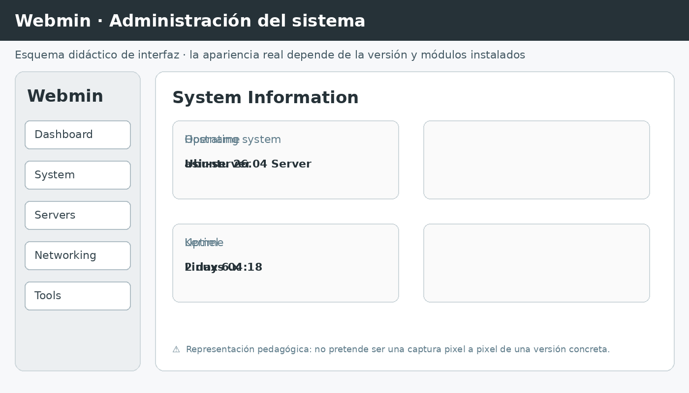

# 📡⚡ Unidad de Trabajo 2 · SERVICIO DE CONFIGURACIÓN DINÁMICA DE HOST (DHCP) ⚡📡

> 🧭 **ANTES DE EMPEZAR · VOCABULARIO TÉCNICO**
>
> Las siglas, abreviaturas y conceptos técnicos que van a aparecer en esta unidad se presentan aquí antes de su desarrollo. La explicación local de cada tema podrá ampliar estas definiciones cuando sea necesario.
>
> **UT** — Unidad de Trabajo: unidad didáctica del módulo profesional.
> **RA** — Resultado de Aprendizaje: capacidad que el alumnado debe demostrar al finalizar un bloque curricular.
> **CFGS** — Ciclo Formativo de Grado Superior.
> **ASIR** — Administración de Sistemas Informáticos en Red.
> **SRI** — Servicios de Red e Internet.
> **DHCP** — Protocolo de configuración dinámica de host: entrega automáticamente parámetros de red a los clientes.
> **IOS** — Cisco Internetwork Operating System, sistema operativo de muchos equipos de red Cisco.
> **ISC** — Internet Systems Consortium, organización que desarrolla software de infraestructura de Internet como BIND y Kea.
> **WSL2** — Windows Subsystem for Linux 2: tecnología de Windows que ejecuta un entorno Linux mediante una máquina virtual ligera.
> **CLI** — Interfaz de línea de comandos, es decir, administración mediante órdenes escritas.
> **IP** — Protocolo de Internet, responsable del direccionamiento y encaminamiento de paquetes.
> **NS** — Registro DNS que identifica servidores autoritativos de una zona.
> **KEA** — Servidor DHCP desarrollado por Internet Systems Consortium como alternativa moderna al servidor DHCP clásico de ISC.
> **RELAY** — Agente que reenvía mensajes DHCP entre redes distintas.
> **DORA** — Secuencia Discover, Offer, Request y Acknowledgement usada habitualmente para obtener una concesión IPv4 mediante DHCP.
> **LEASE** — Concesión temporal de parámetros de red entregada por DHCP.
> **Docker** — Plataforma de contenerización para construir, distribuir y ejecutar aplicaciones aisladas en contenedores.
> **Docker Compose** — Herramienta de Docker para definir y ejecutar aplicaciones multicontenedor mediante un archivo declarativo.
> **DNS** — Sistema de nombres de dominio: servicio distribuido que relaciona nombres con direcciones IP y otros datos.
> **DHCPDISCOVER** — Mensaje DHCP con el que un cliente busca servidores disponibles.
> **DHCPOFFER** — Mensaje DHCP con el que un servidor ofrece parámetros de configuración.
> **DHCPREQUEST** — Mensaje DHCP con el que un cliente solicita una oferta o confirma una concesión.
> **DHCPACK** — Mensaje DHCP que confirma una concesión y sus parámetros.
> **MAC** — Dirección de control de acceso al medio asociada a una interfaz de red.
> **POOL** — Conjunto de direcciones disponibles para asignación dinámica.
> **GUI** — Interfaz gráfica de usuario, es decir, administración mediante ventanas, menús y controles visuales.
> **JSON** — Formato textual para representar datos estructurados mediante objetos y listas.
> **DHCPNAK** — Mensaje DHCP que rechaza una solicitud o indica que la concesión solicitada no es válida.
> **UDP** — Protocolo de transporte sin conexión, ligero y sin garantía de entrega.
> **TCP** — Protocolo de transporte orientado a conexión que proporciona entrega fiable y ordenada.
> **LAN** — Red de área local.
> **POST** — Método HTTP usado normalmente para enviar datos al servidor para crear o procesar un recurso.
> **WEBMIN** — Interfaz web de administración de sistemas Linux y Unix.
> **GET** — Método HTTP usado normalmente para solicitar una representación de un recurso.
> **VLAN** — Red de área local virtual que permite separar lógicamente redes sobre infraestructura compartida.
> **EOL** — End of Life: momento a partir del cual un producto deja de recibir soporte normal del fabricante.
> **PUT** — Método HTTP usado normalmente para crear o reemplazar la representación de un recurso en una URI determinada.
> **MX** — Registro DNS que identifica los servidores que reciben correo.
> **SOA** — Registro DNS de autoridad de una zona que incluye información de temporización y control.
> **TLS** — Protocolo criptográfico que proporciona confidencialidad, integridad y autenticación mediante certificados.
> **BIND9** — Rama 9 de BIND, implementación de servidor DNS usada habitualmente en Linux.
>
> **Criterio didáctico:** no se presupone que conocer una sigla equivalga a comprender el concepto. Primero se identifica qué significa y qué función desempeña; después se emplea en comandos, configuraciones y prácticas.

> 🧩 **ANTES DE EMPEZAR · CONCEPTOS BASE**
>
> **Protocolo** — conjunto de reglas que define cómo se comunican dos o más sistemas.
> **Cliente** — programa o equipo que inicia una petición de un servicio.
> **Servidor** — programa o equipo que ofrece un servicio y atiende peticiones.
> **Servicio de red** — aplicación o proceso que ofrece una función accesible mediante la red, normalmente a través de uno o varios puertos.
> **Proceso** — instancia en ejecución de un programa dentro de un sistema operativo.
> **Demonio (daemon)** — proceso que permanece ejecutándose en segundo plano para prestar un servicio; en Linux es habitual que esté gestionado por `systemd`.
> **Puerto** — número lógico asociado a un servicio de transporte; permite distinguir varias comunicaciones que utilizan la misma dirección IP.
> **Socket** — extremo de comunicación que combina, según el contexto, una dirección IP, un puerto y un protocolo de transporte.
> **Interfaz de red** — componente físico o virtual mediante el que un sistema se conecta a una red.
> **Dirección IP** — identificador lógico de una interfaz dentro de una red IP.
> **Subred** — porción de un espacio de direccionamiento IP que comparte un prefijo común.
> **Puerta de enlace predeterminada** — equipo al que un host entrega el tráfico destinado a redes que no conoce directamente.
> **Encaminamiento (routing)** — proceso de decidir por qué camino debe avanzar un paquete para alcanzar su destino.
> **Tabla de encaminamiento** — conjunto de rutas que utiliza un sistema para decidir dónde enviar los paquetes.
> **Broadcast o difusión** — envío dirigido a todos los equipos de un dominio de difusión.
> **Unicast** — comunicación dirigida de un emisor a un receptor concreto.
> **Multicast** — comunicación dirigida a un grupo de receptores que se han suscrito al grupo.
> **Resolución de nombres** — proceso mediante el cual un sistema obtiene información asociada a un nombre, por ejemplo una dirección IP mediante DNS.
> **Caché** — almacenamiento temporal de resultados para poder reutilizarlos sin repetir inmediatamente una consulta o cálculo.
> **Archivo de configuración** — fichero que contiene parámetros con los que un programa determina cómo debe funcionar.
> **Validación** — comprobación de que una configuración tiene una sintaxis y una estructura aceptables antes de aplicarla.
> **Estado** — situación actual de un proceso, servicio, interfaz o recurso; conocerlo es esencial para diagnosticar una incidencia.
> **Registro (log)** — anotación generada por un programa o sistema para dejar constancia de eventos, errores y operaciones.
>
> Estos conceptos son el vocabulario común sobre el que se construyen las prácticas. Cuando una unidad introduzca un concepto especializado —por ejemplo, una zona DNS, una concesión DHCP, un virtual host, un contenedor o un Pod— se explicará de nuevo antes de utilizarlo operativamente.

> 🧠 **CONCEPTOS QUE NO DEBEMOS DAR POR SUPUESTOS**
>
> **`systemd`** — sistema de inicio y gestor de servicios habitual en Linux; `systemctl` permite consultar y administrar esos servicios.
> **Archivo de configuración** — fichero que contiene los parámetros con los que un servicio determina su comportamiento.
> **Registro DNS** — entrada de una zona DNS que asocia un nombre con un dato, como una dirección IP, un servidor de correo o un alias.
> **Zona DNS** — parte de la jerarquía DNS administrada por un servidor autoritativo concreto.
> **Servidor autoritativo** — servidor que posee la información oficial de una zona DNS y puede responder con autoridad sobre ella.
> **Resolver o resolvedor** — componente que realiza consultas DNS en nombre de una aplicación o de un usuario y obtiene la respuesta siguiendo el proceso de resolución.
> **Consulta recursiva** — consulta en la que el servidor consultado asume la tarea de obtener una respuesta completa para el cliente, si tiene habilitada la recursión.
> **Consulta iterativa** — consulta en la que el servidor responde con la mejor información que conoce, pudiendo remitir al consultante hacia otro servidor.
> **Concesión DHCP** — asignación temporal de una dirección IP y otros parámetros de red a un cliente.
> **Imagen de contenedor** — plantilla inmutable a partir de la cual se crean contenedores.
> **Volumen** — almacenamiento gestionado que permite conservar datos independientemente del ciclo de vida de un contenedor.
> **Red Docker** — red virtual administrada por Docker que permite conectar contenedores y, según su configuración, publicar servicios hacia el host.
> **Orquestación** — automatización de la ejecución, escalado, recuperación y coordinación de múltiples cargas de trabajo o contenedores.
> **Pod** — unidad mínima desplegable de Kubernetes; contiene uno o varios contenedores que comparten determinados recursos.
> **Virtual host** — configuración que permite que un mismo servidor web atienda distintos sitios o nombres mediante configuraciones diferenciadas.
> **Certificado digital** — credencial criptográfica que vincula una identidad con una clave pública y que puede estar firmada por una autoridad de certificación.
> **Códec** — algoritmo que codifica y decodifica audio, vídeo u otro tipo de datos; un códec no es lo mismo que un contenedor multimedia.
> **Contenedor multimedia** — formato de archivo que agrupa una o varias pistas de audio, vídeo, subtítulos o metadatos.
> **Streaming** — distribución de contenido de forma que el receptor puede comenzar a consumirlo mientras continúa recibiendo datos.
> **Commit** — instantánea registrada por Git que conserva un conjunto concreto de cambios.
> **Staging area** — área intermedia de Git donde se seleccionan los cambios que formarán el próximo commit.
> **Rama (branch)** — línea de desarrollo independiente dentro de un repositorio Git.
> **Remoto (remote)** — referencia a un repositorio Git externo con el que se intercambian commits mediante `fetch`, `pull` o `push`.
> **Codespace** — entorno de desarrollo remoto proporcionado por GitHub para trabajar con un repositorio.
> **Webmin** — interfaz web de administración de sistemas que permite gestionar determinados servicios y parámetros de un sistema Linux.
> **Roundcube** — cliente de correo web que accede al buzón mediante IMAP y puede enviar mensajes mediante SMTP.
> **Sympa** — gestor de listas de distribución que proporciona funciones de suscripción, moderación, administración y distribución de mensajes.

### RA2 · Configuración automática de red.

> **SERVICIOS DE RED E INTERNET · CFGS ASIR · Material docente integral · 2026**
>
> Material autónomo actualizado para el perfil profesional de Técnico Superior en Administración de Sistemas Informáticos en Red. Laboratorio de referencia: **Cisco Packet Tracer**, **WSL2 + Ubuntu 26.04** y **VirtualBox + Ubuntu 26.04 Server**.
>
> ### 🎯 Resultado de aprendizaje trabajado
>
> **RA2.** Administra servicios de configuración automática, identificándolos y verificando la correcta asignación de los parámetros.

---

> 🎯 **MISIÓN DE LA UT**
>
> Comprender cómo un cliente obtiene automáticamente su configuración de
> red, cómo se mantiene una concesión DHCP y cómo diseñar, configurar,
> verificar y diagnosticar un servicio DHCP en una red real o simulada.

> 💡 **Actualización importante**
>
> El material previo utiliza principalmente **ISC DHCP** y ejemplos
> basados en Windows Server 2008 y Debian. En esta versión se conserva
> la arquitectura conceptual del capítulo, pero las prácticas Linux se
> trasladan a **Kea DHCP**. ISC declaró ISC DHCP *End of Life* en 2022 y
> recomienda migrar a Kea. Ubuntu 26.04 incluye `kea-dhcp4-server` 3.0.3
> en sus repositorios.\
> Véase la documentación oficial de ISC y el catálogo de paquetes de
> Ubuntu.

------------------------------------------------------------------------

# 🧭 Mapa de la unidad

``` text
                         📡 DHCP
                           │
             ┌─────────────┼─────────────┐
             │             │             │
          🏠 CLIENTE    🖥️ SERVIDOR    🌉 RELAY
             │             │             │
             └───────┬─────┴─────┬───────┘
                     │           │
                  🔄 DORA     🗂️ ÁMBITOS
                     │           │
                ⏱️ LEASE     🧷 RESERVAS
                     │           │
                     └─────┬─────┘
                           │
                    🧪 VERIFICACIÓN
                           │
              ┌────────────┼────────────┐
              │            │            │
         Packet Tracer   Ubuntu 26.04   Wireshark
                          + Kea
┌──────────────────────────────────────────────────────────────────────┐
│ 🧪 ENTORNOS · I Packet Tracer · II WSL2 · III VirtualBox · IV Compose │
└──────────────────────────────────────────────────────────────────────┘
```

------------------------------------------------------------------------

> 🧪 **LOS CUATRO ENTORNOS DE PRÁCTICAS**
>
> **I · Cisco Packet Tracer** — simulación de red y protocolos.  
> **II · WSL2 + Ubuntu 26.04** — herramientas, clientes y diagnóstico.  
> **III · VirtualBox + Ubuntu 26.04 Server** — administración de servidores completos.  
> **IV · Docker Compose** — infraestructura reproducible y multicontenedor.


# 🎯 0. Objetivos

Al finalizar esta unidad deberás ser capaz de:

-   Explicar qué problema resuelve DHCP.
-   Diferenciar configuración manual y automática.
-   Identificar los componentes de una arquitectura DHCP.
-   Comprender las fases de obtención y renovación de una concesión.
-   Diferenciar **asignación manual, automática y dinámica**.
-   Trabajar con ámbitos, rangos, exclusiones y reservas.
-   Configurar opciones como máscara, gateway y DNS.
-   Comprender el formato y finalidad de los mensajes DHCP.
-   Analizar **DHCPDISCOVER, DHCPOFFER, DHCPREQUEST y DHCPACK**.
-   Comprender qué ocurre cuando cliente y servidor están en redes
    diferentes.
-   Configurar un **DHCP relay**.
-   Analizar tráfico DHCP con Wireshark.
-   Configurar un servidor DHCP moderno en Ubuntu 26.04 Server mediante
    **Kea**.
-   Diagnosticar errores de direccionamiento automático.

------------------------------------------------------------------------

# 🚀 1. Introducción

DHCP (*Dynamic Host Configuration Protocol*) permite proporcionar
automáticamente a los clientes los parámetros necesarios para
comunicarse mediante IP.

Un cliente DHCP puede recibir, entre otros:

-   Dirección IP.
-   Máscara de red.
-   Puerta de enlace predeterminada.
-   Servidores DNS.
-   Nombre de dominio.
-   Tiempo de concesión.
-   Otros parámetros definidos mediante opciones DHCP.

Sin DHCP, cada equipo tendría que recibir manualmente esta información.

``` text
              CONFIGURACIÓN MANUAL
              ─────────────────────
                 👨‍💻 Administrador
                        │
                        ├── IP
                        ├── Máscara
                        ├── Gateway
                        └── DNS


              CONFIGURACIÓN DHCP
              ──────────────────
                 🖥️ Cliente
                     │
                     │ DHCP
                     ▼
                📡 Servidor
                     │
             ┌───────┴───────┐
             ▼               ▼
            IP              DNS
```

------------------------------------------------------------------------

# 🧠 2. ¿Qué problema resuelve DHCP?

En una red pequeña puede parecer sencillo configurar manualmente todos
los equipos.

En una red con cientos o miles de dispositivos aparecen rápidamente
problemas:

-   Duplicación de direcciones.
-   Errores de máscara.
-   Gateways incorrectos.
-   DNS mal configurado.
-   Dificultad para modificar parámetros.
-   Equipos que cambian de ubicación.
-   Direcciones que quedan ocupadas innecesariamente.
-   Mayor carga administrativa.

DHCP centraliza esta configuración.

> ⚠️ **DHCP no sustituye al direccionamiento bien diseñado.**
>
> El administrador sigue teniendo que definir correctamente las redes,
> los rangos disponibles, las reservas y las opciones que recibirán los
> clientes.

------------------------------------------------------------------------

> 🧭 **ANTES DE EMPEZAR · Arquitectura DHCP**
>
> DHCP no es solamente «un servidor que entrega IP». Intervienen clientes, servidores, ámbitos de direcciones, opciones, concesiones y, cuando existen varias redes, agentes relay. Conviene conocer estos componentes antes de configurar el servicio.

# 🧱 3. Componentes del servicio DHCP

El funcionamiento puede entenderse mediante cuatro elementos
principales:

  Componente          Función
  ------------------- -------------------------------------
  📡 Servidor DHCP    Asigna direcciones y parámetros
  💻 Cliente DHCP     Solicita y utiliza la configuración
  📜 Protocolo DHCP   Define mensajes y reglas
  🌉 Relay DHCP       Transporta peticiones entre redes

``` text
       CLIENTE
          │
          │ DHCP
          ▼
    ┌─────────────┐
    │ DHCP SERVER │
    └─────────────┘

Si están en redes diferentes:

       CLIENTE
          │
          ▼
    🌉 DHCP RELAY
          │
          ▼
    DHCP SERVER
```

------------------------------------------------------------------------

# 🏷️ 4. Asignación de direcciones

El material previo distingue tres mecanismos.

## 4.1. Asignación manual o reserva

El administrador establece una correspondencia entre un cliente y una
dirección determinada.

Ejemplo conceptual:

``` text
MAC  00:11:22:33:44:55
          │
          ▼
       192.168.10.50
```

La dirección se entrega mediante DHCP, pero queda asociada al cliente.

En Kea puede realizarse mediante **host reservations**.

------------------------------------------------------------------------

## 4.2. Asignación dinámica

El servidor selecciona una dirección disponible de un conjunto o *pool*
y la entrega durante un tiempo determinado.

``` text
POOL DHCP

192.168.10.100 ─────────────── 192.168.10.200
       │                              │
       └──────── direcciones ─────────┘
```

La dirección pertenece al cliente durante una **concesión** (*lease*).

------------------------------------------------------------------------

## 4.3. Asignación automática

El servidor puede asignar una dirección de forma persistente siguiendo
la política configurada.

La distinción exacta entre automática y dinámica depende de la
implementación y de la política de administración utilizada.

------------------------------------------------------------------------

# 📦 5. Ámbitos, subredes y pools

Un servidor DHCP debe saber **para qué red** está sirviendo direcciones.

En terminología tradicional se habla de:

-   Ámbito.
-   Rango.
-   Exclusiones.
-   Reservas.
-   Opciones.

En Kea la configuración DHCP utiliza principalmente el concepto
`subnet4`, dentro del cual se pueden definir uno o varios `pools`.

Ejemplo:

``` text
SUBRED
192.168.10.0/24
       │
       ├── Gateway: 192.168.10.1
       ├── DNS:     192.168.10.10
       │
       └── POOL
           192.168.10.100 - 192.168.10.200
```

------------------------------------------------------------------------

# 🚫 6. Exclusiones

No todas las direcciones de una subred deben entregarse dinámicamente.

Por ejemplo:

``` text
192.168.10.0/24

.1       Router
.10      Servidor DNS
.20      Servidor web
.30      Impresora
.100-.200 DHCP
```

La zona dinámica debe evitar direcciones utilizadas por dispositivos con
configuración estática.

> 💡 En un diseño actual es frecuente separar claramente:
>
> -   infraestructura,
> -   servidores,
> -   dispositivos reservados,
> -   clientes dinámicos.

------------------------------------------------------------------------

# 🧷 7. Reservas DHCP

Una reserva permite que un cliente concreto reciba siempre una dirección
determinada.

En Kea una reserva puede asociarse, entre otros identificadores, a una
dirección MAC mediante `hw-address`.

Ejemplo:

``` json
{
  "reservations": [
    {
      "hw-address": "00:11:22:33:44:55",
      "ip-address": "192.168.10.50"
    }
  ]
}
```

> ⚠️ Una reserva **no es lo mismo que configurar manualmente la IP en el
> cliente**.
>
> En una reserva el cliente sigue utilizando DHCP.

------------------------------------------------------------------------

# ⏱️ 8. Tiempo de concesión --- Lease Time

Una dirección dinámica se entrega durante un periodo limitado.

``` text
     OBTENCIÓN
        │
        ▼
┌───────────────────┐
│   LEASE ACTIVA    │
└───────────────────┘
        │
        ├── renovación
        │
        └── expiración
```

El tiempo de concesión debe adaptarse al tipo de red.

### Red con pocos clientes

Puede utilizar concesiones largas.

### Red con muchos clientes temporales

Puede interesar reducir la duración.

Ejemplos:

-   Aula informática.
-   Red Wi-Fi de invitados.
-   Laboratorio.
-   Red de dispositivos temporales.

------------------------------------------------------------------------

> 🧭 **ANTES DE EMPEZAR · DORA y broadcast**
>
> Un cliente que todavía no conoce su configuración necesita localizar un servidor. Por eso el intercambio inicial utiliza mensajes DHCP y mecanismos de difusión. La secuencia **Discover → Offer → Request → ACK (DORA)** describe el proceso básico de obtención de una concesión IP.

# 🔄 9. Funcionamiento DHCP: DORA

La secuencia clásica para obtener una concesión IP se resume mediante
**DORA**:

``` text
        CLIENTE                         SERVIDOR
           │                                │
           │──── DHCPDISCOVER ─────────────>│
           │                                │
           │<──── DHCPOFFER ────────────────│
           │                                │
           │──── DHCPREQUEST ──────────────>│
           │                                │
           │<──── DHCPACK ──────────────────│
           │                                │
           ▼                                ▼
       CONFIGURADO                       CONCESIÓN
```

------------------------------------------------------------------------

# 📡 10. DHCPDISCOVER

El cliente todavía no dispone de una configuración IP válida para esa
red.

Emite un mensaje **DHCPDISCOVER** para localizar servidores DHCP.

En el escenario inicial puede utilizar difusión (*broadcast*).

------------------------------------------------------------------------

# 📤 11. DHCPOFFER

Un servidor DHCP que puede atender la petición responde con una oferta.

La oferta puede incluir:

-   Dirección IP propuesta.
-   Máscara.
-   Tiempo de concesión.
-   Gateway.
-   DNS.
-   Otras opciones.

------------------------------------------------------------------------

# 📬 12. DHCPREQUEST

El cliente selecciona una oferta y solicita formalmente la
configuración.

Cuando existen varios servidores, este mensaje también permite indicar
cuál ha sido seleccionado.

------------------------------------------------------------------------

# ✅ 13. DHCPACK

El servidor confirma la concesión mediante **DHCPACK**.

El cliente puede configurar entonces:

``` text
IP       → 192.168.10.101
Máscara  → 255.255.255.0
Gateway  → 192.168.10.1
DNS      → 192.168.10.10
Lease    → 8 horas
```

------------------------------------------------------------------------

# ❌ 14. DHCPNAK

El servidor puede responder con **DHCPNAK** cuando la solicitud no puede
aceptarse, por ejemplo porque la configuración solicitada no es válida
para la red atendida.

No debe confundirse con una simple ausencia de respuesta.

------------------------------------------------------------------------

# 🔁 15. Renovación de la concesión

Una concesión no permanece indefinidamente.

El cliente intenta renovarla antes de que expire.

``` text
          LEASE
            │
            │
       ┌────▼────┐
       │   T1    │ ──► intento de renovación
       └────┬────┘
            │
            │ si no responde
            ▼
       ┌─────────┐
       │   T2    │ ──► búsqueda más amplia
       └────┬────┘
            │
            ▼
        EXPIRACIÓN
```

La implementación concreta de T1 y T2 depende de la configuración y del
protocolo.

------------------------------------------------------------------------

# 🔌 16. Puertos utilizados por DHCP

DHCP para IP utiliza **UDP**.

  Función           Puerto
  --------------- --------
  Servidor DHCP     UDP 67
  Cliente DHCP      UDP 68

``` text
CLIENTE                         SERVIDOR
UDP 68  ───── DHCP ──────────► UDP 67
UDP 68  ◄──── DHCP ─────────── UDP 67
```

> 🧠 **Para recordar:** DHCP no utiliza TCP para el intercambio normal
> de mensajes DHCP.

------------------------------------------------------------------------

> 🧭 **ANTES DE EMPEZAR · DHCP Relay**
>
> Los routers separan dominios de broadcast. Por ello, un cliente DHCP situado en otra subred no puede depender de que su difusión atraviese el router como si fuera tráfico IP normal. Un **DHCP relay** recibe la petición y la reenvía hacia el servidor, conservando la información necesaria para identificar la red del cliente.

# 🌉 17. DHCP Relay
### 📊 DORA de un vistazo

| Mensaje | Origen → destino | Finalidad |
|---|---|---|
| DHCPDISCOVER | Cliente → broadcast/relay | Localizar servidores DHCP |
| DHCPOFFER | Servidor → cliente/relay | Proponer una configuración |
| DHCPREQUEST | Cliente → servidor/broadcast | Solicitar la concesión elegida |
| DHCPACK | Servidor → cliente | Confirmar la concesión |
| DHCPNAK | Servidor → cliente | Rechazar la solicitud |


Un broadcast DHCP no atraviesa routers de forma normal.

Por tanto:

``` text
❌ NO

LAN A ── DHCP Broadcast ──X── Router ──X── DHCP Server


✅ SÍ

LAN A
  │
  ▼
🌉 RELAY
  │
  │ DHCP reenviado
  ▼
DHCP SERVER
```

El relay recibe la petición en una red y genera/reenvía un mensaje hacia
el servidor DHCP.

En Cisco IOS se utiliza habitualmente:

``` text
interface GigabitEthernet0/0
 ip helper-address 192.168.20.10
```

El `ip helper-address` permite reenviar broadcasts UDP, incluyendo DHCP,
hacia el servidor configurado.

------------------------------------------------------------------------

# 🧭 18. ¿Cómo sabe el servidor qué red debe atender?

Cuando existe un relay, el mensaje reenviado incorpora información que
permite al servidor determinar la red desde la que procede la petición.

En Cisco aparece especialmente el campo **giaddr** (*gateway IP
address*).

``` text
CLIENTE
192.168.10.0/24
      │
      ▼
R1
192.168.10.1
      │
      │ relay
      ▼
DHCP SERVER
192.168.20.10
```

El servidor puede utilizar esa información para seleccionar el `subnet4`
correspondiente.

------------------------------------------------------------------------

# 🧩 19. DHCP en varias redes

Un único servidor DHCP puede proporcionar configuración a varias
subredes cuando existe conectividad y un mecanismo de relay.

``` text
                 DHCP SERVER
                 192.168.30.10
                       │
             ┌─────────┴─────────┐
             │                   │
          RELAY               RELAY
             │                   │
        192.168.10.0/24     192.168.20.0/24
```

Esto evita tener que desplegar un servidor DHCP independiente en cada
LAN.

------------------------------------------------------------------------

# 🧮 20. Opciones DHCP

Una dirección IP no es suficiente para configurar un cliente.

Entre las opciones habituales:

  Opción                  Función
  ----------------------- ------------------------
  `routers`               Gateway predeterminado
  `domain-name-servers`   Servidores DNS
  `domain-name`           Dominio
  `host-name`             Nombre del host
  `ntp-servers`           Servidores NTP
  `broadcast-address`     Broadcast de la red

En Kea se pueden establecer mediante `option-data`.

Ejemplo:

``` json
{
  "option-data": [
    {
      "name": "routers",
      "data": "192.168.10.1"
    },
    {
      "name": "domain-name-servers",
      "data": "192.168.10.10"
    }
  ]
}
```

------------------------------------------------------------------------

# 🗃️ 21. Base de datos de concesiones

El servidor necesita conservar información sobre las concesiones.

Kea puede utilizar distintos backends. Para un laboratorio sencillo es
especialmente útil `memfile`.

``` text
       KEA DHCP
          │
          ▼
    ┌──────────────┐
    │  LEASE DATA  │
    └──────────────┘
          │
          ├── cliente
          ├── dirección
          ├── estado
          └── tiempos
```

Para entornos más complejos puede utilizarse una base de datos como
MySQL/MariaDB o PostgreSQL, según la arquitectura desplegada.

------------------------------------------------------------------------

# 🛡️ 22. Varios servidores DHCP

El material previo introduce el funcionamiento con varios servidores
DHCP.

Puede utilizarse para:

-   redundancia,
-   continuidad del servicio,
-   reparto de carga,
-   disponibilidad.

Pero **dos servidores independientes no deben configurarse sin
coordinación sobre el mismo pool**, porque podrían producir asignaciones
conflictivas.

------------------------------------------------------------------------

# 🔄 23. Alta disponibilidad y DHCP Failover


La tecnología ha evolucionado. En el laboratorio actual se distinguirán:

-   el concepto de redundancia DHCP,
-   la coordinación de concesiones,
-   las implementaciones concretas de alta disponibilidad.

Kea dispone de mecanismos de **High Availability**, mientras que el
antiguo ISC DHCP Failover pertenece a una tecnología asociada al
software ya retirado.

> ⚠️ No se debe trasladar literalmente una configuración de `dhcpd.conf`
> antigua a Kea. Son productos y modelos de configuración diferentes.

------------------------------------------------------------------------

# 🔐 24. Seguridad DHCP

DHCP es un servicio crítico porque controla parte de la configuración de
red.

Amenazas posibles:

### 🕵️ DHCP Rogue

Un equipo no autorizado actúa como servidor DHCP.

``` text
CLIENTE
   │
   ├──── DHCPDISCOVER ────► Servidor legítimo
   │
   └──── DHCPDISCOVER ────► 🚨 Rogue DHCP
```

El cliente podría recibir:

-   gateway malicioso,
-   DNS controlado por un atacante,
-   direcciones incorrectas,
-   información de red manipulada.

### 🛡️ Medidas

En switches gestionables pueden utilizarse mecanismos como **DHCP
Snooping** y políticas de puertos.

------------------------------------------------------------------------

> 🧭 **PREPARACIÓN DIDÁCTICA**
>
> 🧭 **ANTES DE LA PRÁCTICA · QUÉ VAS A OBSERVAR**
> 
> Antes de teclear comandos, identifica el flujo esperado: cliente → descubrimiento → oferta → solicitud → confirmación. La práctica debe terminar con una concesión verificable, no simplemente con un servicio arrancado.

# 🖥️ Administración web con Webmin

La administración de servicios mediante terminal es una competencia fundamental en ASIR, pero una interfaz web puede resultar útil como **capa de observación y administración**, especialmente cuando queremos relacionar parámetros del servicio con su representación gráfica. Webmin no sustituye la comprensión de los ficheros de configuración ni de los comandos: es una interfaz sobre el sistema.

> 🧭 **IDEA CLAVE · WEBMIN ES EL CUADRO DE MANDOS, NO EL MOTOR**
>
> Imagina un automóvil: el volante y el salpicadero facilitan la conducción, pero no sustituyen el conocimiento del motor. En ASIR debemos saber qué cambia Webmin, dónde se almacena esa configuración y cómo comprobarla desde la terminal.



**Captura didáctica.** La interfaz real puede variar según la versión y los módulos instalados.

### Flujo recomendado

1. Comprueba el estado del servicio desde la terminal.
2. Abre Webmin y localiza el módulo correspondiente.
3. Realiza un cambio pequeño.
4. Comprueba qué configuración ha cambiado.
5. Valida la configuración.
6. Reinicia o recarga sólo si es necesario.
7. Verifica el resultado desde un cliente.

Comandos que conviene recordar:

```bash
systemctl status kea-dhcp4-server
sudo journalctl -u kea-dhcp4-server -n 50
sudo kea-dhcp4 -t /etc/kea/kea-dhcp4.conf
```

La práctica correcta es, por tanto, **GUI → configuración → validación → servicio → cliente**.


---

# 🗂️ Antes de las prácticas · localizar la configuración de DHCP

DHCP parece sencillo porque el cliente solo recibe una IP, pero detrás existe un servidor que mantiene **subredes, pools, reservas, opciones y concesiones**. Antes de configurarlo, aprende a encontrar cada pieza.

### 🐧 / 🖥️ Kea DHCP

```text
/etc/kea/
├── kea-dhcp4.conf           → configuración principal de DHCPv4
├── kea-dhcp6.conf           → configuración de DHCPv6, si se utiliza
└── kea-ctrl-agent.conf      → API de control, cuando está habilitada

/var/lib/kea/                → ficheros de estado/concesiones según backend
/var/log/                    → registros, según configuración del sistema
```

Comandos fundamentales:
sudo ls -la /etc/kea
sudo sed -n '1,260p' /etc/kea/kea-dhcp4.conf
sudo systemctl status kea-dhcp4-server
sudo journalctl -u kea-dhcp4-server --no-pager

Antes de reiniciar un servicio, valida la sintaxis con la herramienta de comprobación disponible en tu instalación. Una configuración DHCP incorrecta puede dejar sin dirección a toda una LAN.

### 🖥️ Webmin

Si la instalación dispone de un módulo DHCP compatible, localízalo en **Servers**. No des por hecho que Webmin dispone de un módulo actualizado para cada versión de Kea: si el módulo no representa una directiva, edítala y valídala desde CLI.

> 🧠 **Analogía:** el fichero de configuración es el plano de la oficina; Webmin es la recepción que te ayuda a llegar a algunas salas, pero el técnico debe conocer el plano completo.


> 👨‍🏫 **Criterio de corrección de las prácticas**
>
> La solución de referencia no se reduce a una configuración final. Se valoran el proceso, la capacidad para localizar ficheros, validar la sintaxis, comprobar puertos y conectividad, interpretar logs y justificar técnicamente cada decisión. Cuando el ejercicio admita varias soluciones, cualquier solución equivalente y correctamente justificada es válida.
# 🧪 25. PRÁCTICA 1 --- DHCP básico en Cisco Packet Tracer
> 🧭 **PREPARACIÓN DE LA PRÁCTICA**
>
> **1 · Sitúate.** Lee primero el objetivo y localiza en la unidad el concepto que estamos llevando a la práctica. No empieces copiando comandos: primero debes poder explicar qué componente estamos construyendo y para qué sirve.
>
> **2 · Prepara el entorno.** Comprueba si esta práctica utiliza **Entorno I · Packet Tracer**, **Entorno II · WSL2**, **Entorno III · VirtualBox + Ubuntu 26.04 Server** o **Entorno IV · Docker Compose**. Verifica conectividad, nombres, interfaces y estado de los servicios antes de modificar nada.
>
> **3 · Predice.** Antes de ejecutar un comando importante, escribe qué esperas que ocurra. Por ejemplo: «después de `ss -lnt`, espero encontrar el servicio escuchando en TCP/80». Esta pequeña predicción convierte la práctica en una investigación y no en una receta.
>
> **4 · Construye paso a paso.** Cada número debe dejar el sistema en un estado ligeramente más completo que el anterior. Después de cada bloque, realiza una comprobación corta. Si el paso 4 depende del 3, no avances hasta que el 3 funcione.
>
> **5 · Diagnostica si falla.** No empieces reiniciando. Sigue esta secuencia: **estado → configuración → logs → puertos → red → prueba desde el cliente**. Conserva las órdenes utilizadas y la evidencia del fallo.
>
> **6 · Demuestra.** La práctica termina cuando puedes demostrar el resultado con una evidencia: captura, salida de comando, conexión desde cliente, fichero de configuración o tráfico observado.
>
> **7 · Explica.** Cierra con una breve explicación técnica: qué has configurado, qué protocolo interviene, qué puerto utiliza, cómo se verifica y qué error sería el primero que investigarías si dejara de funcionar.


## Objetivo

Construir una LAN donde los clientes obtengan automáticamente su
configuración.

### Topología

``` text
      🖥️ PC-A
          │
          │
      ┌───┴───┐
      │ SWITCH│
      └───┬───┘
          │
     📡 DHCP Server
```

### Direccionamiento

Servidor:

``` text
IP:       192.168.10.2/24
Gateway:  192.168.10.1
```

Pool:

``` text
Network:        192.168.10.0/24
Default Gateway:192.168.10.1
DNS:            192.168.10.2
Start IP:       192.168.10.100
Maximum users:  50
```

### Tareas

1.  Crear la topología.
2.  Configurar el servidor con IP estática.
3.  Activar el servicio DHCP.
4.  Crear el pool.
5.  Configurar el PC como DHCP.
6.  Comprobar la dirección obtenida.
7.  Comprobar gateway y DNS.
8.  Utilizar `ping`.
9.  Cambiar temporalmente una opción del pool.
10. Renovar la configuración y comprobar el cambio.

------------------------------------------------------------------------


### 🧭 Guía de resolución y comprobación

Esta práctica se considera resuelta cuando puedes **explicar y demostrar** el resultado, no solo cuando el comando termina sin errores. Sigue siempre esta secuencia:

1. **Identifica el estado inicial.** Anota interfaces, direcciones, rutas y servicios que ya estaban activos.
2. **Aplica el cambio mínimo.** No modifiques varias cosas a la vez: si algo falla, necesitas saber qué cambio lo provocó.
3. **Valida inmediatamente.** Comprueba la sintaxis o el estado del servicio antes de probar desde el cliente.
4. **Prueba desde el punto de vista del usuario.** Una configuración correcta debe producir el comportamiento esperado desde el cliente, no solo desde el servidor.
5. **Observa evidencias.** Conserva la salida de comandos, logs, capturas de tráfico y capturas de pantalla que demuestren el resultado.

**Comandos de referencia para esta práctica:**

- `show ip interface brief`
- `show ip route`
- `show running-config`
- `ping <destino>`
- `traceroute <destino>`

> 💡 **Si algo falla:** no empieces reiniciando. Compara primero **estado → configuración → logs → puertos → red → cliente**. Un reinicio puede ocultar la causa y hacer más difícil aprender de la incidencia.

### 🧪 Rúbrica de evaluación

| Criterio | Puntos | Evidencia esperada |
|---|---:|---|
| Comprensión del objetivo y del protocolo | 2 | Explica qué servicio/protocolo está utilizando y por qué. |
| Preparación y configuración | 2 | Ficheros, comandos o topología correctamente preparados. |
| Verificación funcional | 2 | Demuestra el resultado desde un cliente o herramienta adecuada. |
| Diagnóstico y razonamiento | 2 | Utiliza evidencias para justificar la solución. |
| Documentación técnica | 1 | Incluye comandos, configuraciones y capturas relevantes. |
| Seguridad y buenas prácticas | 1 | Aplica permisos, exposición de puertos y credenciales con criterio. |
| **Total** | **10** | **Superación recomendada: ≥ 5 puntos y práctica funcional.** |


# 🧪 26. PRÁCTICA 2 --- DHCP en varias redes con relay
> 🧭 **PREPARACIÓN DE LA PRÁCTICA**
>
> **1 · Sitúate.** Lee primero el objetivo y localiza en la unidad el concepto que estamos llevando a la práctica. No empieces copiando comandos: primero debes poder explicar qué componente estamos construyendo y para qué sirve.
>
> **2 · Prepara el entorno.** Comprueba si esta práctica utiliza **Entorno I · Packet Tracer**, **Entorno II · WSL2**, **Entorno III · VirtualBox + Ubuntu 26.04 Server** o **Entorno IV · Docker Compose**. Verifica conectividad, nombres, interfaces y estado de los servicios antes de modificar nada.
>
> **3 · Predice.** Antes de ejecutar un comando importante, escribe qué esperas que ocurra. Por ejemplo: «después de `ss -lnt`, espero encontrar el servicio escuchando en TCP/80». Esta pequeña predicción convierte la práctica en una investigación y no en una receta.
>
> **4 · Construye paso a paso.** Cada número debe dejar el sistema en un estado ligeramente más completo que el anterior. Después de cada bloque, realiza una comprobación corta. Si el paso 4 depende del 3, no avances hasta que el 3 funcione.
>
> **5 · Diagnostica si falla.** No empieces reiniciando. Sigue esta secuencia: **estado → configuración → logs → puertos → red → prueba desde el cliente**. Conserva las órdenes utilizadas y la evidencia del fallo.
>
> **6 · Demuestra.** La práctica termina cuando puedes demostrar el resultado con una evidencia: captura, salida de comando, conexión desde cliente, fichero de configuración o tráfico observado.
>
> **7 · Explica.** Cierra con una breve explicación técnica: qué has configurado, qué protocolo interviene, qué puerto utiliza, cómo se verifica y qué error sería el primero que investigarías si dejara de funcionar.


## Objetivo

Comprobar que un servidor DHCP puede atender clientes de varias redes
mediante un router configurado como relay.

``` text
       LAN 10                         LAN 20
192.168.10.0/24                 192.168.20.0/24
      │                                │
      ▼                                ▼
     PCs                              PCs
      │                                │
      └──────────── Router ────────────┘
                       │
                       │
                 DHCP Server
                 192.168.30.10
```

En cada interfaz del router que reciba peticiones DHCP se configurará:

``` text
ip helper-address 192.168.30.10
```

Cisco documenta `ip helper-address` como mecanismo para reenviar
broadcasts UDP, incluidos BOOTP y DHCP. 

### Evidencias

El alumno deberá demostrar:

-   IP obtenida en LAN 10.
-   IP obtenida en LAN 20.
-   Gateway correcto en cada LAN.
-   Que ambas concesiones proceden del mismo servidor.
-   Diferencias entre los pools.

------------------------------------------------------------------------


### 🧭 Guía de resolución y comprobación

Esta práctica se considera resuelta cuando puedes **explicar y demostrar** el resultado, no solo cuando el comando termina sin errores. Sigue siempre esta secuencia:

1. **Identifica el estado inicial.** Anota interfaces, direcciones, rutas y servicios que ya estaban activos.
2. **Aplica el cambio mínimo.** No modifiques varias cosas a la vez: si algo falla, necesitas saber qué cambio lo provocó.
3. **Valida inmediatamente.** Comprueba la sintaxis o el estado del servicio antes de probar desde el cliente.
4. **Prueba desde el punto de vista del usuario.** Una configuración correcta debe producir el comportamiento esperado desde el cliente, no solo desde el servidor.
5. **Observa evidencias.** Conserva la salida de comandos, logs, capturas de tráfico y capturas de pantalla que demuestren el resultado.

**Comandos de referencia para esta práctica:**

- `ip addr`
- `ip route`
- `sudo systemctl status kea-dhcp4-server`
- `sudo journalctl -u kea-dhcp4-server --no-pager`
- `ip neigh`

> 💡 **Si algo falla:** no empieces reiniciando. Compara primero **estado → configuración → logs → puertos → red → cliente**. Un reinicio puede ocultar la causa y hacer más difícil aprender de la incidencia.

### 🧪 Rúbrica de evaluación

| Criterio | Puntos | Evidencia esperada |
|---|---:|---|
| Comprensión del objetivo y del protocolo | 2 | Explica qué servicio/protocolo está utilizando y por qué. |
| Preparación y configuración | 2 | Ficheros, comandos o topología correctamente preparados. |
| Verificación funcional | 2 | Demuestra el resultado desde un cliente o herramienta adecuada. |
| Diagnóstico y razonamiento | 2 | Utiliza evidencias para justificar la solución. |
| Documentación técnica | 1 | Incluye comandos, configuraciones y capturas relevantes. |
| Seguridad y buenas prácticas | 1 | Aplica permisos, exposición de puertos y credenciales con criterio. |
| **Total** | **10** | **Superación recomendada: ≥ 5 puntos y práctica funcional.** |


# 🧪 27. PRÁCTICA 3 --- DHCP con Kea en VirtualBox + Ubuntu 26.04 Server
> 🧭 **PREPARACIÓN DE LA PRÁCTICA**
>
> **1 · Sitúate.** Lee primero el objetivo y localiza en la unidad el concepto que estamos llevando a la práctica. No empieces copiando comandos: primero debes poder explicar qué componente estamos construyendo y para qué sirve.
>
> **2 · Prepara el entorno.** Comprueba si esta práctica utiliza **Entorno I · Packet Tracer**, **Entorno II · WSL2**, **Entorno III · VirtualBox + Ubuntu 26.04 Server** o **Entorno IV · Docker Compose**. Verifica conectividad, nombres, interfaces y estado de los servicios antes de modificar nada.
>
> **3 · Predice.** Antes de ejecutar un comando importante, escribe qué esperas que ocurra. Por ejemplo: «después de `ss -lnt`, espero encontrar el servicio escuchando en TCP/80». Esta pequeña predicción convierte la práctica en una investigación y no en una receta.
>
> **4 · Construye paso a paso.** Cada número debe dejar el sistema en un estado ligeramente más completo que el anterior. Después de cada bloque, realiza una comprobación corta. Si el paso 4 depende del 3, no avances hasta que el 3 funcione.
>
> **5 · Diagnostica si falla.** No empieces reiniciando. Sigue esta secuencia: **estado → configuración → logs → puertos → red → prueba desde el cliente**. Conserva las órdenes utilizadas y la evidencia del fallo.
>
> **6 · Demuestra.** La práctica termina cuando puedes demostrar el resultado con una evidencia: captura, salida de comando, conexión desde cliente, fichero de configuración o tráfico observado.
>
> **7 · Explica.** Cierra con una breve explicación técnica: qué has configurado, qué protocolo interviene, qué puerto utiliza, cómo se verifica y qué error sería el primero que investigarías si dejara de funcionar.


## Objetivo

Instalar y configurar un servidor DHCP moderno utilizando Kea.

Ubuntu 26.04 proporciona el paquete `kea-dhcp4-server`; el catálogo de
paquetes de Ubuntu muestra la rama 3.0.x para 26.04 LTS.


### Topología

``` text
              VirtualBox
                  │
        ┌─────────┴─────────┐
        │                   │
   🖥️ DHCP SERVER       💻 CLIENTE
        │                   │
        └──── SRI-DHCP ─────┘
          192.168.10.0/24
```

### Servidor

``` text
IP:       192.168.10.2/24
Gateway:  192.168.10.1
```

### Cliente

``` text
DHCP automático
```

### Instalar Kea

``` bash
sudo apt update
sudo apt install kea-dhcp4-server
```

El paquete `kea-dhcp4-server` está disponible para Ubuntu 26.04 LTS.


------------------------------------------------------------------------

> 🧭 **ANTES DE EMPEZAR · Kea**
>
> Kea es la plataforma DHCP moderna de ISC que utilizaremos en Ubuntu. Su configuración es estructurada y basada en JSON, y su arquitectura difiere de la antigua configuración de ISC DHCP. No conviene trasladar literalmente ejemplos de `dhcpd.conf`.


### 🧭 Guía de resolución y comprobación

Esta práctica se considera resuelta cuando puedes **explicar y demostrar** el resultado, no solo cuando el comando termina sin errores. Sigue siempre esta secuencia:

1. **Identifica el estado inicial.** Anota interfaces, direcciones, rutas y servicios que ya estaban activos.
2. **Aplica el cambio mínimo.** No modifiques varias cosas a la vez: si algo falla, necesitas saber qué cambio lo provocó.
3. **Valida inmediatamente.** Comprueba la sintaxis o el estado del servicio antes de probar desde el cliente.
4. **Prueba desde el punto de vista del usuario.** Una configuración correcta debe producir el comportamiento esperado desde el cliente, no solo desde el servidor.
5. **Observa evidencias.** Conserva la salida de comandos, logs, capturas de tráfico y capturas de pantalla que demuestren el resultado.

**Comandos de referencia para esta práctica:**

- `ip addr`
- `ip route`
- `sudo systemctl status kea-dhcp4-server`
- `sudo journalctl -u kea-dhcp4-server --no-pager`
- `ip neigh`

> 💡 **Si algo falla:** no empieces reiniciando. Compara primero **estado → configuración → logs → puertos → red → cliente**. Un reinicio puede ocultar la causa y hacer más difícil aprender de la incidencia.

### 🧪 Rúbrica de evaluación

| Criterio | Puntos | Evidencia esperada |
|---|---:|---|
| Comprensión del objetivo y del protocolo | 2 | Explica qué servicio/protocolo está utilizando y por qué. |
| Preparación y configuración | 2 | Ficheros, comandos o topología correctamente preparados. |
| Verificación funcional | 2 | Demuestra el resultado desde un cliente o herramienta adecuada. |
| Diagnóstico y razonamiento | 2 | Utiliza evidencias para justificar la solución. |
| Documentación técnica | 1 | Incluye comandos, configuraciones y capturas relevantes. |
| Seguridad y buenas prácticas | 1 | Aplica permisos, exposición de puertos y credenciales con criterio. |
| **Total** | **10** | **Superación recomendada: ≥ 5 puntos y práctica funcional.** |


# 🛠️ 28. Configuración básica de Kea

El fichero de configuración DHCP contiene un objeto `Dhcp4`.

Una configuración mínima puede seguir esta estructura:

``` json
{
  "Dhcp4": {
    "interfaces-config": {
      "interfaces": [ "enp0s8" ]
    },

    "lease-database": {
      "type": "memfile",
      "persist": true,
      "name": "/var/lib/kea/dhcp4.leases"
    },

    "valid-lifetime": 28800,

    "subnet4": [
      {
        "subnet": "192.168.10.0/24",

        "pools": [
          {
            "pool": "192.168.10.100 - 192.168.10.200"
          }
        ],

        "option-data": [
          {
            "name": "routers",
            "data": "192.168.10.1"
          },
          {
            "name": "domain-name-servers",
            "data": "192.168.10.1"
          }
        ]
      }
    ]
  }
}
```

La estructura `interfaces-config`, `lease-database`, `valid-lifetime` y
`subnet4/pools` corresponde a la configuración DHCP documentada por
Kea. 

> 🔎 **Importante:** adapta el nombre de interfaz (`enp0s8`) a la
> interfaz real de la máquina.

Puedes comprobarla con:

``` bash
ip addr
```

------------------------------------------------------------------------

# 🧪 29. Validar la configuración de Kea
### 🧭 Guía de resolución y comprobación

**Puntos a conseguir:** dejar el sistema en el estado solicitado, poder explicar qué protocolo interviene, comprobarlo desde un cliente y aportar evidencias reproducibles.

1. **Preparar** el entorno y registrar el estado inicial.
2. **Construir** solo el siguiente elemento necesario.
3. **Validar** sintaxis y servicio.
4. **Probar** desde el cliente.
5. **Observar** puertos, logs y tráfico cuando proceda.
6. **Documentar** configuración, comandos y capturas.


#### Solución de referencia

La configuración mínima de Kea debe contener una subred y un pool coherentes con la red de la práctica. Como patrón didáctico:

```json
{
  "Dhcp4": {
    "interfaces-config": {"interfaces": ["<interfaz>"]},
    "subnet4": [
      {
        "subnet": "192.168.10.0/24",
        "pools": [{"pool": "192.168.10.100-192.168.10.199"}],
        "option-data": [
          {"name": "routers", "data": "192.168.10.1"},
          {"name": "domain-name-servers", "data": "192.168.10.10"}
        ]
      }
    ]
  }
}
```

Adapta interfaz, red, pool, gateway y DNS a la topología real. Después valida la configuración, reinicia o recarga el servicio y demuestra la concesión desde un cliente.


### 📸 Evidencias y capturas

Incluye, cuando aporte información, una captura de la topología, del fichero o interfaz configurada, del estado del servicio y de la prueba final. Cada captura debe llevar una frase que explique **qué demuestra**; una imagen sin interpretación no constituye una evidencia técnica suficiente.

### 🧪 Rúbrica de evaluación

| Criterio | Puntos |
|---|---:|
| Comprensión del servicio/protocolo | 2 |
| Configuración y proceso | 2 |
| Funcionamiento demostrado | 2 |
| Diagnóstico y razonamiento | 2 |
| Documentación y evidencias | 1 |
| Seguridad y buenas prácticas | 1 |
| **Total** | **10** |


Antes de iniciar el servicio conviene comprobar que el JSON es válido y
que la configuración puede ser aceptada por Kea.

La comprobación recomendada para Kea es:

``` bash
sudo kea-dhcp4 -t /etc/kea/kea-dhcp4.conf
```

`-t` comprueba la configuración e informa del primer error detectado.

Consulta la ayuda y la versión disponibles:

``` bash
kea-dhcp4 -V
kea-dhcp4 --help
```

Después verifica el estado del servicio:

``` bash
systemctl status kea-dhcp4-server
```

Y revisa los registros:

``` bash
journalctl -u kea-dhcp4-server
```

### Objetivo de diagnóstico

Si el cliente no obtiene IP, no debemos empezar modificando el pool al
azar.

Seguir:

``` text
1️⃣ ¿La interfaz del servidor existe?
        ↓
2️⃣ ¿Tiene IP en la LAN?
        ↓
3️⃣ ¿Kea escucha en esa interfaz?
        ↓
4️⃣ ¿El servicio está activo?
        ↓
5️⃣ ¿El pool pertenece a esa subred?
        ↓
6️⃣ ¿El cliente está realmente en DHCP?
        ↓
7️⃣ ¿Hay firewall?
        ↓
8️⃣ ¿Qué muestran los paquetes?
```

------------------------------------------------------------------------

# 🧷 30. PRÁCTICA 4 --- Reservas DHCP con Kea
> 🧭 **PREPARACIÓN DE LA PRÁCTICA**
>
> **1 · Sitúate.** Lee primero el objetivo y localiza en la unidad el concepto que estamos llevando a la práctica. No empieces copiando comandos: primero debes poder explicar qué componente estamos construyendo y para qué sirve.
>
> **2 · Prepara el entorno.** Comprueba si esta práctica utiliza **Entorno I · Packet Tracer**, **Entorno II · WSL2**, **Entorno III · VirtualBox + Ubuntu 26.04 Server** o **Entorno IV · Docker Compose**. Verifica conectividad, nombres, interfaces y estado de los servicios antes de modificar nada.
>
> **3 · Predice.** Antes de ejecutar un comando importante, escribe qué esperas que ocurra. Por ejemplo: «después de `ss -lnt`, espero encontrar el servicio escuchando en TCP/80». Esta pequeña predicción convierte la práctica en una investigación y no en una receta.
>
> **4 · Construye paso a paso.** Cada número debe dejar el sistema en un estado ligeramente más completo que el anterior. Después de cada bloque, realiza una comprobación corta. Si el paso 4 depende del 3, no avances hasta que el 3 funcione.
>
> **5 · Diagnostica si falla.** No empieces reiniciando. Sigue esta secuencia: **estado → configuración → logs → puertos → red → prueba desde el cliente**. Conserva las órdenes utilizadas y la evidencia del fallo.
>
> **6 · Demuestra.** La práctica termina cuando puedes demostrar el resultado con una evidencia: captura, salida de comando, conexión desde cliente, fichero de configuración o tráfico observado.
>
> **7 · Explica.** Cierra con una breve explicación técnica: qué has configurado, qué protocolo interviene, qué puerto utiliza, cómo se verifica y qué error sería el primero que investigarías si dejara de funcionar.


Configura:

``` text
Cliente A
MAC: 00:11:22:33:44:55
IP reservada: 192.168.10.50
```

Ejemplo:

``` json
{
  "reservations": [
    {
      "hw-address": "00:11:22:33:44:55",
      "ip-address": "192.168.10.50"
    }
  ]
}
```

### Comprobaciones

1.  Arrancar cliente.
2.  Solicitar configuración DHCP.
3.  Verificar que recibe `.50`.
4.  Liberar la concesión.
5.  Volver a solicitar configuración.
6.  Comprobar que continúa recibiendo `.50`.

La documentación de Kea permite reservas mediante `hw-address`,
`client-id`, DUID y otros identificadores. 

------------------------------------------------------------------------

# 📡 31. PRÁCTICA 5 --- Analizar DHCP con Wireshark
> 🧭 **PREPARACIÓN DE LA PRÁCTICA**
>
> **1 · Sitúate.** Lee primero el objetivo y localiza en la unidad el concepto que estamos llevando a la práctica. No empieces copiando comandos: primero debes poder explicar qué componente estamos construyendo y para qué sirve.
>
> **2 · Prepara el entorno.** Comprueba si esta práctica utiliza **Entorno I · Packet Tracer**, **Entorno II · WSL2**, **Entorno III · VirtualBox + Ubuntu 26.04 Server** o **Entorno IV · Docker Compose**. Verifica conectividad, nombres, interfaces y estado de los servicios antes de modificar nada.
>
> **3 · Predice.** Antes de ejecutar un comando importante, escribe qué esperas que ocurra. Por ejemplo: «después de `ss -lnt`, espero encontrar el servicio escuchando en TCP/80». Esta pequeña predicción convierte la práctica en una investigación y no en una receta.
>
> **4 · Construye paso a paso.** Cada número debe dejar el sistema en un estado ligeramente más completo que el anterior. Después de cada bloque, realiza una comprobación corta. Si el paso 4 depende del 3, no avances hasta que el 3 funcione.
>
> **5 · Diagnostica si falla.** No empieces reiniciando. Sigue esta secuencia: **estado → configuración → logs → puertos → red → prueba desde el cliente**. Conserva las órdenes utilizadas y la evidencia del fallo.
>
> **6 · Demuestra.** La práctica termina cuando puedes demostrar el resultado con una evidencia: captura, salida de comando, conexión desde cliente, fichero de configuración o tráfico observado.
>
> **7 · Explica.** Cierra con una breve explicación técnica: qué has configurado, qué protocolo interviene, qué puerto utiliza, cómo se verifica y qué error sería el primero que investigarías si dejara de funcionar.


## Objetivo

Dejar de considerar DHCP como una "caja negra".

Captura tráfico en la interfaz correspondiente.

Filtro Wireshark:

``` text
dhcp
```

o:

``` text
bootp
```

Busca:

``` text
DHCPDISCOVER
DHCPOFFER
DHCPREQUEST
DHCPACK
```

### Actividad

Construye una tabla:

  Mensaje    Origen     Destino              Función
  ---------- ---------- -------------------- -----------------------
  DISCOVER   Cliente    Broadcast/servidor   Buscar servidores
  OFFER      Servidor   Cliente              Ofrecer configuración
  REQUEST    Cliente    Servidor             Solicitar oferta
  ACK        Servidor   Cliente              Confirmar concesión

### Reto

Identifica en una captura:

-   dirección MAC del cliente,
-   dirección ofrecida,
-   servidor DHCP,
-   gateway,
-   DNS,
-   duración de la concesión.

------------------------------------------------------------------------

# 🌉 32. PRÁCTICA 6 --- DHCP Relay
> 🧭 **PREPARACIÓN DE LA PRÁCTICA**
>
> **1 · Sitúate.** Lee primero el objetivo y localiza en la unidad el concepto que estamos llevando a la práctica. No empieces copiando comandos: primero debes poder explicar qué componente estamos construyendo y para qué sirve.
>
> **2 · Prepara el entorno.** Comprueba si esta práctica utiliza **Entorno I · Packet Tracer**, **Entorno II · WSL2**, **Entorno III · VirtualBox + Ubuntu 26.04 Server** o **Entorno IV · Docker Compose**. Verifica conectividad, nombres, interfaces y estado de los servicios antes de modificar nada.
>
> **3 · Predice.** Antes de ejecutar un comando importante, escribe qué esperas que ocurra. Por ejemplo: «después de `ss -lnt`, espero encontrar el servicio escuchando en TCP/80». Esta pequeña predicción convierte la práctica en una investigación y no en una receta.
>
> **4 · Construye paso a paso.** Cada número debe dejar el sistema en un estado ligeramente más completo que el anterior. Después de cada bloque, realiza una comprobación corta. Si el paso 4 depende del 3, no avances hasta que el 3 funcione.
>
> **5 · Diagnostica si falla.** No empieces reiniciando. Sigue esta secuencia: **estado → configuración → logs → puertos → red → prueba desde el cliente**. Conserva las órdenes utilizadas y la evidencia del fallo.
>
> **6 · Demuestra.** La práctica termina cuando puedes demostrar el resultado con una evidencia: captura, salida de comando, conexión desde cliente, fichero de configuración o tráfico observado.
>
> **7 · Explica.** Cierra con una breve explicación técnica: qué has configurado, qué protocolo interviene, qué puerto utiliza, cómo se verifica y qué error sería el primero que investigarías si dejara de funcionar.


Construye:

``` text
LAN A                         LAN B
192.168.10.0/24               192.168.20.0/24
     │                              │
    PC ──────── Router ─────────────┘
                   │
                   ▼
             DHCP SERVER
             192.168.20.10
```

En la interfaz del router conectada a la LAN A:

``` text
ip helper-address 192.168.20.10
```

### Comprobación

El cliente de LAN A debe recibir una dirección del pool correspondiente
a `192.168.10.0/24`.

> 🧠 **Pregunta clave**
>
> ¿Cómo puede el servidor saber que la solicitud procede de LAN A si el
> servidor está en LAN B?
>
> Analiza el campo `giaddr` en una captura.

------------------------------------------------------------------------

# 🧪 33. PRÁCTICA 7 --- DHCP en WSL2
> 🧭 **PREPARACIÓN DE LA PRÁCTICA**
>
> **1 · Sitúate.** Lee primero el objetivo y localiza en la unidad el concepto que estamos llevando a la práctica. No empieces copiando comandos: primero debes poder explicar qué componente estamos construyendo y para qué sirve.
>
> **2 · Prepara el entorno.** Comprueba si esta práctica utiliza **Entorno I · Packet Tracer**, **Entorno II · WSL2**, **Entorno III · VirtualBox + Ubuntu 26.04 Server** o **Entorno IV · Docker Compose**. Verifica conectividad, nombres, interfaces y estado de los servicios antes de modificar nada.
>
> **3 · Predice.** Antes de ejecutar un comando importante, escribe qué esperas que ocurra. Por ejemplo: «después de `ss -lnt`, espero encontrar el servicio escuchando en TCP/80». Esta pequeña predicción convierte la práctica en una investigación y no en una receta.
>
> **4 · Construye paso a paso.** Cada número debe dejar el sistema en un estado ligeramente más completo que el anterior. Después de cada bloque, realiza una comprobación corta. Si el paso 4 depende del 3, no avances hasta que el 3 funcione.
>
> **5 · Diagnostica si falla.** No empieces reiniciando. Sigue esta secuencia: **estado → configuración → logs → puertos → red → prueba desde el cliente**. Conserva las órdenes utilizadas y la evidencia del fallo.
>
> **6 · Demuestra.** La práctica termina cuando puedes demostrar el resultado con una evidencia: captura, salida de comando, conexión desde cliente, fichero de configuración o tráfico observado.
>
> **7 · Explica.** Cierra con una breve explicación técnica: qué has configurado, qué protocolo interviene, qué puerto utiliza, cómo se verifica y qué error sería el primero que investigarías si dejara de funcionar.


WSL2 se utilizará principalmente como **cliente y entorno de análisis**,
no como sustituto de una LAN virtual completa.

Ejecuta:

``` bash
ip addr
ip route
resolvectl status
```

Comprueba:

-   dirección IP,
-   interfaz activa,
-   gateway,
-   DNS.

Después:

``` bash
ip route get 8.8.8.8
```

Y:

``` bash
ss -lunp
```

### Reto

Compara la configuración obtenida en WSL2 con la de una máquina virtual
Ubuntu Server.

> ⚠️ WSL2 tiene una arquitectura de red propia y no debe utilizarse como
> sustituto directo de una topología de varias LAN. Para las prácticas
> de servidor DHCP y relay se utilizará preferentemente VirtualBox o
> Packet Tracer.

------------------------------------------------------------------------


### 🧭 Guía de resolución y comprobación

Esta práctica se considera resuelta cuando puedes **explicar y demostrar** el resultado, no solo cuando el comando termina sin errores. Sigue siempre esta secuencia:

1. **Identifica el estado inicial.** Anota interfaces, direcciones, rutas y servicios que ya estaban activos.
2. **Aplica el cambio mínimo.** No modifiques varias cosas a la vez: si algo falla, necesitas saber qué cambio lo provocó.
3. **Valida inmediatamente.** Comprueba la sintaxis o el estado del servicio antes de probar desde el cliente.
4. **Prueba desde el punto de vista del usuario.** Una configuración correcta debe producir el comportamiento esperado desde el cliente, no solo desde el servidor.
5. **Observa evidencias.** Conserva la salida de comandos, logs, capturas de tráfico y capturas de pantalla que demuestren el resultado.

**Comandos de referencia para esta práctica:**

- `ip addr`
- `ip route`
- `sudo systemctl status kea-dhcp4-server`
- `sudo journalctl -u kea-dhcp4-server --no-pager`
- `ip neigh`

> 💡 **Si algo falla:** no empieces reiniciando. Compara primero **estado → configuración → logs → puertos → red → cliente**. Un reinicio puede ocultar la causa y hacer más difícil aprender de la incidencia.

### 🧪 Rúbrica de evaluación

| Criterio | Puntos | Evidencia esperada |
|---|---:|---|
| Comprensión del objetivo y del protocolo | 2 | Explica qué servicio/protocolo está utilizando y por qué. |
| Preparación y configuración | 2 | Ficheros, comandos o topología correctamente preparados. |
| Verificación funcional | 2 | Demuestra el resultado desde un cliente o herramienta adecuada. |
| Diagnóstico y razonamiento | 2 | Utiliza evidencias para justificar la solución. |
| Documentación técnica | 1 | Incluye comandos, configuraciones y capturas relevantes. |
| Seguridad y buenas prácticas | 1 | Aplica permisos, exposición de puertos y credenciales con criterio. |
| **Total** | **10** | **Superación recomendada: ≥ 5 puntos y práctica funcional.** |


# 🧰 34. Herramientas fundamentales

## `ip addr`

``` bash
ip addr
```

Muestra interfaces y direcciones.

## `ip route`

``` bash
ip route
```

Muestra la tabla de routing.

## `ping`

``` bash
ping 192.168.10.1
```

Comprueba conectividad IP.

## `ss`

``` bash
ss -lunp
```

Permite observar sockets UDP.

## `journalctl`

``` bash
journalctl -u kea-dhcp4-server
```

Permite estudiar los registros del servicio.

## Wireshark

Permite analizar el intercambio DHCP paquete a paquete.

------------------------------------------------------------------------

# 🚨 35. Errores frecuentes

### ❌ El cliente obtiene `169.254.x.x`

Posibles causas:

-   no encuentra servidor DHCP,
-   servidor apagado,
-   relay incorrecto,
-   interfaz equivocada,
-   firewall,
-   VLAN incorrecta.

### ❌ El cliente recibe IP pero no navega

Comprobar:

``` text
IP       ✓
Máscara  ✓
Gateway  ?
DNS      ?
Routing  ?
```

### ❌ El servidor funciona pero no entrega IP

Comprobar:

``` bash
systemctl status kea-dhcp4-server
journalctl -u kea-dhcp4-server
```

### ❌ Kea no arranca

Revisar:

-   JSON mal formado,
-   nombre de interfaz incorrecto,
-   puerto ocupado,
-   permisos,
-   configuración incompatible.

### ❌ Dos servidores entregan direcciones

No asumir automáticamente que existe alta disponibilidad.

Comprobar qué servidores están respondiendo.

------------------------------------------------------------------------

# 🔎 36. Diagnóstico sistemático

Utiliza siempre este árbol:

``` text
                 CLIENTE SIN IP
                       │
                       ▼
             ¿Interfaz activa?
                 /          \
               NO            SÍ
               │              │
           solucionar         ▼
                         ¿DHCP activo?
                          /        \
                        NO          SÍ
                        │            │
                    revisar          ▼
                              ¿Servidor visible?
                               /           \
                             NO             SÍ
                             │               │
                         relay/VLAN       ▼
                                      ¿Pool válido?
                                       /       \
                                     NO         SÍ
                                     │           │
                                  corregir      ▼
                                           ¿Firewall?
```

------------------------------------------------------------------------

# 📚 37. DHCP y otros servicios

DHCP suele trabajar conjuntamente con:

``` text
        DHCP
         │
    ┌────┼────┐
    │    │    │
   IP   DNS  Gateway
    │    │    │
    └────┼────┘
         │
       RED IP
```

DHCP proporciona información de configuración.

DNS resuelve nombres.

El router proporciona conectividad entre redes.

No deben confundirse las funciones.

------------------------------------------------------------------------

# 🧠 38. Resumen

``` text
                    DHCP
                     │
       ┌─────────────┼─────────────┐
       │             │             │
    CLIENTE       SERVIDOR       RELAY
       │             │             │
       └─────── DORA ──────────────┘
                     │
               CONFIGURACIÓN
                     │
          ┌──────────┼──────────┐
          │          │          │
          IP       GATEWAY      DNS
          │          │          │
          └──────────┼──────────┘
                     │
                  LEASE
                     │
             🔄 RENOVACIÓN
```

Las ideas fundamentales son:

1.  DHCP automatiza la configuración IP.
2.  El servidor administra direcciones y opciones.
3.  Las concesiones tienen duración.
4.  DORA resume la obtención inicial.
5.  DHCP utiliza UDP 67/68 en IP.
6.  Los broadcasts no atraviesan routers normalmente.
7.  Un relay permite atender clientes de otras redes.
8.  Las reservas permiten asociar clientes con direcciones concretas.
9.  Un único servidor puede atender varias subredes mediante relay.
10. ISC DHCP es software histórico y está EOL; el laboratorio
    actualizado utiliza Kea.

------------------------------------------------------------------------

# ❓ 39. Autoevaluación

1.  ¿Qué problema principal resuelve DHCP?
2.  ¿Qué parámetros puede recibir un cliente DHCP?
3.  ¿Qué diferencia existe entre una asignación dinámica y una reserva?
4.  ¿Qué es una concesión (*lease*)?
5.  ¿Qué significa DORA?
6.  ¿Qué función cumple DHCPDISCOVER?
7.  ¿Qué función cumple DHCPREQUEST?
8.  ¿Qué puertos UDP utiliza DHCP?
9.  ¿Por qué es necesario un DHCP relay cuando cliente y servidor están
    en redes diferentes?
10. ¿Qué función cumple `ip helper-address` en Cisco?
11. ¿Qué información permite al servidor determinar la subred atendida
    por un relay?
12. ¿Qué es un pool DHCP?
13. ¿Para qué sirven las exclusiones?
14. ¿Qué diferencia existe entre una reserva DHCP y una IP estática
    configurada en el cliente?
15. ¿Qué es un DHCP rogue?
16. ¿Qué herramienta permite observar DHCP paquete a paquete?
17. ¿Qué utilidad tiene `journalctl -u kea-dhcp4-server`?
18. ¿Qué software sustituye actualmente a ISC DHCP en el laboratorio?
19. ¿Qué estructura de configuración utiliza Kea DHCP para definir
    subredes?
20. ¿Por qué WSL2 no se utilizará como plataforma principal para una
    topología DHCP de varias LAN?

------------------------------------------------------------------------

# ✅ Solucionario de la autoevaluación

> 📌 Intenta responder primero sin consultar esta sección.

### 1. ¿Qué problema principal resuelve DHCP?

Automatiza la entrega de parámetros de configuración de red a los
clientes, reduciendo la configuración manual y los errores asociados.

### 2. ¿Qué parámetros puede recibir un cliente DHCP?

Como mínimo, una dirección IP y su máscara; habitualmente también
gateway, servidores DNS y otros parámetros mediante opciones DHCP.

### 3. ¿Qué diferencia existe entre asignación dinámica y reserva?

En la asignación dinámica se selecciona una dirección disponible de un
pool durante una concesión. En una reserva, el servidor asocia un
cliente determinado con una dirección concreta.

### 4. ¿Qué es una concesión?

Es el periodo durante el cual un cliente puede utilizar una
configuración asignada por DHCP.

### 5. ¿Qué significa DORA?

``` text
D = DHCPDISCOVER
O = DHCPOFFER
R = DHCPREQUEST
A = DHCPACK
```

Es la secuencia clásica de obtención inicial de una concesión DHCP.

### 6. ¿Qué función cumple DHCPDISCOVER?

Permite al cliente localizar servidores DHCP disponibles.

### 7. ¿Qué función cumple DHCPREQUEST?

Permite al cliente solicitar formalmente una configuración/oferta y
comunicar la selección de servidor en el proceso correspondiente.

### 8. ¿Qué puertos UDP utiliza DHCP?

**UDP 67** en el servidor y **UDP 68** en el cliente.

### 9. ¿Por qué es necesario DHCP relay entre redes diferentes?

Porque las peticiones iniciales DHCP utilizan difusión y los routers no
reenvían normalmente esos broadcasts entre redes. El relay recibe la
petición y la reenvía al servidor DHCP.

### 10. ¿Qué función cumple `ip helper-address`?

Configura en Cisco el destino al que se reenvían determinadas difusiones
UDP, incluidas las peticiones DHCP. 

### 11. ¿Qué información permite determinar la subred?

En un escenario con relay Cisco, el campo **giaddr** permite al servidor
identificar la red desde la que procede la petición y seleccionar el
ámbito correspondiente. 

### 12. ¿Qué es un pool DHCP?

Es un conjunto de direcciones disponibles para asignación dinámica a los
clientes.

### 13. ¿Para qué sirven las exclusiones?

Para impedir que determinadas direcciones sean asignadas dinámicamente,
normalmente porque están reservadas para infraestructura o dispositivos
con direccionamiento controlado.

### 14. ¿Reserva DHCP o IP estática?

En una reserva el cliente sigue utilizando DHCP y el servidor decide qué
dirección asignarle. Con una IP estática, el parámetro se configura
directamente en el cliente y no depende de una concesión DHCP.

### 15. ¿Qué es un DHCP rogue?

Un servidor DHCP no autorizado que responde a clientes y puede
proporcionar parámetros de red incorrectos o maliciosos.

### 16. ¿Qué herramienta permite observar DHCP paquete a paquete?

**Wireshark**.

### 17. ¿Qué utilidad tiene `journalctl -u kea-dhcp4-server`?

Permite consultar los registros del servicio Kea DHCP gestionado por
systemd y utilizarlos para diagnosticar errores.

### 18. ¿Qué software sustituye actualmente a ISC DHCP?

**Kea DHCP**. ISC declaró ISC DHCP EOL en 2022 y recomienda migrar a
Kea. 

### 19. ¿Qué estructura utiliza Kea DHCP para definir subredes?

La estructura `subnet4`, que contiene las subredes DHCP y puede
incluir `pools` y opciones asociadas. 

### 20. ¿Por qué WSL2 no es la plataforma principal para una topología DHCP de

varias LAN?

Porque WSL2 proporciona un entorno Linux integrado con una arquitectura
de red propia; para estudiar varias LAN, routers, relay e interfaces
virtuales independientes resulta más controlable utilizar Packet Tracer
o máquinas virtuales con VirtualBox.

------------------------------------------------------------------------


# 📝 Test de repaso

## 1. ¿Qué problema resuelve principalmente DHCP?
A. Cifrar las conexiones
B. Automatizar parámetros de configuración de red
C. Resolver nombres DNS
D. Transferir ficheros

## 2. ¿Qué secuencia resume la obtención inicial de una concesión DHCP?
A. SYN/ACK/FIN
B. GET/POST/PUT
C. DORA
D. MX/SOA/NS

## 3. ¿Qué puertos utiliza tradicionalmente DHCPv4?
A. UDP 67 servidor y UDP 68 cliente
B. TCP 67 servidor y TCP 68 cliente
C. UDP 53 servidor y cliente
D. TCP 80 y 443

## 4. ¿Por qué se necesita un relay cuando cliente y servidor están en redes IP distintas?
A. Porque DHCP utiliza únicamente TCP
B. Porque los broadcasts DHCP iniciales no atraviesan routers normalmente
C. Porque el servidor no puede tener IP
D. Porque DNS debe retransmitir DHCP

## 5. ¿Qué elemento permite reservar una dirección para un cliente concreto?
A. Una reserva DHCP
B. Un registro MX
C. Un Virtual Host
D. Un certificado TLS

## 6. ¿Qué comando permite observar el estado del servicio Kea?
A. `dig`
B. `systemctl status kea-dhcp4-server`
C. `curl -I`
D. `sshd -t`

## 7. ¿Qué herramienta resulta especialmente útil para comprobar el proceso DORA paquete a paquete?
A. Wireshark/tcpdump
B. `passwd`
C. `tar`
D. `nano`

## 8. ¿Qué describe mejor un pool DHCP?
A. Conjunto de direcciones que el servidor puede conceder
B. Lista de servidores DNS raíz
C. Grupo de puertos TCP
D. Fichero de logs

## 9. ¿Qué ocurre normalmente si un cliente DHCP se encuentra en otra subred y no existe relay?
A. El router convierte automáticamente cualquier broadcast en DHCP
B. El servidor recibe siempre el broadcast directamente
C. El proceso inicial no llega normalmente al servidor DHCP de otra red
D. DNS asume la función de DHCP

## 10. ¿Qué software se utiliza en este material como servidor DHCP actualizado?
A. ISC DHCP 4.x
B. Kea DHCP
C. BIND9
D. Dovecot

### ✅ Respuestas

| Pregunta | Respuesta |
|---:|:---:|
| 1 | **B** |
| 2 | **C** |
| 3 | **A** |
| 4 | **B** |
| 5 | **A** |
| 6 | **B** |
| 7 | **A** |
| 8 | **A** |
| 9 | **C** |
| 10 | **B** |

# 🏆 40. Reto final --- Diseña una infraestructura DHCP

Construye una infraestructura con:

``` text
                  INTERNET
                     │
                ┌────┴────┐
                │ ROUTER  │
                └────┬────┘
                     │
             ┌───────┴────────┐
             │                │
          LAN-A             LAN-B
     192.168.10.0/24    192.168.20.0/24
             │                │
             └───────┬────────┘
                     │
                  RELAY
                     │
                     ▼
             DHCP SERVER
       VirtualBox + Ubuntu 26.04 Server
                     │
                    KEA
```

## Requisitos

El servidor deberá:

-   Atender las dos redes.
-   Entregar IP dinámica.
-   Proporcionar gateway.
-   Proporcionar DNS.
-   Tener al menos una reserva.
-   Mantener concesiones.
-   Registrar actividad.
-   Permitir analizar el proceso mediante Wireshark.

## Evidencias

Entrega:

1.  Diagrama de red.
2.  Configuración del servidor.
3.  Configuración del relay.
4.  Captura de `DORA`.
5.  Captura de una concesión.
6.  Captura de una renovación.
7.  Evidencia de la reserva.
8.  Tabla de direccionamiento.
9.  Diagnóstico de un fallo provocado por el profesor.

------------------------------------------------------------------------


