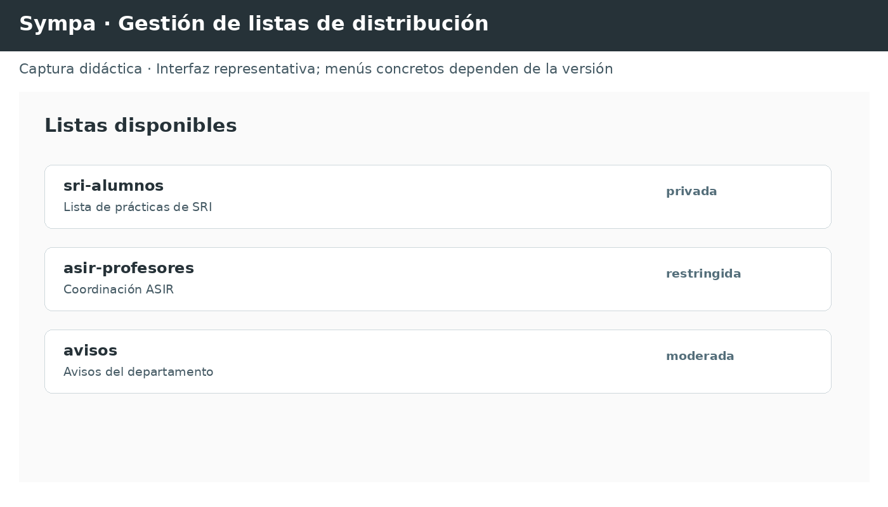

# 💬⚡ Unidad de Trabajo 7 · MENSAJERÍA, NOTICIAS Y LISTAS DE DISTRIBUCIÓN ⚡💬

### RA6 · Mensajería instantánea, noticias y listas de distribución.

> **SERVICIOS DE RED E INTERNET · CFGS ASIR · Material docente integral · 2026**
>
> Material autónomo actualizado para el perfil profesional de Técnico Superior en Administración de Sistemas Informáticos en Red. Laboratorio de referencia: **Cisco Packet Tracer**, **WSL2 + Ubuntu 26.04** y **VirtualBox + Ubuntu 26.04 Server**.
>
> ### 🎯 Resultado de aprendizaje trabajado
>
> **RA6.** Administra servicios de mensajería instantánea, noticias y listas de distribución, verificando y asegurando el acceso de los usuarios.

> 🧭 **ANTES DE UTILIZAR MENSAJERÍA, XMPP, IRC Y NNTP**
>
> **XMPP (Extensible Messaging and Presence Protocol)** es un protocolo abierto de mensajería y presencia. Un **JID (Jabber ID)** identifica una cuenta o recurso XMPP y una **stanza** es una unidad estructural como `message`, `presence` o `iq`. **IRC (Internet Relay Chat)** es un protocolo de conversación textual basado en canales. **NNTP (Network News Transfer Protocol)** se utiliza para intercambio y consulta de artículos de grupos de noticias.


---

## 🗺️ Índice

1. [Introducción](#1--introducción)
2. [Servicios de mensajería instantánea](#2--servicios-de-mensajería-instantánea)
   - 2.1 Características y funcionamiento
   - 2.2 Protocolos
   - 2.3 Jabber/XMPP
   - 2.4 Clientes
   - 2.5 Servidores
3. [Chats](#3--chats)
   - 3.1 Componentes y funcionamiento
   - 3.2 Clientes
   - 3.3 Servidores IRC
4. [Listas de distribución](#4--listas-de-distribución)
   - 4.1 Tipos de acceso
   - 4.2 Tipos de listas
   - 4.3 Tipos de distribución
   - 4.4 Servidores
5. [Servicios de noticias](#5--servicios-de-noticias)
   - 5.1 NNTP
   - 5.2 Grupos de noticias
   - 5.3 Clientes
   - 5.4 Servidores
6. [Arquitectura de laboratorio](#6--arquitectura-de-laboratorio)
7. [Prácticas](#7--prácticas)
8. [Diagnóstico y troubleshooting](#8--diagnóstico-y-troubleshooting)
9. [Seguridad](#9--seguridad)
10. [Proyecto final: Campus Comunica](#10--proyecto-final-campus-comunica)
11. [Resumen](#11--resumen)
12. [Autoevaluación](#12--autoevaluación)
13. [✅ Respuestas de la autoevaluación](#13---respuestas-de-la-autoevaluación)
14. [📝 Test de repaso](#14---test-de-repaso)
15. [✅ Solucionario del test](#15---solucionario-del-test)

---

# 1. 🌐 Introducción

Los servicios de comunicación sobre red permiten intercambiar información entre usuarios sin necesidad de que ambos equipos estén conectados físicamente.

Podemos distinguir, de forma general:

| Servicio | Modelo | Comunicación | Ejemplo |
|---|---|---|---|
| Mensajería instantánea | Cliente/servidor | Síncrona o casi síncrona | XMPP |
| Chat | Cliente/servidor | Síncrona y grupal | IRC |
| Lista de distribución | Servidor de correo | Asíncrona | Mailman |
| Noticias | Cliente/servidor | Asíncrona | NNTP/Usenet |

### 🧠 Idea fundamental

```text
                    SERVICIOS DE COMUNICACIÓN
                              │
             ┌────────────────┼────────────────┐
             │                │                │
        MENSAJERÍA           CHAT          PUBLICACIÓN
        INSTANTÁNEA                         ASÍNCRONA
             │                │                │
          XMPP/IM             IRC        ┌─────┴─────┐
                                         │           │
                                      LISTAS       NNTP
```

La unidad agrupa tres familias de servicios:

- 💬 mensajería instantánea;
- 📋 listas de distribución;
- 📰 servicios de noticias.

---

> 🧭 **ANTES DE EMPEZAR · Mensajería instantánea**
>
> En este contexto, mensajería instantánea significa intercambio de mensajes y estado de presencia mediante un servicio de red. Se diferencia del correo porque la interacción está orientada a comunicación inmediata y normalmente mantiene una sesión de usuario activa.

> 🧭 **PREPARACIÓN DIDÁCTICA**
>
> 🧭 **ANTES DE EMPEZAR · MENSAJERÍA ≠ CORREO**
> 
> La mensajería instantánea prioriza conversación y presencia. El correo prioriza almacenamiento y entrega asíncrona. Algunas infraestructuras comparten protocolos auxiliares, pero el modelo de interacción es diferente.

# 2. 💬 Servicios de mensajería instantánea

## 2.1 Características y funcionamiento

La mensajería instantánea permite intercambiar mensajes entre usuarios conectados a una red.

El modelo tradicional es:

```text
┌──────────────┐
│   CLIENTE A  │
└──────┬───────┘
       │
       │ conexión
       ▼
┌──────────────────┐
│ SERVIDOR IM/XMPP │
└──────┬───────────┘
       │
       │ conexión
       ▼
┌──────────────┐
│   CLIENTE B  │
└──────────────┘
```

El servidor puede encargarse de:

- autenticar usuarios;
- mantener sesiones;
- localizar usuarios;
- almacenar mensajes cuando proceda;
- gestionar presencia;
- establecer conversaciones;
- aplicar políticas de acceso;
- proporcionar salas o servicios adicionales.

### 👤 Presencia

Uno de los elementos característicos de la mensajería instantánea es la **presencia**.

Un usuario puede anunciar estados como:

```text
🟢 Disponible
🟡 Ausente
🔴 No molestar
⚫ Desconectado
```

En XMPP, la presencia forma parte del protocolo y permite informar al resto de la red sobre el estado de un usuario.

---

## 2.2 Protocolos

La edición original cita protocolos históricos como:

- ICQ;
- Jabber;
- IRC;
- MSN/MSNP.

La situación actual es diferente: muchos servicios comerciales cerraron, migraron a protocolos propietarios o pasaron a utilizar arquitecturas basadas en aplicaciones web y móviles.

Para ASIR interesa distinguir:

### Protocolos abiertos

Permiten que distintas implementaciones puedan interoperar mediante especificaciones públicas.

**Ejemplo principal de esta unidad: XMPP.**

### Protocolos propietarios

Están controlados por un proveedor concreto y pueden limitar la interoperabilidad.

---

> 🧭 **ANTES DE EMPEZAR · XMPP**
>
> XMPP es un protocolo basado en XML. Para entender su funcionamiento basta inicialmente con distinguir tres tipos de **stanza** —`message`, `presence` e `iq`— y comprender el identificador de usuario **JID**.

# 2.3 🔗 Jabber / XMPP
### 📊 XMPP: elementos que debes distinguir

| Elemento | Qué representa | Ejemplo conceptual |
|---|---|---|
| JID | Identidad de usuario/entidad | `ana@ejemplo.org` |
| `message` | Mensaje | Texto enviado a otro usuario |
| `presence` | Estado/presencia | Disponible, ausente |
| `iq` | Consulta/respuesta | Petición de información |
| Servidor | Gestiona sesiones y rutas | Prosody |
| Cliente | Interfaz del usuario | Gajim, Dino, etc. |


**XMPP (Extensible Messaging and Presence Protocol)** es un protocolo abierto basado en XML para mensajería, presencia y comunicación entre entidades.

El nombre **Jabber** se utiliza históricamente para referirse al ecosistema XMPP.

### Características

- 🌐 arquitectura distribuida;
- 🔓 especificación abierta;
- 🧩 extensible mediante XEP;
- 👤 gestión de presencia;
- 💬 mensajería individual;
- 👥 salas multiusuario mediante componentes específicos;
- 🔐 posibilidad de utilizar TLS;
- 🔑 autenticación;
- 🔄 posibilidad de federación entre servidores.

### JID

La identidad XMPP se expresa mediante un **Jabber ID (JID)**.

Ejemplo:

```text
ger@asirlab.local
```

También pueden aparecer recursos:

```text
ger@asirlab.local/portatil
ger@asirlab.local/movil
```

Conceptualmente:

```text
usuario @ dominio / recurso
   │        │         │
   │        │         └── sesión/recurso concreto
   │        └──────────── servidor o dominio XMPP
   └───────────────────── usuario
```

---

> 🧭 **PREPARACIÓN DIDÁCTICA**
>
> 🧭 **ANTES DE EMPEZAR · IDENTIDAD Y PRESENCIA**
> 
> En XMPP el usuario no se identifica únicamente por una dirección IP. Utiliza un identificador lógico (JID) y mantiene información de presencia. Esta separación entre identidad, transporte y presencia es una idea nueva respecto al correo.

## 2.3.1 Arquitectura XMPP

```text
                 FEDERACIÓN XMPP
                       │
        ┌──────────────┴──────────────┐
        │                             │
┌───────▼────────┐             ┌──────▼─────────┐
│ xmpp.iesA.es   │◄───────────►│ xmpp.iesB.es   │
└───────┬────────┘             └──────┬─────────┘
        │                             │
   ┌────┴────┐                   ┌────┴────┐
   │         │                   │         │
 Usuario A  Usuario B         Usuario C  Usuario D
```

Esta arquitectura es importante porque evita pensar en XMPP como un único servidor central mundial.

---

## 2.3.2 XML y stanzas

La comunicación XMPP utiliza estructuras denominadas **stanzas**.

Las tres principales son:

```text
┌──────────────┐
│   message    │ → mensajes
├──────────────┤
│   presence   │ → presencia
├──────────────┤
│     iq       │ → consultas/respuestas
└──────────────┘
```

Ejemplo conceptual:

```xml
<message to="ana@asirlab.local">
    <body>Hola Ana</body>
</message>
```

No es necesario memorizar cada etiqueta XML: lo importante es comprender que XMPP define una estructura estandarizada para transportar información de comunicación y presencia.

---

# 2.4 🖥️ Clientes de mensajería

Un cliente XMPP permite:

- iniciar sesión;
- gestionar contactos;
- consultar presencia;
- enviar mensajes;
- participar en salas;
- gestionar varias cuentas.

Históricamente el libro utiliza **Pidgin** como ejemplo.

En un laboratorio actual podemos utilizar:

- Gajim;
- clientes XMPP compatibles con la plataforma;
- clientes CLI;
- herramientas de diagnóstico.

### 💡 Actividad

Instala un cliente XMPP y documenta:

1. servidor utilizado;
2. cuenta creada;
3. JID;
4. método de autenticación;
5. estado de presencia;
6. conversación entre dos usuarios.

---

# 2.5 🖥️ Servidores de mensajería instantánea

El libro cita servidores como:

- Openfire;
- ejabberd;
- otros servidores Jabber/XMPP.

Para el laboratorio actual se propone **Prosody**, porque Ubuntu 26.04 dispone del paquete correspondiente en sus repositorios. 

Openfire sigue siendo una alternativa interesante si se quiere trabajar con una interfaz de administración web.

---

> 🧭 **ANTES DE EMPEZAR · IRC y canales**
>
> IRC organiza la conversación mediante servidores y canales. Un canal es un espacio lógico al que se incorporan clientes y en el que se aplican reglas de operación y permisos.

# 3. 💬 Chats

El chat es una forma de comunicación interactiva, normalmente basada en conversaciones entre múltiples usuarios.

La diferencia conceptual respecto a la mensajería uno-a-uno es la existencia de **canales o salas**.

```text
             ┌─────────────┐
             │ IRC SERVER  │
             └──────┬──────┘
                    │
          ┌─────────┼─────────┐
          │         │         │
        Ana       Luis       Ger
          │         │         │
          └──────┬──┴──────┬──┘
                 │         │
              #asir       #redes
```

---

## 3.1 Componentes y funcionamiento

En un sistema IRC encontramos:

- servidor;
- cliente;
- usuario;
- nickname;
- canal;
- operadores;
- mensajes privados;
- comandos.

Ejemplos conceptuales:

```text
NICK Ger
JOIN #asir
PRIVMSG #asir :Hola
PART #asir
QUIT
```

---

## 3.2 Clientes IRC

Un cliente IRC puede funcionar:

- mediante GUI;
- desde terminal;
- mediante aplicaciones multiplataforma.

Para laboratorio resulta especialmente útil un cliente CLI porque permite observar claramente la naturaleza textual del protocolo.

---

# 3.3 🖥️ Servidor IRC

El laboratorio puede utilizar **InspIRCd** como implementación de servidor IRC cuando se desee practicar este protocolo.

Actualmente sigue existiendo como servidor IRC modular y Ubuntu dispone de paquetes de InspIRCd en sus repositorios. 

### Arquitectura

```text
Cliente A ─┐
Cliente B ─┼──► InspIRCd ──► #asir
Cliente C ─┘
```

### Actividad

Crear:

```text
#asir
#soporte
#profesores
```

Asignar operadores y probar:

- entrada;
- salida;
- mensajes públicos;
- mensajes privados;
- topic;
- usuarios conectados.

---

> 🧭 **ANTES DE EMPEZAR · Lista de distribución**
>
> Una lista de distribución utiliza normalmente infraestructura de correo para distribuir mensajes a un conjunto gestionado de miembros. Por eso una lista no debe confundirse con un alias simple: incorpora miembros, políticas de publicación, moderación y distribución.

> 🧭 **PREPARACIÓN DIDÁCTICA**
>
> 🧭 **ANTES DE EMPEZAR · UNA LISTA NO ES UN CHAT**
> 
> Una lista de distribución utiliza el correo como mecanismo de transporte, pero añade reglas de suscripción, moderación y entrega a múltiples destinatarios. Por eso Sympa pertenece conceptualmente a esta unidad aunque utilice SMTP para transportar mensajes.

# 4. 📋 Listas de distribución

Una lista de distribución permite enviar un mensaje a múltiples destinatarios mediante una dirección común.

Ejemplo:

```text
              mensaje
                 │
                 ▼
        ┌─────────────────┐
        │ asir@centro.es  │
        └────────┬────────┘
                 │
       ┌─────────┼─────────┐
       ▼         ▼         ▼
     Ana       Luis       Ger
```

La lista actúa como intermediario.

### Diferencia respecto a un grupo de chat

| Característica | Lista | Chat |
|---|---|---|
| Comunicación | Asíncrona | Síncrona |
| Transporte habitual | Correo electrónico | Protocolo de chat |
| Histórico | Depende de configuración | Depende del servicio |
| Destinatarios | Suscriptores | Usuarios de sala |
| Funcionamiento | Basado en mensajes | Basado en sesiones |

---

# 4.1 🔐 Tipos de acceso

Una lista puede permitir diferentes niveles de acceso:

### Pública

Cualquiera puede solicitar la suscripción.

### Privada

La incorporación requiere autorización.

### Restringida

Solo determinados usuarios pueden enviar mensajes.

### Moderada

Los mensajes deben ser aprobados antes de distribuirse.

---

# 4.2 🗂️ Tipos de listas

Podemos clasificarlas por finalidad:

- 📢 anuncios;
- 💬 discusión;
- 🛠️ soporte técnico;
- 👨‍🏫 comunidad docente;
- 🧑‍💻 desarrollo;
- 📰 boletines.

---

# 4.3 📬 Tipos de distribución

Una lista puede utilizar:

### Lista abierta

Los miembros pueden publicar.

### Lista moderada

Los mensajes pasan por moderación.

### Lista de anuncios

Normalmente solo determinados remitentes publican.

### Lista cerrada

El acceso y/o publicación están restringidos.

---

# 4.4 🖥️ Servidores de listas

La edición original cita:

- LISTSERV;
- Majordomo;
- Mailman;
- Microsoft Exchange.

En un laboratorio actual es preferible estudiar **Mailman 3** como evolución moderna del concepto.

> ⚠️ No debe confundirse una lista de distribución con un simple alias de correo. La lista gestiona miembros, políticas de publicación, moderación y distribución.

---

> 🧭 **ANTES DE EMPEZAR · NNTP y noticias**
>
> Los servicios de noticias representan un modelo de publicación y consulta de mensajes organizados en grupos. A diferencia del chat, el contenido está pensado para permanecer disponible y ser consultado posteriormente.

> 🧭 **PREPARACIÓN DIDÁCTICA**
>
> 🧭 **ANTES DE EMPEZAR · PUBLICACIÓN ASÍNCRONA**
> 
> NNTP organiza información en grupos de noticias y permite distribuir artículos entre servidores. Es un modelo diferente de un chat y de una lista de correo: el usuario consulta un conjunto de artículos publicados.

# 5. 📰 Servicios de noticias

Los servicios de noticias permiten publicar mensajes en **grupos de noticias**.

Históricamente, el ejemplo principal es **Usenet**.

El protocolo asociado es:

> **NNTP — Network News Transfer Protocol**

---

## 5.1 NNTP

NNTP se utiliza para:

- consultar grupos;
- publicar artículos;
- transferir noticias entre servidores;
- descargar artículos;
- gestionar información de grupos.

Puerto tradicional:

```text
TCP/119 → NNTP
```

Para NNTP sobre TLS se utiliza habitualmente:

```text
TCP/563 → NNTPS
```

---

## 5.2 📰 Grupos de noticias

Un grupo organiza mensajes alrededor de un tema.

Ejemplo histórico:

```text
comp.os.linux.redes
```

El concepto se aproxima a:

```text
GRUPO
  │
  ├── artículo 1
  ├── artículo 2
  ├── artículo 3
  └── respuestas
```

Los artículos pueden formar **hilos de discusión**.

---

## 5.3 Clientes de noticias

La edición original utiliza **KNode** como ejemplo.

Actualmente muchos lectores clásicos de noticias han quedado obsoletos, por lo que esta parte debe abordarse principalmente para comprender:

- NNTP;
- grupos;
- artículos;
- hilos;
- sincronización;
- publicación;
- almacenamiento.

---

# 5.4 🖥️ Servidores NNTP

El libro utiliza **Leafnode** en sus prácticas.

Para un laboratorio actual también puede estudiarse **INN (InterNetNews)**, que sigue siendo un servidor NNTP relevante y dispone de empaquetado para distribuciones Ubuntu. 

### Arquitectura

```text
          ┌─────────────────┐
          │   NNTP SERVER   │
          │     INN/        │
          │    Leafnode     │
          └────────┬────────┘
                   │
          ┌────────┼────────┐
          ▼        ▼        ▼
       Cliente A Cliente B Cliente C
```

---

# 🖥️ Administración de listas con Sympa

Sympa es un gestor de listas de correo. A diferencia de un servidor SMTP, no se ocupa de transportar por sí mismo todo el correo de Internet: añade una **capa de gestión de listas**, suscripciones, moderación y distribución.

> 🧭 **IDEA CLAVE · SYMPA SE APOYA EN EL CORREO**
>
> Una analogía útil: SMTP es la red de reparto; una lista de Sympa es la oficina que mantiene el padrón de destinatarios y decide a quién se entrega una publicación.



**Captura didáctica.** Los nombres y menús concretos dependen de la versión y configuración.

### Elementos que debemos distinguir

| Elemento | Función |
|---|---|
| Lista | Dirección colectiva |
| Suscriptor | Usuario que recibe mensajes |
| Moderador | Decide qué mensajes se distribuyen cuando la lista es moderada |
| Propietario | Administra la lista y su configuración |
| MTA | Transporta los mensajes de correo |
| Web de Sympa | Facilita administración y suscripción |

### Flujo de una publicación

```text
Remitente
   │ SMTP
   ▼
Dirección de la lista
   │
   ▼
Sympa ── comprueba reglas ──► moderación (si procede)
   │
   ├──► miembro A
   ├──► miembro B
   └──► miembro C
```


---

# 🗂️ Antes de las prácticas · localizar la configuración de mensajería, listas y noticias

Aquí convivirán varios servicios. No los mezcles: cada uno tiene su propio modelo y sus propios ficheros.

```text
Prosody / XMPP
/etc/prosody/                 → prosody.cfg.lua y configuración de módulos

IRC (servidor elegido)
/etc/                         → ubicación variable según software/paquete

Sympa
/etc/sympa/                   → configuración del servicio
/var/lib/sympa/               → datos, listas y estado según instalación

Mailman
/etc/mailman3/                → configuración de Mailman 3

NNTP
/etc/news/ o configuración específica del servidor → depende del software
```

Comandos de reconocimiento:
```bash
sudo find /etc -maxdepth 2 -type f \( -name '*prosody*' -o -name '*sympa*' -o -name '*mailman*' \) 2>/dev/null
sudo systemctl list-units --type=service | grep -Ei 'prosody|sympa|mailman|news|irc'
sudo ss -lntup
```

### 🌐 Sympa

Sympa dispone de una interfaz web para administrar listas, suscriptores y moderación.


### 🖥️ Webmin

Webmin no debe considerarse un panel universal para estos servicios. Si existe un módulo específico, úsalo como apoyo; si no existe, trabaja con CLI y con la interfaz propia de cada aplicación.


> 👨‍🏫 **Criterio de corrección de las prácticas**
>
> La solución de referencia no se reduce a una configuración final. Se valoran el proceso, la capacidad para localizar ficheros, validar la sintaxis, comprobar puertos y conectividad, interpretar logs y justificar técnicamente cada decisión. Cuando el ejercicio admita varias soluciones, cualquier solución equivalente y correctamente justificada es válida.
## 🧪 Práctica 7.X — Crear y administrar una lista con Sympa
> 🧭 **PREPARACIÓN DE LA PRÁCTICA**
>
> **1 · Sitúate.** Lee primero el objetivo y localiza en la unidad el concepto que estamos llevando a la práctica. No empieces copiando comandos: primero debes poder explicar qué componente estamos construyendo y para qué sirve.
>
> **2 · Prepara el entorno.** Comprueba si esta práctica utiliza **Entorno I · Packet Tracer**, **Entorno II · WSL2**, **Entorno III · VirtualBox + Ubuntu 26.04 Server** o **Anexo VI · Entorno IV · Docker Compose**. Verifica conectividad, nombres, interfaces y estado de los servicios antes de modificar nada.
>
> **3 · Predice.** Antes de ejecutar un comando importante, escribe qué esperas que ocurra. Por ejemplo: «después de `ss -lnt`, espero encontrar el servicio escuchando en TCP/80». Esta pequeña predicción convierte la práctica en una investigación y no en una receta.
>
> **4 · Construye paso a paso.** Cada número debe dejar el sistema en un estado ligeramente más completo que el anterior. Después de cada bloque, realiza una comprobación corta. Si el paso 4 depende del 3, no avances hasta que el 3 funcione.
>
> **5 · Diagnostica si falla.** No empieces reiniciando. Sigue esta secuencia: **estado → configuración → logs → puertos → red → prueba desde el cliente**. Conserva las órdenes utilizadas y la evidencia del fallo.
>
> **6 · Demuestra.** La práctica termina cuando puedes demostrar el resultado con una evidencia: captura, salida de comando, conexión desde cliente, fichero de configuración o tráfico observado.
>
> **7 · Explica.** Cierra con una breve explicación técnica: qué has configurado, qué protocolo interviene, qué puerto utiliza, cómo se verifica y qué error sería el primero que investigarías si dejara de funcionar.


### Objetivo

Crear una lista de laboratorio, añadir suscriptores, publicar un mensaje y observar la distribución.

### Procedimiento

1. Instala el servidor y sus dependencias en el entorno de VirtualBox.
2. Comprueba que el MTA utilizado por el laboratorio está operativo.
3. Accede a la interfaz web de Sympa.
4. Crea una lista de prueba.
5. Define propietario y moderador.
6. Añade dos cuentas de laboratorio.
7. Publica un mensaje.
8. Comprueba la recepción individual.
9. Revisa los logs del MTA y de Sympa.
10. Explica qué parte del recorrido corresponde a Sympa y cuál al transporte SMTP.

### Diagnóstico

```bash
systemctl status sympa
systemctl status postfix
journalctl -u sympa -n 50
journalctl -u postfix -n 50
```

### Evidencias

- captura de la lista en Sympa;
- mensaje publicado;
- recepción por al menos dos miembros;
- logs relevantes;
- diagrama del flujo.


### 🧭 Guía de resolución y comprobación

Esta práctica se considera resuelta cuando puedes **explicar y demostrar** el resultado, no solo cuando el comando termina sin errores. Sigue siempre esta secuencia:

1. **Identifica el estado inicial.** Anota interfaces, direcciones, rutas y servicios que ya estaban activos.
2. **Aplica el cambio mínimo.** No modifiques varias cosas a la vez: si algo falla, necesitas saber qué cambio lo provocó.
3. **Valida inmediatamente.** Comprueba la sintaxis o el estado del servicio antes de probar desde el cliente.
4. **Prueba desde el punto de vista del usuario.** Una configuración correcta debe producir el comportamiento esperado desde el cliente, no solo desde el servidor.
5. **Observa evidencias.** Conserva la salida de comandos, logs, capturas de tráfico y capturas de pantalla que demuestren el resultado.

**Comandos de referencia para esta práctica:**

- `ss -lntup`
- `sudo systemctl status <servicio>`
- `sudo journalctl -u <servicio> --no-pager`
- `tcpdump -ni any port <puerto>`
- `curl -I http://<interfaz-web>/`

> 💡 **Si algo falla:** no empieces reiniciando. Compara primero **estado → configuración → logs → puertos → red → cliente**. Un reinicio puede ocultar la causa y hacer más difícil aprender de la incidencia.

### 🧪 Rúbrica de evaluación

| Criterio | Puntos | Evidencia esperada |
|---|---:|---|
| Comprensión del objetivo y del protocolo | 2 | Explica qué servicio/protocolo está utilizando y por qué. |
| Preparación y configuración | 2 | Ficheros, comandos o topología correctamente preparados. |
| Verificación funcional | 2 | Demuestra el resultado desde un cliente o herramienta adecuada. |
| Diagnóstico y razonamiento | 2 | Utiliza evidencias para justificar la solución. |
| Documentación técnica | 1 | Incluye comandos, configuraciones y capturas relevantes. |
| Seguridad y buenas prácticas | 1 | Aplica permisos, exposición de puertos y credenciales con criterio. |
| **Total** | **10** | **Superación recomendada: ≥ 5 puntos y práctica funcional.** |


# 6. 🧪 Arquitectura de laboratorio

La unidad se trabajará mediante cuatro entornos complementarios: simulación de red con Packet Tracer, herramientas y clientes en WSL2, servidores completos en VirtualBox y despliegues reproducibles con Docker Compose.

```text
              🧪 ENTORNOS DE PRÁCTICAS
                       │
       ┌───────────────┼───────────────┬───────────────┐
       ▼               ▼               ▼               ▼
 Packet Tracer       WSL2          VirtualBox      Docker Compose
 simulación       clientes/tools    servidores      servicios
```

## 6.1 Cisco Packet Tracer

Se utilizará para representar:

- red;
- direccionamiento;
- routers;
- switches;
- DNS;
- conectividad;
- segmentación.

### Topología propuesta

```text
                     INTERNET / WAN
                           │
                       [ ROUTER ]
                           │
                     192.168.50.1
                           │
                     ┌─────┴─────┐
                     │  SWITCH   │
                     └─────┬─────┘
                           │
          ┌────────────────┼────────────────┐
          │                │                │
      SERVER          CLIENTE-01       CLIENTE-02
   192.168.50.10     192.168.50.101   192.168.50.102
```

---

## 6.2 WSL2 + Ubuntu 26.04

WSL2 se utilizará principalmente como:

- cliente;
- estación de diagnóstico;
- terminal de administración;
- generador de tráfico;
- entorno para pruebas TCP/IP.

Ejemplos:

```bash
ip addr
ip route
ss -lntup
dig
nc
curl
ping
traceroute
tcpdump
```

---

## 6.3 VirtualBox + Ubuntu 26.04 Server

Se utilizará como servidor de servicios.

Ejemplo:

```text
VM: sri-server
IP: 192.168.50.10/24
Hostname: srv-sri
```

Servicios:

```text
XMPP  → 5222/TCP
IRC   → 6667/TCP
NNTP  → 119/TCP
```

---

# 7. 🧪 Prácticas

## 🧪 Práctica 7.1 · Diseñar la red de comunicación
> 🧭 **PREPARACIÓN DE LA PRÁCTICA**
>
> **1 · Sitúate.** Lee primero el objetivo y localiza en la unidad el concepto que estamos llevando a la práctica. No empieces copiando comandos: primero debes poder explicar qué componente estamos construyendo y para qué sirve.
>
> **2 · Prepara el entorno.** Comprueba si esta práctica utiliza **Entorno I · Packet Tracer**, **Entorno II · WSL2**, **Entorno III · VirtualBox + Ubuntu 26.04 Server** o **Anexo VI · Entorno IV · Docker Compose**. Verifica conectividad, nombres, interfaces y estado de los servicios antes de modificar nada.
>
> **3 · Predice.** Antes de ejecutar un comando importante, escribe qué esperas que ocurra. Por ejemplo: «después de `ss -lnt`, espero encontrar el servicio escuchando en TCP/80». Esta pequeña predicción convierte la práctica en una investigación y no en una receta.
>
> **4 · Construye paso a paso.** Cada número debe dejar el sistema en un estado ligeramente más completo que el anterior. Después de cada bloque, realiza una comprobación corta. Si el paso 4 depende del 3, no avances hasta que el 3 funcione.
>
> **5 · Diagnostica si falla.** No empieces reiniciando. Sigue esta secuencia: **estado → configuración → logs → puertos → red → prueba desde el cliente**. Conserva las órdenes utilizadas y la evidencia del fallo.
>
> **6 · Demuestra.** La práctica termina cuando puedes demostrar el resultado con una evidencia: captura, salida de comando, conexión desde cliente, fichero de configuración o tráfico observado.
>
> **7 · Explica.** Cierra con una breve explicación técnica: qué has configurado, qué protocolo interviene, qué puerto utiliza, cómo se verifica y qué error sería el primero que investigarías si dejara de funcionar.


### Objetivo

Diseñar la infraestructura necesaria para desplegar los servicios de la unidad.

### Tareas

1. Crear la topología en Cisco Packet Tracer.
2. Asignar direccionamiento.
3. Configurar gateway.
4. Verificar conectividad.
5. Documentar la tabla IP.

### Tabla

| Equipo | IP | Máscara | Gateway |
|---|---|---|---|
| Router | 192.168.50.1 | /24 | — |
| Servidor | 192.168.50.10 | /24 | 192.168.50.1 |
| Cliente 1 | 192.168.50.101 | /24 | 192.168.50.1 |
| Cliente 2 | 192.168.50.102 | /24 | 192.168.50.1 |

---


### 🧭 Guía de resolución y comprobación

Esta práctica se considera resuelta cuando puedes **explicar y demostrar** el resultado, no solo cuando el comando termina sin errores. Sigue siempre esta secuencia:

1. **Identifica el estado inicial.** Anota interfaces, direcciones, rutas y servicios que ya estaban activos.
2. **Aplica el cambio mínimo.** No modifiques varias cosas a la vez: si algo falla, necesitas saber qué cambio lo provocó.
3. **Valida inmediatamente.** Comprueba la sintaxis o el estado del servicio antes de probar desde el cliente.
4. **Prueba desde el punto de vista del usuario.** Una configuración correcta debe producir el comportamiento esperado desde el cliente, no solo desde el servidor.
5. **Observa evidencias.** Conserva la salida de comandos, logs, capturas de tráfico y capturas de pantalla que demuestren el resultado.

**Comandos de referencia para esta práctica:**

- `ip addr`
- `ip route`
- `ss -lntup`
- `journalctl -b --no-pager`
- `ping <destino>`

> 💡 **Si algo falla:** no empieces reiniciando. Compara primero **estado → configuración → logs → puertos → red → cliente**. Un reinicio puede ocultar la causa y hacer más difícil aprender de la incidencia.

### 🧪 Rúbrica de evaluación

| Criterio | Puntos | Evidencia esperada |
|---|---:|---|
| Comprensión del objetivo y del protocolo | 2 | Explica qué servicio/protocolo está utilizando y por qué. |
| Preparación y configuración | 2 | Ficheros, comandos o topología correctamente preparados. |
| Verificación funcional | 2 | Demuestra el resultado desde un cliente o herramienta adecuada. |
| Diagnóstico y razonamiento | 2 | Utiliza evidencias para justificar la solución. |
| Documentación técnica | 1 | Incluye comandos, configuraciones y capturas relevantes. |
| Seguridad y buenas prácticas | 1 | Aplica permisos, exposición de puertos y credenciales con criterio. |
| **Total** | **10** | **Superación recomendada: ≥ 5 puntos y práctica funcional.** |


## 🧪 Práctica 7.2 · Diagnóstico TCP
> 🧭 **PREPARACIÓN DE LA PRÁCTICA**
>
> **1 · Sitúate.** Lee primero el objetivo y localiza en la unidad el concepto que estamos llevando a la práctica. No empieces copiando comandos: primero debes poder explicar qué componente estamos construyendo y para qué sirve.
>
> **2 · Prepara el entorno.** Comprueba si esta práctica utiliza **Entorno I · Packet Tracer**, **Entorno II · WSL2**, **Entorno III · VirtualBox + Ubuntu 26.04 Server** o **Anexo VI · Entorno IV · Docker Compose**. Verifica conectividad, nombres, interfaces y estado de los servicios antes de modificar nada.
>
> **3 · Predice.** Antes de ejecutar un comando importante, escribe qué esperas que ocurra. Por ejemplo: «después de `ss -lnt`, espero encontrar el servicio escuchando en TCP/80». Esta pequeña predicción convierte la práctica en una investigación y no en una receta.
>
> **4 · Construye paso a paso.** Cada número debe dejar el sistema en un estado ligeramente más completo que el anterior. Después de cada bloque, realiza una comprobación corta. Si el paso 4 depende del 3, no avances hasta que el 3 funcione.
>
> **5 · Diagnostica si falla.** No empieces reiniciando. Sigue esta secuencia: **estado → configuración → logs → puertos → red → prueba desde el cliente**. Conserva las órdenes utilizadas y la evidencia del fallo.
>
> **6 · Demuestra.** La práctica termina cuando puedes demostrar el resultado con una evidencia: captura, salida de comando, conexión desde cliente, fichero de configuración o tráfico observado.
>
> **7 · Explica.** Cierra con una breve explicación técnica: qué has configurado, qué protocolo interviene, qué puerto utiliza, cómo se verifica y qué error sería el primero que investigarías si dejara de funcionar.


Desde WSL:

```bash
ping 192.168.50.10
```

Comprobar posteriormente:

```bash
nc -vz 192.168.50.10 5222
nc -vz 192.168.50.10 6667
nc -vz 192.168.50.10 119
```

Interpretar:

```text
succeeded     → puerto accesible
refused       → host accesible, servicio no escucha
timed out     → filtrado, ruta incorrecta o host inaccesible
```

---


### 🧭 Guía de resolución y comprobación

Esta práctica se considera resuelta cuando puedes **explicar y demostrar** el resultado, no solo cuando el comando termina sin errores. Sigue siempre esta secuencia:

1. **Identifica el estado inicial.** Anota interfaces, direcciones, rutas y servicios que ya estaban activos.
2. **Aplica el cambio mínimo.** No modifiques varias cosas a la vez: si algo falla, necesitas saber qué cambio lo provocó.
3. **Valida inmediatamente.** Comprueba la sintaxis o el estado del servicio antes de probar desde el cliente.
4. **Prueba desde el punto de vista del usuario.** Una configuración correcta debe producir el comportamiento esperado desde el cliente, no solo desde el servidor.
5. **Observa evidencias.** Conserva la salida de comandos, logs, capturas de tráfico y capturas de pantalla que demuestren el resultado.

**Comandos de referencia para esta práctica:**

- `ip addr`
- `ip route`
- `ss -lntup`
- `journalctl -b --no-pager`
- `ping <destino>`

> 💡 **Si algo falla:** no empieces reiniciando. Compara primero **estado → configuración → logs → puertos → red → cliente**. Un reinicio puede ocultar la causa y hacer más difícil aprender de la incidencia.

### 🧪 Rúbrica de evaluación

| Criterio | Puntos | Evidencia esperada |
|---|---:|---|
| Comprensión del objetivo y del protocolo | 2 | Explica qué servicio/protocolo está utilizando y por qué. |
| Preparación y configuración | 2 | Ficheros, comandos o topología correctamente preparados. |
| Verificación funcional | 2 | Demuestra el resultado desde un cliente o herramienta adecuada. |
| Diagnóstico y razonamiento | 2 | Utiliza evidencias para justificar la solución. |
| Documentación técnica | 1 | Incluye comandos, configuraciones y capturas relevantes. |
| Seguridad y buenas prácticas | 1 | Aplica permisos, exposición de puertos y credenciales con criterio. |
| **Total** | **10** | **Superación recomendada: ≥ 5 puntos y práctica funcional.** |


# 🧪 Práctica 7.3 · Desplegar XMPP con Prosody
> 🧭 **PREPARACIÓN DE LA PRÁCTICA**
>
> **1 · Sitúate.** Lee primero el objetivo y localiza en la unidad el concepto que estamos llevando a la práctica. No empieces copiando comandos: primero debes poder explicar qué componente estamos construyendo y para qué sirve.
>
> **2 · Prepara el entorno.** Comprueba si esta práctica utiliza **Entorno I · Packet Tracer**, **Entorno II · WSL2**, **Entorno III · VirtualBox + Ubuntu 26.04 Server** o **Anexo VI · Entorno IV · Docker Compose**. Verifica conectividad, nombres, interfaces y estado de los servicios antes de modificar nada.
>
> **3 · Predice.** Antes de ejecutar un comando importante, escribe qué esperas que ocurra. Por ejemplo: «después de `ss -lnt`, espero encontrar el servicio escuchando en TCP/80». Esta pequeña predicción convierte la práctica en una investigación y no en una receta.
>
> **4 · Construye paso a paso.** Cada número debe dejar el sistema en un estado ligeramente más completo que el anterior. Después de cada bloque, realiza una comprobación corta. Si el paso 4 depende del 3, no avances hasta que el 3 funcione.
>
> **5 · Diagnostica si falla.** No empieces reiniciando. Sigue esta secuencia: **estado → configuración → logs → puertos → red → prueba desde el cliente**. Conserva las órdenes utilizadas y la evidencia del fallo.
>
> **6 · Demuestra.** La práctica termina cuando puedes demostrar el resultado con una evidencia: captura, salida de comando, conexión desde cliente, fichero de configuración o tráfico observado.
>
> **7 · Explica.** Cierra con una breve explicación técnica: qué has configurado, qué protocolo interviene, qué puerto utiliza, cómo se verifica y qué error sería el primero que investigarías si dejara de funcionar.


> **Actualización de la práctica original:** el libro propone Openfire/Jabber. En Ubuntu 26.04 utilizaremos Prosody para disponer de una práctica reproducible basada en paquetes de la distribución. Ubuntu 26.04 publica Prosody 13.x en sus repositorios. 

### 1. Instalar

```bash
sudo apt update
sudo apt install prosody
```

### 2. Comprobar servicio

```bash
systemctl status prosody
```

### 3. Configurar el dominio

Editar:

```bash
sudo nano /etc/prosody/prosody.cfg.lua
```

Añadir un host de laboratorio, por ejemplo:

```lua
VirtualHost "asirlab.local"
```

### 4. Crear usuarios

```bash
sudo prosodyctl adduser ger@asirlab.local
sudo prosodyctl adduser alumno1@asirlab.local
```

### 5. Reiniciar

```bash
sudo prosodyctl check config
sudo systemctl restart prosody
```

### 6. Comprobar puertos

```bash
sudo ss -lntp | grep prosody
```

### 7. Crear dos clientes

Configurar:

```text
Servidor: asirlab.local
Usuario: ger
Puerto XMPP: 5222
```

y una segunda cuenta.

### 🎯 Resultado

Los dos usuarios deben poder:

- autenticarse;
- verse;
- intercambiar mensajes;
- cambiar su estado de presencia.

---


### 🧭 Guía de resolución y comprobación

Esta práctica se considera resuelta cuando puedes **explicar y demostrar** el resultado, no solo cuando el comando termina sin errores. Sigue siempre esta secuencia:

1. **Identifica el estado inicial.** Anota interfaces, direcciones, rutas y servicios que ya estaban activos.
2. **Aplica el cambio mínimo.** No modifiques varias cosas a la vez: si algo falla, necesitas saber qué cambio lo provocó.
3. **Valida inmediatamente.** Comprueba la sintaxis o el estado del servicio antes de probar desde el cliente.
4. **Prueba desde el punto de vista del usuario.** Una configuración correcta debe producir el comportamiento esperado desde el cliente, no solo desde el servidor.
5. **Observa evidencias.** Conserva la salida de comandos, logs, capturas de tráfico y capturas de pantalla que demuestren el resultado.

**Comandos de referencia para esta práctica:**

- `ss -lntup`
- `sudo systemctl status <servicio>`
- `sudo journalctl -u <servicio> --no-pager`
- `tcpdump -ni any port <puerto>`
- `curl -I http://<interfaz-web>/`

> 💡 **Si algo falla:** no empieces reiniciando. Compara primero **estado → configuración → logs → puertos → red → cliente**. Un reinicio puede ocultar la causa y hacer más difícil aprender de la incidencia.

### 🧪 Rúbrica de evaluación

| Criterio | Puntos | Evidencia esperada |
|---|---:|---|
| Comprensión del objetivo y del protocolo | 2 | Explica qué servicio/protocolo está utilizando y por qué. |
| Preparación y configuración | 2 | Ficheros, comandos o topología correctamente preparados. |
| Verificación funcional | 2 | Demuestra el resultado desde un cliente o herramienta adecuada. |
| Diagnóstico y razonamiento | 2 | Utiliza evidencias para justificar la solución. |
| Documentación técnica | 1 | Incluye comandos, configuraciones y capturas relevantes. |
| Seguridad y buenas prácticas | 1 | Aplica permisos, exposición de puertos y credenciales con criterio. |
| **Total** | **10** | **Superación recomendada: ≥ 5 puntos y práctica funcional.** |


# 🧪 Práctica 7.4 · Analizar XMPP con tcpdump
> 🧭 **PREPARACIÓN DE LA PRÁCTICA**
>
> **1 · Sitúate.** Lee primero el objetivo y localiza en la unidad el concepto que estamos llevando a la práctica. No empieces copiando comandos: primero debes poder explicar qué componente estamos construyendo y para qué sirve.
>
> **2 · Prepara el entorno.** Comprueba si esta práctica utiliza **Entorno I · Packet Tracer**, **Entorno II · WSL2**, **Entorno III · VirtualBox + Ubuntu 26.04 Server** o **Anexo VI · Entorno IV · Docker Compose**. Verifica conectividad, nombres, interfaces y estado de los servicios antes de modificar nada.
>
> **3 · Predice.** Antes de ejecutar un comando importante, escribe qué esperas que ocurra. Por ejemplo: «después de `ss -lnt`, espero encontrar el servicio escuchando en TCP/80». Esta pequeña predicción convierte la práctica en una investigación y no en una receta.
>
> **4 · Construye paso a paso.** Cada número debe dejar el sistema en un estado ligeramente más completo que el anterior. Después de cada bloque, realiza una comprobación corta. Si el paso 4 depende del 3, no avances hasta que el 3 funcione.
>
> **5 · Diagnostica si falla.** No empieces reiniciando. Sigue esta secuencia: **estado → configuración → logs → puertos → red → prueba desde el cliente**. Conserva las órdenes utilizadas y la evidencia del fallo.
>
> **6 · Demuestra.** La práctica termina cuando puedes demostrar el resultado con una evidencia: captura, salida de comando, conexión desde cliente, fichero de configuración o tráfico observado.
>
> **7 · Explica.** Cierra con una breve explicación técnica: qué has configurado, qué protocolo interviene, qué puerto utiliza, cómo se verifica y qué error sería el primero que investigarías si dejara de funcionar.


En el servidor:

```bash
sudo tcpdump -ni any port 5222
```

Iniciar una conversación.

Analizar:

- IP origen;
- IP destino;
- puerto;
- TCP;
- tamaño de segmentos;
- establecimiento de conexión.

### Pregunta

¿Por qué no debemos asumir que observar tráfico TCP/5222 implica poder leer el contenido de los mensajes?

**Respuesta:** porque la sesión puede utilizar TLS y el contenido de aplicación puede ir cifrado.

---


### 🧭 Guía de resolución y comprobación

Esta práctica se considera resuelta cuando puedes **explicar y demostrar** el resultado, no solo cuando el comando termina sin errores. Sigue siempre esta secuencia:

1. **Identifica el estado inicial.** Anota interfaces, direcciones, rutas y servicios que ya estaban activos.
2. **Aplica el cambio mínimo.** No modifiques varias cosas a la vez: si algo falla, necesitas saber qué cambio lo provocó.
3. **Valida inmediatamente.** Comprueba la sintaxis o el estado del servicio antes de probar desde el cliente.
4. **Prueba desde el punto de vista del usuario.** Una configuración correcta debe producir el comportamiento esperado desde el cliente, no solo desde el servidor.
5. **Observa evidencias.** Conserva la salida de comandos, logs, capturas de tráfico y capturas de pantalla que demuestren el resultado.

**Comandos de referencia para esta práctica:**

- `ss -lntup`
- `sudo systemctl status <servicio>`
- `sudo journalctl -u <servicio> --no-pager`
- `tcpdump -ni any port <puerto>`
- `curl -I http://<interfaz-web>/`

> 💡 **Si algo falla:** no empieces reiniciando. Compara primero **estado → configuración → logs → puertos → red → cliente**. Un reinicio puede ocultar la causa y hacer más difícil aprender de la incidencia.

### 🧪 Rúbrica de evaluación

| Criterio | Puntos | Evidencia esperada |
|---|---:|---|
| Comprensión del objetivo y del protocolo | 2 | Explica qué servicio/protocolo está utilizando y por qué. |
| Preparación y configuración | 2 | Ficheros, comandos o topología correctamente preparados. |
| Verificación funcional | 2 | Demuestra el resultado desde un cliente o herramienta adecuada. |
| Diagnóstico y razonamiento | 2 | Utiliza evidencias para justificar la solución. |
| Documentación técnica | 1 | Incluye comandos, configuraciones y capturas relevantes. |
| Seguridad y buenas prácticas | 1 | Aplica permisos, exposición de puertos y credenciales con criterio. |
| **Total** | **10** | **Superación recomendada: ≥ 5 puntos y práctica funcional.** |


# 🧪 Práctica 7.5 · Crear un servidor IRC
> 🧭 **PREPARACIÓN DE LA PRÁCTICA**
>
> **1 · Sitúate.** Lee primero el objetivo y localiza en la unidad el concepto que estamos llevando a la práctica. No empieces copiando comandos: primero debes poder explicar qué componente estamos construyendo y para qué sirve.
>
> **2 · Prepara el entorno.** Comprueba si esta práctica utiliza **Entorno I · Packet Tracer**, **Entorno II · WSL2**, **Entorno III · VirtualBox + Ubuntu 26.04 Server** o **Anexo VI · Entorno IV · Docker Compose**. Verifica conectividad, nombres, interfaces y estado de los servicios antes de modificar nada.
>
> **3 · Predice.** Antes de ejecutar un comando importante, escribe qué esperas que ocurra. Por ejemplo: «después de `ss -lnt`, espero encontrar el servicio escuchando en TCP/80». Esta pequeña predicción convierte la práctica en una investigación y no en una receta.
>
> **4 · Construye paso a paso.** Cada número debe dejar el sistema en un estado ligeramente más completo que el anterior. Después de cada bloque, realiza una comprobación corta. Si el paso 4 depende del 3, no avances hasta que el 3 funcione.
>
> **5 · Diagnostica si falla.** No empieces reiniciando. Sigue esta secuencia: **estado → configuración → logs → puertos → red → prueba desde el cliente**. Conserva las órdenes utilizadas y la evidencia del fallo.
>
> **6 · Demuestra.** La práctica termina cuando puedes demostrar el resultado con una evidencia: captura, salida de comando, conexión desde cliente, fichero de configuración o tráfico observado.
>
> **7 · Explica.** Cierra con una breve explicación técnica: qué has configurado, qué protocolo interviene, qué puerto utiliza, cómo se verifica y qué error sería el primero que investigarías si dejara de funcionar.


Instalar:

```bash
sudo apt update
sudo apt install inspircd
```

Ubuntu dispone de InspIRCd como paquete de su distribución. 

Comprobar:

```bash
systemctl status inspircd
```

Puerto:

```bash
sudo ss -lntp | grep 6667
```

---

## 🧪 Práctica 7.6 · Conectarse por IRC desde WSL
> 🧭 **PREPARACIÓN DE LA PRÁCTICA**
>
> **1 · Sitúate.** Lee primero el objetivo y localiza en la unidad el concepto que estamos llevando a la práctica. No empieces copiando comandos: primero debes poder explicar qué componente estamos construyendo y para qué sirve.
>
> **2 · Prepara el entorno.** Comprueba si esta práctica utiliza **Entorno I · Packet Tracer**, **Entorno II · WSL2**, **Entorno III · VirtualBox + Ubuntu 26.04 Server** o **Anexo VI · Entorno IV · Docker Compose**. Verifica conectividad, nombres, interfaces y estado de los servicios antes de modificar nada.
>
> **3 · Predice.** Antes de ejecutar un comando importante, escribe qué esperas que ocurra. Por ejemplo: «después de `ss -lnt`, espero encontrar el servicio escuchando en TCP/80». Esta pequeña predicción convierte la práctica en una investigación y no en una receta.
>
> **4 · Construye paso a paso.** Cada número debe dejar el sistema en un estado ligeramente más completo que el anterior. Después de cada bloque, realiza una comprobación corta. Si el paso 4 depende del 3, no avances hasta que el 3 funcione.
>
> **5 · Diagnostica si falla.** No empieces reiniciando. Sigue esta secuencia: **estado → configuración → logs → puertos → red → prueba desde el cliente**. Conserva las órdenes utilizadas y la evidencia del fallo.
>
> **6 · Demuestra.** La práctica termina cuando puedes demostrar el resultado con una evidencia: captura, salida de comando, conexión desde cliente, fichero de configuración o tráfico observado.
>
> **7 · Explica.** Cierra con una breve explicación técnica: qué has configurado, qué protocolo interviene, qué puerto utiliza, cómo se verifica y qué error sería el primero que investigarías si dejara de funcionar.


Utilizar un cliente IRC apropiado o realizar una conexión TCP básica:

```bash
nc 192.168.50.10 6667
```

Experimentar con comandos IRC:

```text
NICK alumno1
USER alumno1 0 * :Alumno 1
JOIN #asir
PRIVMSG #asir :Hola desde ASIR
```

Observar la respuesta del servidor.

> 💡 Esta práctica es especialmente útil para comprender que muchos protocolos de aplicación siguen funcionando como intercambio de texto sobre TCP.

---


### 🧭 Guía de resolución y comprobación

Esta práctica se considera resuelta cuando puedes **explicar y demostrar** el resultado, no solo cuando el comando termina sin errores. Sigue siempre esta secuencia:

1. **Identifica el estado inicial.** Anota interfaces, direcciones, rutas y servicios que ya estaban activos.
2. **Aplica el cambio mínimo.** No modifiques varias cosas a la vez: si algo falla, necesitas saber qué cambio lo provocó.
3. **Valida inmediatamente.** Comprueba la sintaxis o el estado del servicio antes de probar desde el cliente.
4. **Prueba desde el punto de vista del usuario.** Una configuración correcta debe producir el comportamiento esperado desde el cliente, no solo desde el servidor.
5. **Observa evidencias.** Conserva la salida de comandos, logs, capturas de tráfico y capturas de pantalla que demuestren el resultado.

**Comandos de referencia para esta práctica:**

- `ss -lntup`
- `sudo systemctl status <servicio>`
- `sudo journalctl -u <servicio> --no-pager`
- `tcpdump -ni any port <puerto>`
- `curl -I http://<interfaz-web>/`

> 💡 **Si algo falla:** no empieces reiniciando. Compara primero **estado → configuración → logs → puertos → red → cliente**. Un reinicio puede ocultar la causa y hacer más difícil aprender de la incidencia.

### 🧪 Rúbrica de evaluación

| Criterio | Puntos | Evidencia esperada |
|---|---:|---|
| Comprensión del objetivo y del protocolo | 2 | Explica qué servicio/protocolo está utilizando y por qué. |
| Preparación y configuración | 2 | Ficheros, comandos o topología correctamente preparados. |
| Verificación funcional | 2 | Demuestra el resultado desde un cliente o herramienta adecuada. |
| Diagnóstico y razonamiento | 2 | Utiliza evidencias para justificar la solución. |
| Documentación técnica | 1 | Incluye comandos, configuraciones y capturas relevantes. |
| Seguridad y buenas prácticas | 1 | Aplica permisos, exposición de puertos y credenciales con criterio. |
| **Total** | **10** | **Superación recomendada: ≥ 5 puntos y práctica funcional.** |


# 🧪 Práctica 7.7 · Crear canales IRC
> 🧭 **PREPARACIÓN DE LA PRÁCTICA**
>
> **1 · Sitúate.** Lee primero el objetivo y localiza en la unidad el concepto que estamos llevando a la práctica. No empieces copiando comandos: primero debes poder explicar qué componente estamos construyendo y para qué sirve.
>
> **2 · Prepara el entorno.** Comprueba si esta práctica utiliza **Entorno I · Packet Tracer**, **Entorno II · WSL2**, **Entorno III · VirtualBox + Ubuntu 26.04 Server** o **Anexo VI · Entorno IV · Docker Compose**. Verifica conectividad, nombres, interfaces y estado de los servicios antes de modificar nada.
>
> **3 · Predice.** Antes de ejecutar un comando importante, escribe qué esperas que ocurra. Por ejemplo: «después de `ss -lnt`, espero encontrar el servicio escuchando en TCP/80». Esta pequeña predicción convierte la práctica en una investigación y no en una receta.
>
> **4 · Construye paso a paso.** Cada número debe dejar el sistema en un estado ligeramente más completo que el anterior. Después de cada bloque, realiza una comprobación corta. Si el paso 4 depende del 3, no avances hasta que el 3 funcione.
>
> **5 · Diagnostica si falla.** No empieces reiniciando. Sigue esta secuencia: **estado → configuración → logs → puertos → red → prueba desde el cliente**. Conserva las órdenes utilizadas y la evidencia del fallo.
>
> **6 · Demuestra.** La práctica termina cuando puedes demostrar el resultado con una evidencia: captura, salida de comando, conexión desde cliente, fichero de configuración o tráfico observado.
>
> **7 · Explica.** Cierra con una breve explicación técnica: qué has configurado, qué protocolo interviene, qué puerto utiliza, cómo se verifica y qué error sería el primero que investigarías si dejara de funcionar.


Crear y documentar:

```text
#asir
#redes
#soporte
```

Investigar los comandos necesarios para:

- entrar;
- salir;
- cambiar topic;
- expulsar;
- conceder privilegios;
- enviar mensajes privados.

---


### 🧭 Guía de resolución y comprobación

Esta práctica se considera resuelta cuando puedes **explicar y demostrar** el resultado, no solo cuando el comando termina sin errores. Sigue siempre esta secuencia:

1. **Identifica el estado inicial.** Anota interfaces, direcciones, rutas y servicios que ya estaban activos.
2. **Aplica el cambio mínimo.** No modifiques varias cosas a la vez: si algo falla, necesitas saber qué cambio lo provocó.
3. **Valida inmediatamente.** Comprueba la sintaxis o el estado del servicio antes de probar desde el cliente.
4. **Prueba desde el punto de vista del usuario.** Una configuración correcta debe producir el comportamiento esperado desde el cliente, no solo desde el servidor.
5. **Observa evidencias.** Conserva la salida de comandos, logs, capturas de tráfico y capturas de pantalla que demuestren el resultado.

**Comandos de referencia para esta práctica:**

- `ss -lntup`
- `sudo systemctl status <servicio>`
- `sudo journalctl -u <servicio> --no-pager`
- `tcpdump -ni any port <puerto>`
- `curl -I http://<interfaz-web>/`

> 💡 **Si algo falla:** no empieces reiniciando. Compara primero **estado → configuración → logs → puertos → red → cliente**. Un reinicio puede ocultar la causa y hacer más difícil aprender de la incidencia.

### 🧪 Rúbrica de evaluación

| Criterio | Puntos | Evidencia esperada |
|---|---:|---|
| Comprensión del objetivo y del protocolo | 2 | Explica qué servicio/protocolo está utilizando y por qué. |
| Preparación y configuración | 2 | Ficheros, comandos o topología correctamente preparados. |
| Verificación funcional | 2 | Demuestra el resultado desde un cliente o herramienta adecuada. |
| Diagnóstico y razonamiento | 2 | Utiliza evidencias para justificar la solución. |
| Documentación técnica | 1 | Incluye comandos, configuraciones y capturas relevantes. |
| Seguridad y buenas prácticas | 1 | Aplica permisos, exposición de puertos y credenciales con criterio. |
| **Total** | **10** | **Superación recomendada: ≥ 5 puntos y práctica funcional.** |


# 🧪 Práctica 7.8 · Modelo de lista de distribución
> 🧭 **PREPARACIÓN DE LA PRÁCTICA**
>
> **1 · Sitúate.** Lee primero el objetivo y localiza en la unidad el concepto que estamos llevando a la práctica. No empieces copiando comandos: primero debes poder explicar qué componente estamos construyendo y para qué sirve.
>
> **2 · Prepara el entorno.** Comprueba si esta práctica utiliza **Entorno I · Packet Tracer**, **Entorno II · WSL2**, **Entorno III · VirtualBox + Ubuntu 26.04 Server** o **Anexo VI · Entorno IV · Docker Compose**. Verifica conectividad, nombres, interfaces y estado de los servicios antes de modificar nada.
>
> **3 · Predice.** Antes de ejecutar un comando importante, escribe qué esperas que ocurra. Por ejemplo: «después de `ss -lnt`, espero encontrar el servicio escuchando en TCP/80». Esta pequeña predicción convierte la práctica en una investigación y no en una receta.
>
> **4 · Construye paso a paso.** Cada número debe dejar el sistema en un estado ligeramente más completo que el anterior. Después de cada bloque, realiza una comprobación corta. Si el paso 4 depende del 3, no avances hasta que el 3 funcione.
>
> **5 · Diagnostica si falla.** No empieces reiniciando. Sigue esta secuencia: **estado → configuración → logs → puertos → red → prueba desde el cliente**. Conserva las órdenes utilizadas y la evidencia del fallo.
>
> **6 · Demuestra.** La práctica termina cuando puedes demostrar el resultado con una evidencia: captura, salida de comando, conexión desde cliente, fichero de configuración o tráfico observado.
>
> **7 · Explica.** Cierra con una breve explicación técnica: qué has configurado, qué protocolo interviene, qué puerto utiliza, cómo se verifica y qué error sería el primero que investigarías si dejara de funcionar.


Antes de instalar un servidor, simular el funcionamiento:

```text
             ┌──────────────┐
Remitente ──►│     LISTA    │
             └──────┬───────┘
                    │
          ┌─────────┼─────────┐
          ▼         ▼         ▼
        alumno1   alumno2   alumno3
```

Responder:

1. ¿Quién recibe el mensaje?
2. ¿Quién puede publicar?
3. ¿Quién modera?
4. ¿Cómo se gestionan altas y bajas?
5. ¿Qué ocurre con el spam?

---


### 🧭 Guía de resolución y comprobación

Esta práctica se considera resuelta cuando puedes **explicar y demostrar** el resultado, no solo cuando el comando termina sin errores. Sigue siempre esta secuencia:

1. **Identifica el estado inicial.** Anota interfaces, direcciones, rutas y servicios que ya estaban activos.
2. **Aplica el cambio mínimo.** No modifiques varias cosas a la vez: si algo falla, necesitas saber qué cambio lo provocó.
3. **Valida inmediatamente.** Comprueba la sintaxis o el estado del servicio antes de probar desde el cliente.
4. **Prueba desde el punto de vista del usuario.** Una configuración correcta debe producir el comportamiento esperado desde el cliente, no solo desde el servidor.
5. **Observa evidencias.** Conserva la salida de comandos, logs, capturas de tráfico y capturas de pantalla que demuestren el resultado.

**Comandos de referencia para esta práctica:**

- `ss -lntup`
- `sudo systemctl status <servicio>`
- `sudo journalctl -u <servicio> --no-pager`
- `tcpdump -ni any port <puerto>`
- `curl -I http://<interfaz-web>/`

> 💡 **Si algo falla:** no empieces reiniciando. Compara primero **estado → configuración → logs → puertos → red → cliente**. Un reinicio puede ocultar la causa y hacer más difícil aprender de la incidencia.

### 🧪 Rúbrica de evaluación

| Criterio | Puntos | Evidencia esperada |
|---|---:|---|
| Comprensión del objetivo y del protocolo | 2 | Explica qué servicio/protocolo está utilizando y por qué. |
| Preparación y configuración | 2 | Ficheros, comandos o topología correctamente preparados. |
| Verificación funcional | 2 | Demuestra el resultado desde un cliente o herramienta adecuada. |
| Diagnóstico y razonamiento | 2 | Utiliza evidencias para justificar la solución. |
| Documentación técnica | 1 | Incluye comandos, configuraciones y capturas relevantes. |
| Seguridad y buenas prácticas | 1 | Aplica permisos, exposición de puertos y credenciales con criterio. |
| **Total** | **10** | **Superación recomendada: ≥ 5 puntos y práctica funcional.** |


# 🧪 Práctica 7.9 · Mailman
> 🧭 **PREPARACIÓN DE LA PRÁCTICA**
>
> **1 · Sitúate.** Lee primero el objetivo y localiza en la unidad el concepto que estamos llevando a la práctica. No empieces copiando comandos: primero debes poder explicar qué componente estamos construyendo y para qué sirve.
>
> **2 · Prepara el entorno.** Comprueba si esta práctica utiliza **Entorno I · Packet Tracer**, **Entorno II · WSL2**, **Entorno III · VirtualBox + Ubuntu 26.04 Server** o **Anexo VI · Entorno IV · Docker Compose**. Verifica conectividad, nombres, interfaces y estado de los servicios antes de modificar nada.
>
> **3 · Predice.** Antes de ejecutar un comando importante, escribe qué esperas que ocurra. Por ejemplo: «después de `ss -lnt`, espero encontrar el servicio escuchando en TCP/80». Esta pequeña predicción convierte la práctica en una investigación y no en una receta.
>
> **4 · Construye paso a paso.** Cada número debe dejar el sistema en un estado ligeramente más completo que el anterior. Después de cada bloque, realiza una comprobación corta. Si el paso 4 depende del 3, no avances hasta que el 3 funcione.
>
> **5 · Diagnostica si falla.** No empieces reiniciando. Sigue esta secuencia: **estado → configuración → logs → puertos → red → prueba desde el cliente**. Conserva las órdenes utilizadas y la evidencia del fallo.
>
> **6 · Demuestra.** La práctica termina cuando puedes demostrar el resultado con una evidencia: captura, salida de comando, conexión desde cliente, fichero de configuración o tráfico observado.
>
> **7 · Explica.** Cierra con una breve explicación técnica: qué has configurado, qué protocolo interviene, qué puerto utiliza, cómo se verifica y qué error sería el primero que investigarías si dejara de funcionar.


La edición original propone Mailman.

En una instalación moderna se debe trabajar con **Mailman 3** cuando el entorno lo permita.

### Objetivos

- crear una lista;
- añadir suscriptores;
- definir moderación;
- publicar un mensaje;
- comprobar la distribución;
- documentar las políticas.

> ⚠️ La instalación exacta de Mailman 3 depende de la versión empaquetada y del método de despliegue elegido. No se debe copiar una receta de Mailman 2 como si fuera equivalente.

---


### 🧭 Guía de resolución y comprobación

Esta práctica se considera resuelta cuando puedes **explicar y demostrar** el resultado, no solo cuando el comando termina sin errores. Sigue siempre esta secuencia:

1. **Identifica el estado inicial.** Anota interfaces, direcciones, rutas y servicios que ya estaban activos.
2. **Aplica el cambio mínimo.** No modifiques varias cosas a la vez: si algo falla, necesitas saber qué cambio lo provocó.
3. **Valida inmediatamente.** Comprueba la sintaxis o el estado del servicio antes de probar desde el cliente.
4. **Prueba desde el punto de vista del usuario.** Una configuración correcta debe producir el comportamiento esperado desde el cliente, no solo desde el servidor.
5. **Observa evidencias.** Conserva la salida de comandos, logs, capturas de tráfico y capturas de pantalla que demuestren el resultado.

**Comandos de referencia para esta práctica:**

- `dig MX juandecolonia.jc`
- `ss -lntup`
- `sudo postfix check`
- `sudo doveconf -n`
- `curl -I https://<roundcube-host>/`

> 💡 **Si algo falla:** no empieces reiniciando. Compara primero **estado → configuración → logs → puertos → red → cliente**. Un reinicio puede ocultar la causa y hacer más difícil aprender de la incidencia.

### 🧪 Rúbrica de evaluación

| Criterio | Puntos | Evidencia esperada |
|---|---:|---|
| Comprensión del objetivo y del protocolo | 2 | Explica qué servicio/protocolo está utilizando y por qué. |
| Preparación y configuración | 2 | Ficheros, comandos o topología correctamente preparados. |
| Verificación funcional | 2 | Demuestra el resultado desde un cliente o herramienta adecuada. |
| Diagnóstico y razonamiento | 2 | Utiliza evidencias para justificar la solución. |
| Documentación técnica | 1 | Incluye comandos, configuraciones y capturas relevantes. |
| Seguridad y buenas prácticas | 1 | Aplica permisos, exposición de puertos y credenciales con criterio. |
| **Total** | **10** | **Superación recomendada: ≥ 5 puntos y práctica funcional.** |


# 🧪 Práctica 7.10 · Crear un servidor NNTP
> 🧭 **PREPARACIÓN DE LA PRÁCTICA**
>
> **1 · Sitúate.** Lee primero el objetivo y localiza en la unidad el concepto que estamos llevando a la práctica. No empieces copiando comandos: primero debes poder explicar qué componente estamos construyendo y para qué sirve.
>
> **2 · Prepara el entorno.** Comprueba si esta práctica utiliza **Entorno I · Packet Tracer**, **Entorno II · WSL2**, **Entorno III · VirtualBox + Ubuntu 26.04 Server** o **Anexo VI · Entorno IV · Docker Compose**. Verifica conectividad, nombres, interfaces y estado de los servicios antes de modificar nada.
>
> **3 · Predice.** Antes de ejecutar un comando importante, escribe qué esperas que ocurra. Por ejemplo: «después de `ss -lnt`, espero encontrar el servicio escuchando en TCP/80». Esta pequeña predicción convierte la práctica en una investigación y no en una receta.
>
> **4 · Construye paso a paso.** Cada número debe dejar el sistema en un estado ligeramente más completo que el anterior. Después de cada bloque, realiza una comprobación corta. Si el paso 4 depende del 3, no avances hasta que el 3 funcione.
>
> **5 · Diagnostica si falla.** No empieces reiniciando. Sigue esta secuencia: **estado → configuración → logs → puertos → red → prueba desde el cliente**. Conserva las órdenes utilizadas y la evidencia del fallo.
>
> **6 · Demuestra.** La práctica termina cuando puedes demostrar el resultado con una evidencia: captura, salida de comando, conexión desde cliente, fichero de configuración o tráfico observado.
>
> **7 · Explica.** Cierra con una breve explicación técnica: qué has configurado, qué protocolo interviene, qué puerto utiliza, cómo se verifica y qué error sería el primero que investigarías si dejara de funcionar.


### Objetivo

Comprender el funcionamiento de NNTP mediante un servidor de laboratorio.

Se puede utilizar:

- INN;
- Leafnode si está disponible y resulta adecuado para el escenario.

Comprobar previamente:

```bash
apt policy inn2
apt policy leafnode
```

### Investigación

Determinar:

- paquete disponible;
- versión;
- servicio;
- puerto;
- fichero de configuración;
- ubicación de los artículos;
- grupos disponibles.

---


### 🧭 Guía de resolución y comprobación

Esta práctica se considera resuelta cuando puedes **explicar y demostrar** el resultado, no solo cuando el comando termina sin errores. Sigue siempre esta secuencia:

1. **Identifica el estado inicial.** Anota interfaces, direcciones, rutas y servicios que ya estaban activos.
2. **Aplica el cambio mínimo.** No modifiques varias cosas a la vez: si algo falla, necesitas saber qué cambio lo provocó.
3. **Valida inmediatamente.** Comprueba la sintaxis o el estado del servicio antes de probar desde el cliente.
4. **Prueba desde el punto de vista del usuario.** Una configuración correcta debe producir el comportamiento esperado desde el cliente, no solo desde el servidor.
5. **Observa evidencias.** Conserva la salida de comandos, logs, capturas de tráfico y capturas de pantalla que demuestren el resultado.

**Comandos de referencia para esta práctica:**

- `ss -lntup`
- `sudo systemctl status <servicio>`
- `sudo journalctl -u <servicio> --no-pager`
- `tcpdump -ni any port <puerto>`
- `curl -I http://<interfaz-web>/`

> 💡 **Si algo falla:** no empieces reiniciando. Compara primero **estado → configuración → logs → puertos → red → cliente**. Un reinicio puede ocultar la causa y hacer más difícil aprender de la incidencia.

### 🧪 Rúbrica de evaluación

| Criterio | Puntos | Evidencia esperada |
|---|---:|---|
| Comprensión del objetivo y del protocolo | 2 | Explica qué servicio/protocolo está utilizando y por qué. |
| Preparación y configuración | 2 | Ficheros, comandos o topología correctamente preparados. |
| Verificación funcional | 2 | Demuestra el resultado desde un cliente o herramienta adecuada. |
| Diagnóstico y razonamiento | 2 | Utiliza evidencias para justificar la solución. |
| Documentación técnica | 1 | Incluye comandos, configuraciones y capturas relevantes. |
| Seguridad y buenas prácticas | 1 | Aplica permisos, exposición de puertos y credenciales con criterio. |
| **Total** | **10** | **Superación recomendada: ≥ 5 puntos y práctica funcional.** |


# 🧪 Práctica 7.11 · Comprobar NNTP
> 🧭 **PREPARACIÓN DE LA PRÁCTICA**
>
> **1 · Sitúate.** Lee primero el objetivo y localiza en la unidad el concepto que estamos llevando a la práctica. No empieces copiando comandos: primero debes poder explicar qué componente estamos construyendo y para qué sirve.
>
> **2 · Prepara el entorno.** Comprueba si esta práctica utiliza **Entorno I · Packet Tracer**, **Entorno II · WSL2**, **Entorno III · VirtualBox + Ubuntu 26.04 Server** o **Anexo VI · Entorno IV · Docker Compose**. Verifica conectividad, nombres, interfaces y estado de los servicios antes de modificar nada.
>
> **3 · Predice.** Antes de ejecutar un comando importante, escribe qué esperas que ocurra. Por ejemplo: «después de `ss -lnt`, espero encontrar el servicio escuchando en TCP/80». Esta pequeña predicción convierte la práctica en una investigación y no en una receta.
>
> **4 · Construye paso a paso.** Cada número debe dejar el sistema en un estado ligeramente más completo que el anterior. Después de cada bloque, realiza una comprobación corta. Si el paso 4 depende del 3, no avances hasta que el 3 funcione.
>
> **5 · Diagnostica si falla.** No empieces reiniciando. Sigue esta secuencia: **estado → configuración → logs → puertos → red → prueba desde el cliente**. Conserva las órdenes utilizadas y la evidencia del fallo.
>
> **6 · Demuestra.** La práctica termina cuando puedes demostrar el resultado con una evidencia: captura, salida de comando, conexión desde cliente, fichero de configuración o tráfico observado.
>
> **7 · Explica.** Cierra con una breve explicación técnica: qué has configurado, qué protocolo interviene, qué puerto utiliza, cómo se verifica y qué error sería el primero que investigarías si dejara de funcionar.


Comprobar conectividad:

```bash
nc -vz 192.168.50.10 119
```

Si el servidor responde, observar el banner NNTP.

Después estudiar comandos del protocolo como:

```text
CAPABILITIES
LIST
GROUP
ARTICLE
QUIT
```

> ⚠️ No se deben ejecutar comandos de publicación en servidores ajenos. Estas pruebas deben realizarse exclusivamente contra el servidor del laboratorio.

---


### 🧭 Guía de resolución y comprobación

Esta práctica se considera resuelta cuando puedes **explicar y demostrar** el resultado, no solo cuando el comando termina sin errores. Sigue siempre esta secuencia:

1. **Identifica el estado inicial.** Anota interfaces, direcciones, rutas y servicios que ya estaban activos.
2. **Aplica el cambio mínimo.** No modifiques varias cosas a la vez: si algo falla, necesitas saber qué cambio lo provocó.
3. **Valida inmediatamente.** Comprueba la sintaxis o el estado del servicio antes de probar desde el cliente.
4. **Prueba desde el punto de vista del usuario.** Una configuración correcta debe producir el comportamiento esperado desde el cliente, no solo desde el servidor.
5. **Observa evidencias.** Conserva la salida de comandos, logs, capturas de tráfico y capturas de pantalla que demuestren el resultado.

**Comandos de referencia para esta práctica:**

- `ss -lntup`
- `sudo systemctl status <servicio>`
- `sudo journalctl -u <servicio> --no-pager`
- `tcpdump -ni any port <puerto>`
- `curl -I http://<interfaz-web>/`

> 💡 **Si algo falla:** no empieces reiniciando. Compara primero **estado → configuración → logs → puertos → red → cliente**. Un reinicio puede ocultar la causa y hacer más difícil aprender de la incidencia.

### 🧪 Rúbrica de evaluación

| Criterio | Puntos | Evidencia esperada |
|---|---:|---|
| Comprensión del objetivo y del protocolo | 2 | Explica qué servicio/protocolo está utilizando y por qué. |
| Preparación y configuración | 2 | Ficheros, comandos o topología correctamente preparados. |
| Verificación funcional | 2 | Demuestra el resultado desde un cliente o herramienta adecuada. |
| Diagnóstico y razonamiento | 2 | Utiliza evidencias para justificar la solución. |
| Documentación técnica | 1 | Incluye comandos, configuraciones y capturas relevantes. |
| Seguridad y buenas prácticas | 1 | Aplica permisos, exposición de puertos y credenciales con criterio. |
| **Total** | **10** | **Superación recomendada: ≥ 5 puntos y práctica funcional.** |


# 🧪 Práctica 7.12 · Comparar los tres modelos
> 🧭 **PREPARACIÓN DE LA PRÁCTICA**
>
> **1 · Sitúate.** Lee primero el objetivo y localiza en la unidad el concepto que estamos llevando a la práctica. No empieces copiando comandos: primero debes poder explicar qué componente estamos construyendo y para qué sirve.
>
> **2 · Prepara el entorno.** Comprueba si esta práctica utiliza **Entorno I · Packet Tracer**, **Entorno II · WSL2**, **Entorno III · VirtualBox + Ubuntu 26.04 Server** o **Anexo VI · Entorno IV · Docker Compose**. Verifica conectividad, nombres, interfaces y estado de los servicios antes de modificar nada.
>
> **3 · Predice.** Antes de ejecutar un comando importante, escribe qué esperas que ocurra. Por ejemplo: «después de `ss -lnt`, espero encontrar el servicio escuchando en TCP/80». Esta pequeña predicción convierte la práctica en una investigación y no en una receta.
>
> **4 · Construye paso a paso.** Cada número debe dejar el sistema en un estado ligeramente más completo que el anterior. Después de cada bloque, realiza una comprobación corta. Si el paso 4 depende del 3, no avances hasta que el 3 funcione.
>
> **5 · Diagnostica si falla.** No empieces reiniciando. Sigue esta secuencia: **estado → configuración → logs → puertos → red → prueba desde el cliente**. Conserva las órdenes utilizadas y la evidencia del fallo.
>
> **6 · Demuestra.** La práctica termina cuando puedes demostrar el resultado con una evidencia: captura, salida de comando, conexión desde cliente, fichero de configuración o tráfico observado.
>
> **7 · Explica.** Cierra con una breve explicación técnica: qué has configurado, qué protocolo interviene, qué puerto utiliza, cómo se verifica y qué error sería el primero que investigarías si dejara de funcionar.


Completar:

| Característica | XMPP | IRC | Lista | NNTP |
|---|---|---|---|---|
| Comunicación síncrona | | | | |
| Comunicación asíncrona | | | | |
| Cliente/servidor | | | | |
| Mensajes individuales | | | | |
| Salas/grupos | | | | |
| Moderación | | | | |
| Puerto tradicional | | | | |
| Cifrado posible | | | | |

---


### 🧭 Guía de resolución y comprobación

Esta práctica se considera resuelta cuando puedes **explicar y demostrar** el resultado, no solo cuando el comando termina sin errores. Sigue siempre esta secuencia:

1. **Identifica el estado inicial.** Anota interfaces, direcciones, rutas y servicios que ya estaban activos.
2. **Aplica el cambio mínimo.** No modifiques varias cosas a la vez: si algo falla, necesitas saber qué cambio lo provocó.
3. **Valida inmediatamente.** Comprueba la sintaxis o el estado del servicio antes de probar desde el cliente.
4. **Prueba desde el punto de vista del usuario.** Una configuración correcta debe producir el comportamiento esperado desde el cliente, no solo desde el servidor.
5. **Observa evidencias.** Conserva la salida de comandos, logs, capturas de tráfico y capturas de pantalla que demuestren el resultado.

**Comandos de referencia para esta práctica:**

- `ip addr`
- `ip route`
- `ss -lntup`
- `journalctl -b --no-pager`
- `ping <destino>`

> 💡 **Si algo falla:** no empieces reiniciando. Compara primero **estado → configuración → logs → puertos → red → cliente**. Un reinicio puede ocultar la causa y hacer más difícil aprender de la incidencia.

### 🧪 Rúbrica de evaluación

| Criterio | Puntos | Evidencia esperada |
|---|---:|---|
| Comprensión del objetivo y del protocolo | 2 | Explica qué servicio/protocolo está utilizando y por qué. |
| Preparación y configuración | 2 | Ficheros, comandos o topología correctamente preparados. |
| Verificación funcional | 2 | Demuestra el resultado desde un cliente o herramienta adecuada. |
| Diagnóstico y razonamiento | 2 | Utiliza evidencias para justificar la solución. |
| Documentación técnica | 1 | Incluye comandos, configuraciones y capturas relevantes. |
| Seguridad y buenas prácticas | 1 | Aplica permisos, exposición de puertos y credenciales con criterio. |
| **Total** | **10** | **Superación recomendada: ≥ 5 puntos y práctica funcional.** |


# 🧪 Práctica 7.13 · Captura de tráfico
> 🧭 **PREPARACIÓN DE LA PRÁCTICA**
>
> **1 · Sitúate.** Lee primero el objetivo y localiza en la unidad el concepto que estamos llevando a la práctica. No empieces copiando comandos: primero debes poder explicar qué componente estamos construyendo y para qué sirve.
>
> **2 · Prepara el entorno.** Comprueba si esta práctica utiliza **Entorno I · Packet Tracer**, **Entorno II · WSL2**, **Entorno III · VirtualBox + Ubuntu 26.04 Server** o **Anexo VI · Entorno IV · Docker Compose**. Verifica conectividad, nombres, interfaces y estado de los servicios antes de modificar nada.
>
> **3 · Predice.** Antes de ejecutar un comando importante, escribe qué esperas que ocurra. Por ejemplo: «después de `ss -lnt`, espero encontrar el servicio escuchando en TCP/80». Esta pequeña predicción convierte la práctica en una investigación y no en una receta.
>
> **4 · Construye paso a paso.** Cada número debe dejar el sistema en un estado ligeramente más completo que el anterior. Después de cada bloque, realiza una comprobación corta. Si el paso 4 depende del 3, no avances hasta que el 3 funcione.
>
> **5 · Diagnostica si falla.** No empieces reiniciando. Sigue esta secuencia: **estado → configuración → logs → puertos → red → prueba desde el cliente**. Conserva las órdenes utilizadas y la evidencia del fallo.
>
> **6 · Demuestra.** La práctica termina cuando puedes demostrar el resultado con una evidencia: captura, salida de comando, conexión desde cliente, fichero de configuración o tráfico observado.
>
> **7 · Explica.** Cierra con una breve explicación técnica: qué has configurado, qué protocolo interviene, qué puerto utiliza, cómo se verifica y qué error sería el primero que investigarías si dejara de funcionar.


Capturar tráfico de cada servicio:

```bash
sudo tcpdump -ni any tcp port 5222
sudo tcpdump -ni any tcp port 6667
sudo tcpdump -ni any tcp port 119
```

Comparar:

- establecimiento TCP;
- puertos;
- persistencia de conexión;
- cantidad de tráfico;
- comportamiento al cerrar sesión.

---


### 🧭 Guía de resolución y comprobación

Esta práctica se considera resuelta cuando puedes **explicar y demostrar** el resultado, no solo cuando el comando termina sin errores. Sigue siempre esta secuencia:

1. **Identifica el estado inicial.** Anota interfaces, direcciones, rutas y servicios que ya estaban activos.
2. **Aplica el cambio mínimo.** No modifiques varias cosas a la vez: si algo falla, necesitas saber qué cambio lo provocó.
3. **Valida inmediatamente.** Comprueba la sintaxis o el estado del servicio antes de probar desde el cliente.
4. **Prueba desde el punto de vista del usuario.** Una configuración correcta debe producir el comportamiento esperado desde el cliente, no solo desde el servidor.
5. **Observa evidencias.** Conserva la salida de comandos, logs, capturas de tráfico y capturas de pantalla que demuestren el resultado.

**Comandos de referencia para esta práctica:**

- `ip addr`
- `ip route`
- `ss -lntup`
- `journalctl -b --no-pager`
- `ping <destino>`

> 💡 **Si algo falla:** no empieces reiniciando. Compara primero **estado → configuración → logs → puertos → red → cliente**. Un reinicio puede ocultar la causa y hacer más difícil aprender de la incidencia.

### 🧪 Rúbrica de evaluación

| Criterio | Puntos | Evidencia esperada |
|---|---:|---|
| Comprensión del objetivo y del protocolo | 2 | Explica qué servicio/protocolo está utilizando y por qué. |
| Preparación y configuración | 2 | Ficheros, comandos o topología correctamente preparados. |
| Verificación funcional | 2 | Demuestra el resultado desde un cliente o herramienta adecuada. |
| Diagnóstico y razonamiento | 2 | Utiliza evidencias para justificar la solución. |
| Documentación técnica | 1 | Incluye comandos, configuraciones y capturas relevantes. |
| Seguridad y buenas prácticas | 1 | Aplica permisos, exposición de puertos y credenciales con criterio. |
| **Total** | **10** | **Superación recomendada: ≥ 5 puntos y práctica funcional.** |


# 🧪 Práctica 7.14 · Inventario de servicios
> 🧭 **PREPARACIÓN DE LA PRÁCTICA**
>
> **1 · Sitúate.** Lee primero el objetivo y localiza en la unidad el concepto que estamos llevando a la práctica. No empieces copiando comandos: primero debes poder explicar qué componente estamos construyendo y para qué sirve.
>
> **2 · Prepara el entorno.** Comprueba si esta práctica utiliza **Entorno I · Packet Tracer**, **Entorno II · WSL2**, **Entorno III · VirtualBox + Ubuntu 26.04 Server** o **Anexo VI · Entorno IV · Docker Compose**. Verifica conectividad, nombres, interfaces y estado de los servicios antes de modificar nada.
>
> **3 · Predice.** Antes de ejecutar un comando importante, escribe qué esperas que ocurra. Por ejemplo: «después de `ss -lnt`, espero encontrar el servicio escuchando en TCP/80». Esta pequeña predicción convierte la práctica en una investigación y no en una receta.
>
> **4 · Construye paso a paso.** Cada número debe dejar el sistema en un estado ligeramente más completo que el anterior. Después de cada bloque, realiza una comprobación corta. Si el paso 4 depende del 3, no avances hasta que el 3 funcione.
>
> **5 · Diagnostica si falla.** No empieces reiniciando. Sigue esta secuencia: **estado → configuración → logs → puertos → red → prueba desde el cliente**. Conserva las órdenes utilizadas y la evidencia del fallo.
>
> **6 · Demuestra.** La práctica termina cuando puedes demostrar el resultado con una evidencia: captura, salida de comando, conexión desde cliente, fichero de configuración o tráfico observado.
>
> **7 · Explica.** Cierra con una breve explicación técnica: qué has configurado, qué protocolo interviene, qué puerto utiliza, cómo se verifica y qué error sería el primero que investigarías si dejara de funcionar.


Ejecutar:

```bash
sudo ss -lntup
```

Elaborar una tabla:

| Servicio | Puerto | Proceso | Dirección | Estado |
|---|---:|---|---|---|
| XMPP | 5222 | | | |
| IRC | 6667 | | | |
| NNTP | 119 | | | |

---


### 🧭 Guía de resolución y comprobación

Esta práctica se considera resuelta cuando puedes **explicar y demostrar** el resultado, no solo cuando el comando termina sin errores. Sigue siempre esta secuencia:

1. **Identifica el estado inicial.** Anota interfaces, direcciones, rutas y servicios que ya estaban activos.
2. **Aplica el cambio mínimo.** No modifiques varias cosas a la vez: si algo falla, necesitas saber qué cambio lo provocó.
3. **Valida inmediatamente.** Comprueba la sintaxis o el estado del servicio antes de probar desde el cliente.
4. **Prueba desde el punto de vista del usuario.** Una configuración correcta debe producir el comportamiento esperado desde el cliente, no solo desde el servidor.
5. **Observa evidencias.** Conserva la salida de comandos, logs, capturas de tráfico y capturas de pantalla que demuestren el resultado.

**Comandos de referencia para esta práctica:**

- `ip addr`
- `ip route`
- `ss -lntup`
- `journalctl -b --no-pager`
- `ping <destino>`

> 💡 **Si algo falla:** no empieces reiniciando. Compara primero **estado → configuración → logs → puertos → red → cliente**. Un reinicio puede ocultar la causa y hacer más difícil aprender de la incidencia.

### 🧪 Rúbrica de evaluación

| Criterio | Puntos | Evidencia esperada |
|---|---:|---|
| Comprensión del objetivo y del protocolo | 2 | Explica qué servicio/protocolo está utilizando y por qué. |
| Preparación y configuración | 2 | Ficheros, comandos o topología correctamente preparados. |
| Verificación funcional | 2 | Demuestra el resultado desde un cliente o herramienta adecuada. |
| Diagnóstico y razonamiento | 2 | Utiliza evidencias para justificar la solución. |
| Documentación técnica | 1 | Incluye comandos, configuraciones y capturas relevantes. |
| Seguridad y buenas prácticas | 1 | Aplica permisos, exposición de puertos y credenciales con criterio. |
| **Total** | **10** | **Superación recomendada: ≥ 5 puntos y práctica funcional.** |


# 🧪 Práctica 7.15 · Firewall
> 🧭 **PREPARACIÓN DE LA PRÁCTICA**
>
> **1 · Sitúate.** Lee primero el objetivo y localiza en la unidad el concepto que estamos llevando a la práctica. No empieces copiando comandos: primero debes poder explicar qué componente estamos construyendo y para qué sirve.
>
> **2 · Prepara el entorno.** Comprueba si esta práctica utiliza **Entorno I · Packet Tracer**, **Entorno II · WSL2**, **Entorno III · VirtualBox + Ubuntu 26.04 Server** o **Anexo VI · Entorno IV · Docker Compose**. Verifica conectividad, nombres, interfaces y estado de los servicios antes de modificar nada.
>
> **3 · Predice.** Antes de ejecutar un comando importante, escribe qué esperas que ocurra. Por ejemplo: «después de `ss -lnt`, espero encontrar el servicio escuchando en TCP/80». Esta pequeña predicción convierte la práctica en una investigación y no en una receta.
>
> **4 · Construye paso a paso.** Cada número debe dejar el sistema en un estado ligeramente más completo que el anterior. Después de cada bloque, realiza una comprobación corta. Si el paso 4 depende del 3, no avances hasta que el 3 funcione.
>
> **5 · Diagnostica si falla.** No empieces reiniciando. Sigue esta secuencia: **estado → configuración → logs → puertos → red → prueba desde el cliente**. Conserva las órdenes utilizadas y la evidencia del fallo.
>
> **6 · Demuestra.** La práctica termina cuando puedes demostrar el resultado con una evidencia: captura, salida de comando, conexión desde cliente, fichero de configuración o tráfico observado.
>
> **7 · Explica.** Cierra con una breve explicación técnica: qué has configurado, qué protocolo interviene, qué puerto utiliza, cómo se verifica y qué error sería el primero que investigarías si dejara de funcionar.


Si se utiliza UFW:

```bash
sudo ufw status
```

Abrir únicamente los servicios necesarios:

```bash
sudo ufw allow 5222/tcp
sudo ufw allow 6667/tcp
sudo ufw allow 119/tcp
```

Comprobar:

```bash
sudo ufw status numbered
```

### 🛡️ Pregunta

¿Por qué no debemos abrir todos los puertos del servidor?

Porque cada servicio expuesto aumenta la superficie de ataque y debe justificarse.

---


### 🧭 Guía de resolución y comprobación

Esta práctica se considera resuelta cuando puedes **explicar y demostrar** el resultado, no solo cuando el comando termina sin errores. Sigue siempre esta secuencia:

1. **Identifica el estado inicial.** Anota interfaces, direcciones, rutas y servicios que ya estaban activos.
2. **Aplica el cambio mínimo.** No modifiques varias cosas a la vez: si algo falla, necesitas saber qué cambio lo provocó.
3. **Valida inmediatamente.** Comprueba la sintaxis o el estado del servicio antes de probar desde el cliente.
4. **Prueba desde el punto de vista del usuario.** Una configuración correcta debe producir el comportamiento esperado desde el cliente, no solo desde el servidor.
5. **Observa evidencias.** Conserva la salida de comandos, logs, capturas de tráfico y capturas de pantalla que demuestren el resultado.

**Comandos de referencia para esta práctica:**

- `ip addr`
- `ip route`
- `ss -lntup`
- `journalctl -b --no-pager`
- `ping <destino>`

> 💡 **Si algo falla:** no empieces reiniciando. Compara primero **estado → configuración → logs → puertos → red → cliente**. Un reinicio puede ocultar la causa y hacer más difícil aprender de la incidencia.

### 🧪 Rúbrica de evaluación

| Criterio | Puntos | Evidencia esperada |
|---|---:|---|
| Comprensión del objetivo y del protocolo | 2 | Explica qué servicio/protocolo está utilizando y por qué. |
| Preparación y configuración | 2 | Ficheros, comandos o topología correctamente preparados. |
| Verificación funcional | 2 | Demuestra el resultado desde un cliente o herramienta adecuada. |
| Diagnóstico y razonamiento | 2 | Utiliza evidencias para justificar la solución. |
| Documentación técnica | 1 | Incluye comandos, configuraciones y capturas relevantes. |
| Seguridad y buenas prácticas | 1 | Aplica permisos, exposición de puertos y credenciales con criterio. |
| **Total** | **10** | **Superación recomendada: ≥ 5 puntos y práctica funcional.** |


# 🧪 Práctica 7.16 · DNS para XMPP
> 🧭 **PREPARACIÓN DE LA PRÁCTICA**
>
> **1 · Sitúate.** Lee primero el objetivo y localiza en la unidad el concepto que estamos llevando a la práctica. No empieces copiando comandos: primero debes poder explicar qué componente estamos construyendo y para qué sirve.
>
> **2 · Prepara el entorno.** Comprueba si esta práctica utiliza **Entorno I · Packet Tracer**, **Entorno II · WSL2**, **Entorno III · VirtualBox + Ubuntu 26.04 Server** o **Anexo VI · Entorno IV · Docker Compose**. Verifica conectividad, nombres, interfaces y estado de los servicios antes de modificar nada.
>
> **3 · Predice.** Antes de ejecutar un comando importante, escribe qué esperas que ocurra. Por ejemplo: «después de `ss -lnt`, espero encontrar el servicio escuchando en TCP/80». Esta pequeña predicción convierte la práctica en una investigación y no en una receta.
>
> **4 · Construye paso a paso.** Cada número debe dejar el sistema en un estado ligeramente más completo que el anterior. Después de cada bloque, realiza una comprobación corta. Si el paso 4 depende del 3, no avances hasta que el 3 funcione.
>
> **5 · Diagnostica si falla.** No empieces reiniciando. Sigue esta secuencia: **estado → configuración → logs → puertos → red → prueba desde el cliente**. Conserva las órdenes utilizadas y la evidencia del fallo.
>
> **6 · Demuestra.** La práctica termina cuando puedes demostrar el resultado con una evidencia: captura, salida de comando, conexión desde cliente, fichero de configuración o tráfico observado.
>
> **7 · Explica.** Cierra con una breve explicación técnica: qué has configurado, qué protocolo interviene, qué puerto utiliza, cómo se verifica y qué error sería el primero que investigarías si dejara de funcionar.


Crear un nombre:

```text
xmpp.asirlab.local
```

Comprobar:

```bash
getent hosts xmpp.asirlab.local
```

y:

```bash
dig xmpp.asirlab.local
```

Analizar la relación:

```text
JID
 ↓
usuario@asirlab.local
 ↓
DNS
 ↓
servidor XMPP
 ↓
TCP/5222
```

---


### 🧭 Guía de resolución y comprobación

Esta práctica se considera resuelta cuando puedes **explicar y demostrar** el resultado, no solo cuando el comando termina sin errores. Sigue siempre esta secuencia:

1. **Identifica el estado inicial.** Anota interfaces, direcciones, rutas y servicios que ya estaban activos.
2. **Aplica el cambio mínimo.** No modifiques varias cosas a la vez: si algo falla, necesitas saber qué cambio lo provocó.
3. **Valida inmediatamente.** Comprueba la sintaxis o el estado del servicio antes de probar desde el cliente.
4. **Prueba desde el punto de vista del usuario.** Una configuración correcta debe producir el comportamiento esperado desde el cliente, no solo desde el servidor.
5. **Observa evidencias.** Conserva la salida de comandos, logs, capturas de tráfico y capturas de pantalla que demuestren el resultado.

**Comandos de referencia para esta práctica:**

- `resolvectl status`
- `dig @<DNS> <nombre>`
- `sudo named-checkconf`
- `sudo named-checkzone <zona> <fichero>`
- `sudo journalctl -u bind9 --no-pager`

> 💡 **Si algo falla:** no empieces reiniciando. Compara primero **estado → configuración → logs → puertos → red → cliente**. Un reinicio puede ocultar la causa y hacer más difícil aprender de la incidencia.

### 🧪 Rúbrica de evaluación

| Criterio | Puntos | Evidencia esperada |
|---|---:|---|
| Comprensión del objetivo y del protocolo | 2 | Explica qué servicio/protocolo está utilizando y por qué. |
| Preparación y configuración | 2 | Ficheros, comandos o topología correctamente preparados. |
| Verificación funcional | 2 | Demuestra el resultado desde un cliente o herramienta adecuada. |
| Diagnóstico y razonamiento | 2 | Utiliza evidencias para justificar la solución. |
| Documentación técnica | 1 | Incluye comandos, configuraciones y capturas relevantes. |
| Seguridad y buenas prácticas | 1 | Aplica permisos, exposición de puertos y credenciales con criterio. |
| **Total** | **10** | **Superación recomendada: ≥ 5 puntos y práctica funcional.** |


# 🧪 Práctica 7.17 · Simular una incidencia
> 🧭 **PREPARACIÓN DE LA PRÁCTICA**
>
> **1 · Sitúate.** Lee primero el objetivo y localiza en la unidad el concepto que estamos llevando a la práctica. No empieces copiando comandos: primero debes poder explicar qué componente estamos construyendo y para qué sirve.
>
> **2 · Prepara el entorno.** Comprueba si esta práctica utiliza **Entorno I · Packet Tracer**, **Entorno II · WSL2**, **Entorno III · VirtualBox + Ubuntu 26.04 Server** o **Anexo VI · Entorno IV · Docker Compose**. Verifica conectividad, nombres, interfaces y estado de los servicios antes de modificar nada.
>
> **3 · Predice.** Antes de ejecutar un comando importante, escribe qué esperas que ocurra. Por ejemplo: «después de `ss -lnt`, espero encontrar el servicio escuchando en TCP/80». Esta pequeña predicción convierte la práctica en una investigación y no en una receta.
>
> **4 · Construye paso a paso.** Cada número debe dejar el sistema en un estado ligeramente más completo que el anterior. Después de cada bloque, realiza una comprobación corta. Si el paso 4 depende del 3, no avances hasta que el 3 funcione.
>
> **5 · Diagnostica si falla.** No empieces reiniciando. Sigue esta secuencia: **estado → configuración → logs → puertos → red → prueba desde el cliente**. Conserva las órdenes utilizadas y la evidencia del fallo.
>
> **6 · Demuestra.** La práctica termina cuando puedes demostrar el resultado con una evidencia: captura, salida de comando, conexión desde cliente, fichero de configuración o tráfico observado.
>
> **7 · Explica.** Cierra con una breve explicación técnica: qué has configurado, qué protocolo interviene, qué puerto utiliza, cómo se verifica y qué error sería el primero que investigarías si dejara de funcionar.


El profesor proporcionará uno de estos fallos:

- servicio detenido;
- puerto bloqueado;
- DNS incorrecto;
- IP incorrecta;
- firewall;
- credenciales incorrectas;
- hostname no resoluble;
- configuración errónea.

El alumno deberá:

1. detectar el fallo;
2. formular hipótesis;
3. obtener evidencias;
4. corregir;
5. documentar.

---


### 🧭 Guía de resolución y comprobación

Esta práctica se considera resuelta cuando puedes **explicar y demostrar** el resultado, no solo cuando el comando termina sin errores. Sigue siempre esta secuencia:

1. **Identifica el estado inicial.** Anota interfaces, direcciones, rutas y servicios que ya estaban activos.
2. **Aplica el cambio mínimo.** No modifiques varias cosas a la vez: si algo falla, necesitas saber qué cambio lo provocó.
3. **Valida inmediatamente.** Comprueba la sintaxis o el estado del servicio antes de probar desde el cliente.
4. **Prueba desde el punto de vista del usuario.** Una configuración correcta debe producir el comportamiento esperado desde el cliente, no solo desde el servidor.
5. **Observa evidencias.** Conserva la salida de comandos, logs, capturas de tráfico y capturas de pantalla que demuestren el resultado.

**Comandos de referencia para esta práctica:**

- `ip addr`
- `ip route`
- `ss -lntup`
- `journalctl -b --no-pager`
- `ping <destino>`

> 💡 **Si algo falla:** no empieces reiniciando. Compara primero **estado → configuración → logs → puertos → red → cliente**. Un reinicio puede ocultar la causa y hacer más difícil aprender de la incidencia.

### 🧪 Rúbrica de evaluación

| Criterio | Puntos | Evidencia esperada |
|---|---:|---|
| Comprensión del objetivo y del protocolo | 2 | Explica qué servicio/protocolo está utilizando y por qué. |
| Preparación y configuración | 2 | Ficheros, comandos o topología correctamente preparados. |
| Verificación funcional | 2 | Demuestra el resultado desde un cliente o herramienta adecuada. |
| Diagnóstico y razonamiento | 2 | Utiliza evidencias para justificar la solución. |
| Documentación técnica | 1 | Incluye comandos, configuraciones y capturas relevantes. |
| Seguridad y buenas prácticas | 1 | Aplica permisos, exposición de puertos y credenciales con criterio. |
| **Total** | **10** | **Superación recomendada: ≥ 5 puntos y práctica funcional.** |


# 🧪 Práctica 7.18 · Logs
> 🧭 **PREPARACIÓN DE LA PRÁCTICA**
>
> **1 · Sitúate.** Lee primero el objetivo y localiza en la unidad el concepto que estamos llevando a la práctica. No empieces copiando comandos: primero debes poder explicar qué componente estamos construyendo y para qué sirve.
>
> **2 · Prepara el entorno.** Comprueba si esta práctica utiliza **Entorno I · Packet Tracer**, **Entorno II · WSL2**, **Entorno III · VirtualBox + Ubuntu 26.04 Server** o **Anexo VI · Entorno IV · Docker Compose**. Verifica conectividad, nombres, interfaces y estado de los servicios antes de modificar nada.
>
> **3 · Predice.** Antes de ejecutar un comando importante, escribe qué esperas que ocurra. Por ejemplo: «después de `ss -lnt`, espero encontrar el servicio escuchando en TCP/80». Esta pequeña predicción convierte la práctica en una investigación y no en una receta.
>
> **4 · Construye paso a paso.** Cada número debe dejar el sistema en un estado ligeramente más completo que el anterior. Después de cada bloque, realiza una comprobación corta. Si el paso 4 depende del 3, no avances hasta que el 3 funcione.
>
> **5 · Diagnostica si falla.** No empieces reiniciando. Sigue esta secuencia: **estado → configuración → logs → puertos → red → prueba desde el cliente**. Conserva las órdenes utilizadas y la evidencia del fallo.
>
> **6 · Demuestra.** La práctica termina cuando puedes demostrar el resultado con una evidencia: captura, salida de comando, conexión desde cliente, fichero de configuración o tráfico observado.
>
> **7 · Explica.** Cierra con una breve explicación técnica: qué has configurado, qué protocolo interviene, qué puerto utiliza, cómo se verifica y qué error sería el primero que investigarías si dejara de funcionar.


Localizar los registros del servicio.

Comandos generales:

```bash
journalctl -u prosody
journalctl -u inspircd
```

Filtrar:

```bash
journalctl -u prosody --since "10 minutes ago"
```

Buscar errores:

```bash
journalctl -u prosody | grep -i error
```

---


### 🧭 Guía de resolución y comprobación

Esta práctica se considera resuelta cuando puedes **explicar y demostrar** el resultado, no solo cuando el comando termina sin errores. Sigue siempre esta secuencia:

1. **Identifica el estado inicial.** Anota interfaces, direcciones, rutas y servicios que ya estaban activos.
2. **Aplica el cambio mínimo.** No modifiques varias cosas a la vez: si algo falla, necesitas saber qué cambio lo provocó.
3. **Valida inmediatamente.** Comprueba la sintaxis o el estado del servicio antes de probar desde el cliente.
4. **Prueba desde el punto de vista del usuario.** Una configuración correcta debe producir el comportamiento esperado desde el cliente, no solo desde el servidor.
5. **Observa evidencias.** Conserva la salida de comandos, logs, capturas de tráfico y capturas de pantalla que demuestren el resultado.

**Comandos de referencia para esta práctica:**

- `ip addr`
- `ip route`
- `ss -lntup`
- `journalctl -b --no-pager`
- `ping <destino>`

> 💡 **Si algo falla:** no empieces reiniciando. Compara primero **estado → configuración → logs → puertos → red → cliente**. Un reinicio puede ocultar la causa y hacer más difícil aprender de la incidencia.

### 🧪 Rúbrica de evaluación

| Criterio | Puntos | Evidencia esperada |
|---|---:|---|
| Comprensión del objetivo y del protocolo | 2 | Explica qué servicio/protocolo está utilizando y por qué. |
| Preparación y configuración | 2 | Ficheros, comandos o topología correctamente preparados. |
| Verificación funcional | 2 | Demuestra el resultado desde un cliente o herramienta adecuada. |
| Diagnóstico y razonamiento | 2 | Utiliza evidencias para justificar la solución. |
| Documentación técnica | 1 | Incluye comandos, configuraciones y capturas relevantes. |
| Seguridad y buenas prácticas | 1 | Aplica permisos, exposición de puertos y credenciales con criterio. |
| **Total** | **10** | **Superación recomendada: ≥ 5 puntos y práctica funcional.** |


# 🧪 Práctica 7.19 · Cliente frente a servidor
> 🧭 **PREPARACIÓN DE LA PRÁCTICA**
>
> **1 · Sitúate.** Lee primero el objetivo y localiza en la unidad el concepto que estamos llevando a la práctica. No empieces copiando comandos: primero debes poder explicar qué componente estamos construyendo y para qué sirve.
>
> **2 · Prepara el entorno.** Comprueba si esta práctica utiliza **Entorno I · Packet Tracer**, **Entorno II · WSL2**, **Entorno III · VirtualBox + Ubuntu 26.04 Server** o **Anexo VI · Entorno IV · Docker Compose**. Verifica conectividad, nombres, interfaces y estado de los servicios antes de modificar nada.
>
> **3 · Predice.** Antes de ejecutar un comando importante, escribe qué esperas que ocurra. Por ejemplo: «después de `ss -lnt`, espero encontrar el servicio escuchando en TCP/80». Esta pequeña predicción convierte la práctica en una investigación y no en una receta.
>
> **4 · Construye paso a paso.** Cada número debe dejar el sistema en un estado ligeramente más completo que el anterior. Después de cada bloque, realiza una comprobación corta. Si el paso 4 depende del 3, no avances hasta que el 3 funcione.
>
> **5 · Diagnostica si falla.** No empieces reiniciando. Sigue esta secuencia: **estado → configuración → logs → puertos → red → prueba desde el cliente**. Conserva las órdenes utilizadas y la evidencia del fallo.
>
> **6 · Demuestra.** La práctica termina cuando puedes demostrar el resultado con una evidencia: captura, salida de comando, conexión desde cliente, fichero de configuración o tráfico observado.
>
> **7 · Explica.** Cierra con una breve explicación técnica: qué has configurado, qué protocolo interviene, qué puerto utiliza, cómo se verifica y qué error sería el primero que investigarías si dejara de funcionar.


Elaborar un esquema que identifique:

```text
CLIENTE
  │
  ├── configuración
  ├── credenciales
  ├── conexión TCP
  └── protocolo
          │
          ▼
SERVIDOR
  │
  ├── autenticación
  ├── autorización
  ├── sesiones
  ├── almacenamiento
  └── distribución
```

---


### 🧭 Guía de resolución y comprobación

Esta práctica se considera resuelta cuando puedes **explicar y demostrar** el resultado, no solo cuando el comando termina sin errores. Sigue siempre esta secuencia:

1. **Identifica el estado inicial.** Anota interfaces, direcciones, rutas y servicios que ya estaban activos.
2. **Aplica el cambio mínimo.** No modifiques varias cosas a la vez: si algo falla, necesitas saber qué cambio lo provocó.
3. **Valida inmediatamente.** Comprueba la sintaxis o el estado del servicio antes de probar desde el cliente.
4. **Prueba desde el punto de vista del usuario.** Una configuración correcta debe producir el comportamiento esperado desde el cliente, no solo desde el servidor.
5. **Observa evidencias.** Conserva la salida de comandos, logs, capturas de tráfico y capturas de pantalla que demuestren el resultado.

**Comandos de referencia para esta práctica:**

- `ip addr`
- `ip route`
- `ss -lntup`
- `journalctl -b --no-pager`
- `ping <destino>`

> 💡 **Si algo falla:** no empieces reiniciando. Compara primero **estado → configuración → logs → puertos → red → cliente**. Un reinicio puede ocultar la causa y hacer más difícil aprender de la incidencia.

### 🧪 Rúbrica de evaluación

| Criterio | Puntos | Evidencia esperada |
|---|---:|---|
| Comprensión del objetivo y del protocolo | 2 | Explica qué servicio/protocolo está utilizando y por qué. |
| Preparación y configuración | 2 | Ficheros, comandos o topología correctamente preparados. |
| Verificación funcional | 2 | Demuestra el resultado desde un cliente o herramienta adecuada. |
| Diagnóstico y razonamiento | 2 | Utiliza evidencias para justificar la solución. |
| Documentación técnica | 1 | Incluye comandos, configuraciones y capturas relevantes. |
| Seguridad y buenas prácticas | 1 | Aplica permisos, exposición de puertos y credenciales con criterio. |
| **Total** | **10** | **Superación recomendada: ≥ 5 puntos y práctica funcional.** |


# 🧪 Práctica 7.20 · Comparación histórica
> 🧭 **PREPARACIÓN DE LA PRÁCTICA**
>
> **1 · Sitúate.** Lee primero el objetivo y localiza en la unidad el concepto que estamos llevando a la práctica. No empieces copiando comandos: primero debes poder explicar qué componente estamos construyendo y para qué sirve.
>
> **2 · Prepara el entorno.** Comprueba si esta práctica utiliza **Entorno I · Packet Tracer**, **Entorno II · WSL2**, **Entorno III · VirtualBox + Ubuntu 26.04 Server** o **Anexo VI · Entorno IV · Docker Compose**. Verifica conectividad, nombres, interfaces y estado de los servicios antes de modificar nada.
>
> **3 · Predice.** Antes de ejecutar un comando importante, escribe qué esperas que ocurra. Por ejemplo: «después de `ss -lnt`, espero encontrar el servicio escuchando en TCP/80». Esta pequeña predicción convierte la práctica en una investigación y no en una receta.
>
> **4 · Construye paso a paso.** Cada número debe dejar el sistema en un estado ligeramente más completo que el anterior. Después de cada bloque, realiza una comprobación corta. Si el paso 4 depende del 3, no avances hasta que el 3 funcione.
>
> **5 · Diagnostica si falla.** No empieces reiniciando. Sigue esta secuencia: **estado → configuración → logs → puertos → red → prueba desde el cliente**. Conserva las órdenes utilizadas y la evidencia del fallo.
>
> **6 · Demuestra.** La práctica termina cuando puedes demostrar el resultado con una evidencia: captura, salida de comando, conexión desde cliente, fichero de configuración o tráfico observado.
>
> **7 · Explica.** Cierra con una breve explicación técnica: qué has configurado, qué protocolo interviene, qué puerto utiliza, cómo se verifica y qué error sería el primero que investigarías si dejara de funcionar.


Investigar qué ocurrió con:

- ICQ;
- MSN Messenger;
- Google Talk;
- Jabber;
- XMPP.

### Objetivo

Distinguir:

> **protocolo ≠ aplicación ≠ servicio ≠ empresa**

---


### 🧭 Guía de resolución y comprobación

Esta práctica se considera resuelta cuando puedes **explicar y demostrar** el resultado, no solo cuando el comando termina sin errores. Sigue siempre esta secuencia:

1. **Identifica el estado inicial.** Anota interfaces, direcciones, rutas y servicios que ya estaban activos.
2. **Aplica el cambio mínimo.** No modifiques varias cosas a la vez: si algo falla, necesitas saber qué cambio lo provocó.
3. **Valida inmediatamente.** Comprueba la sintaxis o el estado del servicio antes de probar desde el cliente.
4. **Prueba desde el punto de vista del usuario.** Una configuración correcta debe producir el comportamiento esperado desde el cliente, no solo desde el servidor.
5. **Observa evidencias.** Conserva la salida de comandos, logs, capturas de tráfico y capturas de pantalla que demuestren el resultado.

**Comandos de referencia para esta práctica:**

- `ip addr`
- `ip route`
- `ss -lntup`
- `journalctl -b --no-pager`
- `ping <destino>`

> 💡 **Si algo falla:** no empieces reiniciando. Compara primero **estado → configuración → logs → puertos → red → cliente**. Un reinicio puede ocultar la causa y hacer más difícil aprender de la incidencia.

### 🧪 Rúbrica de evaluación

| Criterio | Puntos | Evidencia esperada |
|---|---:|---|
| Comprensión del objetivo y del protocolo | 2 | Explica qué servicio/protocolo está utilizando y por qué. |
| Preparación y configuración | 2 | Ficheros, comandos o topología correctamente preparados. |
| Verificación funcional | 2 | Demuestra el resultado desde un cliente o herramienta adecuada. |
| Diagnóstico y razonamiento | 2 | Utiliza evidencias para justificar la solución. |
| Documentación técnica | 1 | Incluye comandos, configuraciones y capturas relevantes. |
| Seguridad y buenas prácticas | 1 | Aplica permisos, exposición de puertos y credenciales con criterio. |
| **Total** | **10** | **Superación recomendada: ≥ 5 puntos y práctica funcional.** |


# 8. 🔎 Diagnóstico y troubleshooting

## 8.1 Método de diagnóstico

Utilizar siempre una secuencia:

```text
1. ¿Hay conectividad IP?
          ↓
2. ¿Resuelve DNS?
          ↓
3. ¿El puerto está accesible?
          ↓
4. ¿El servicio está escuchando?
          ↓
5. ¿El servicio funciona?
          ↓
6. ¿La autenticación funciona?
          ↓
7. ¿La aplicación funciona?
```

---

## 8.2 Herramientas

### `ping`

```bash
ping 192.168.50.10
```

Comprueba conectividad IP básica, no que un servicio concreto funcione.

### `ss`

```bash
ss -lntup
```

Permite conocer puertos en escucha.

### `nc`

```bash
nc -vz servidor 5222
```

Comprueba accesibilidad TCP.

### `dig`

```bash
dig xmpp.asirlab.local
```

Comprueba DNS.

### `tcpdump`

```bash
sudo tcpdump -ni any tcp port 5222
```

Permite observar el tráfico.

### `journalctl`

```bash
journalctl -u prosody
```

Permite consultar el registro del servicio.

---

# 9. 🔐 Seguridad

Estos servicios no deben desplegarse en producción sin estudiar:

- TLS;
- autenticación;
- autorización;
- gestión de usuarios;
- política de contraseñas;
- bloqueo de abuso;
- rate limiting;
- moderación;
- protección frente a spam;
- firewall;
- actualizaciones;
- copias de seguridad;
- privacidad.

## Principio fundamental

```text
        EXPONER UN SERVICIO
                │
                ▼
        ┌───────────────┐
        │ ¿Es necesario?│
        └───────┬───────┘
                │ sí
                ▼
       ¿Está correctamente
          configurado?
                │
                ▼
       ¿Está protegido?
                │
                ▼
       ¿Está monitorizado?
```

---

# 10. 🏆 Proyecto final · Campus Comunica

## Objetivo

Diseñar y desplegar una pequeña infraestructura de comunicación para un centro educativo.

### Servicios

```text
                CAMPUS COMUNICA
                       │
       ┌───────────────┼───────────────┐
       │               │               │
      XMPP            IRC           NNTP
       │               │               │
   Mensajería         Chat         Noticias
       │
       └──────────────┐
                      │
                LISTA DE
               DISTRIBUCIÓN
```

### Requisitos

El proyecto deberá incluir:

1. 🖧 topología de red;
2. 📋 direccionamiento IP;
3. 🖥️ servidor Ubuntu;
4. 💬 servidor XMPP;
5. 💬 servidor IRC;
6. 📰 servidor NNTP;
7. 📋 diseño de una lista de distribución;
8. 🔐 políticas de seguridad;
9. 🔎 pruebas de conectividad;
10. 📡 capturas de tráfico;
11. 📝 documentación;
12. 🚨 procedimiento de resolución de incidencias.

### Entregables

```text
/
├── README.md
├── docs/
│   ├── arquitectura.md
│   ├── instalacion.md
│   ├── configuracion.md
│   ├── seguridad.md
│   └── troubleshooting.md
├── red/
│   └── topologia.pkt
└── evidencias/
    ├── xmpp.png
    ├── irc.png
    ├── nntp.png
    └── capturas/
```

---

# 11. 📌 Resumen

Los conceptos fundamentales de la unidad son:

- 💬 La mensajería instantánea permite comunicación entre usuarios conectados.
- 🖥️ El modelo tradicional utiliza una arquitectura cliente/servidor.
- 🔗 XMPP es un protocolo abierto, extensible y distribuido.
- 👤 XMPP incorpora el concepto de presencia.
- 💬 IRC proporciona comunicación interactiva mediante canales.
- 📋 Las listas de distribución utilizan normalmente correo electrónico para distribuir mensajes.
- 🔐 Las listas pueden ser públicas, privadas, moderadas o restringidas.
- 📰 NNTP permite publicar y consultar artículos organizados en grupos de noticias.
- 🌐 Usenet es el ecosistema histórico asociado a NNTP.
- 🔎 `ss`, `nc`, `dig`, `tcpdump` y `journalctl` son herramientas fundamentales para diagnosticar estos servicios.
- 🛡️ La exposición de servicios debe limitarse y protegerse mediante autenticación, cifrado y firewall.

---

# 12. ❓ Autoevaluación

### 1. ¿Qué caracteriza a un servicio de mensajería instantánea?

### 2. ¿Qué modelo arquitectónico utiliza habitualmente?

### 3. ¿Qué significa XMPP?

### 4. ¿Qué es un JID?

### 5. ¿Qué tres tipos principales de stanza existen en XMPP?

### 6. ¿Qué función tiene la presencia en XMPP?

### 7. ¿Qué diferencia fundamental existe entre XMPP e IRC?

### 8. ¿Qué es un canal IRC?

### 9. ¿Qué función tiene un servidor IRC?

### 10. ¿Qué es una lista de distribución?

### 11. ¿En qué se diferencia una lista de distribución de un chat?

### 12. ¿Qué significa que una lista sea moderada?

### 13. ¿Qué protocolo utiliza tradicionalmente el servicio de noticias?

### 14. ¿Qué significa NNTP?

### 15. ¿Qué es un grupo de noticias?

### 16. ¿Cuál es el puerto tradicional de NNTP?

### 17. ¿Qué herramienta permite comprobar si un puerto TCP está accesible?

### 18. ¿Qué comando permite comprobar los puertos que están escuchando?

### 19. ¿Qué herramienta permite analizar paquetes que atraviesan una interfaz?

### 20. ¿Por qué `ping` no demuestra que un servicio XMPP funcione?

### 21. ¿Qué diferencia existe entre un puerto `refused` y uno que hace `timeout`?

### 22. ¿Qué finalidad tiene un firewall en este escenario?

### 23. ¿Por qué es importante DNS en una infraestructura XMPP?

### 24. ¿Qué ventajas aporta utilizar protocolos abiertos?

### 25. ¿Qué elementos deben documentarse ante una incidencia de un servicio de red?

---

# 13. ✅ Respuestas de la autoevaluación

### 1.
Permite intercambiar mensajes de forma interactiva o casi inmediata entre usuarios.

### 2.
Habitualmente cliente/servidor, aunque determinados protocolos y servicios pueden utilizar arquitecturas distribuidas.

### 3.
**Extensible Messaging and Presence Protocol.**

### 4.
Es el identificador de una entidad XMPP, por ejemplo `usuario@dominio`.

### 5.
`message`, `presence` e `iq`.

### 6.
Permite informar sobre el estado o disponibilidad de un usuario.

### 7.
XMPP está orientado a mensajería y presencia y permite federación; IRC se estructura alrededor de canales y comunicación interactiva.

### 8.
Un espacio lógico de conversación en el que participan varios usuarios.

### 9.
Gestiona conexiones, usuarios, canales y el intercambio de mensajes IRC.

### 10.
Un servicio que recibe mensajes dirigidos a una dirección común y los distribuye a sus suscriptores.

### 11.
La lista es fundamentalmente asíncrona y utiliza normalmente correo electrónico; el chat está orientado a comunicación interactiva.

### 12.
Que los mensajes pueden requerir aprobación antes de ser distribuidos.

### 13.
**NNTP.**

### 14.
**Network News Transfer Protocol.**

### 15.
Un espacio temático en el que se almacenan y organizan artículos de noticias.

### 16.
**TCP/119**. Para NNTP sobre TLS se utiliza habitualmente **TCP/563**.

### 17.
`nc`, por ejemplo:

```bash
nc -vz servidor 5222
```

### 18.
`ss`, por ejemplo:

```bash
ss -lntup
```

### 19.
`tcpdump`.

### 20.
Porque `ping` prueba conectividad IP/ICMP, no la disponibilidad ni el funcionamiento de un servicio concreto.

### 21.
`refused` suele indicar que el host responde pero no hay un servicio aceptando esa conexión en el puerto; `timeout` puede indicar filtrado, problema de ruta o ausencia de respuesta.

### 22.
Controlar qué conexiones pueden entrar o salir del sistema y reducir la superficie de exposición.

### 23.
Porque permite resolver los nombres utilizados por los clientes y facilita una configuración coherente del servicio.

### 24.
Facilitan la interoperabilidad, permiten múltiples implementaciones y reducen la dependencia de un único proveedor.

### 25.
Síntomas, hipótesis, evidencias, comandos ejecutados, configuración afectada, solución aplicada y resultado de las pruebas.

---

# 14. 📝 Test de repaso

## 1. ¿Cuál NO es un protocolo estrictamente asociado a mensajería instantánea?

A. ICQ  
B. Jabber/XMPP  
C. MSN/MSNP  
D. IRC

## 2. ¿Cuál de los siguientes es un servidor XMPP?

A. LISTSERV  
B. Prosody  
C. INN  
D. Postfix

## 3. ¿Qué característica corresponde a XMPP?

A. Es exclusivamente propietario  
B. No admite presencia  
C. Es extensible  
D. Solo funciona mediante UDP

## 4. ¿Qué protocolo se utiliza tradicionalmente para noticias?

A. SMTP  
B. FTP  
C. NNTP  
D. DHCP

## 5. ¿Qué puerto corresponde tradicionalmente a NNTP?

A. 21  
B. 25  
C. 110  
D. 119

## 6. ¿Qué herramienta muestra puertos en escucha?

A. `ss`  
B. `passwd`  
C. `whoami`  
D. `date`

## 7. ¿Qué herramienta permite comprobar rápidamente un puerto TCP?

A. `nc`  
B. `ls`  
C. `cp`  
D. `chmod`

## 8. ¿Qué protocolo se utiliza en IRC?

A. IRC  
B. NNTP  
C. XMPP  
D. POP3

## 9. ¿Qué elemento identifica normalmente una conversación colectiva IRC?

A. Canal  
B. JID  
C. MX  
D. RR

## 10. ¿Qué describe mejor una lista moderada?

A. Nadie puede recibir mensajes  
B. Los mensajes pueden requerir aprobación  
C. Solo funciona con UDP  
D. No utiliza correo electrónico

## 11. ¿Qué herramienta permite capturar tráfico?

A. `tcpdump`  
B. `mkdir`  
C. `passwd`  
D. `hostnamectl`

## 12. ¿Qué comando permite consultar registros de systemd?

A. `journalctl`  
B. `dig`  
C. `ip neigh`  
D. `route`

## 13. ¿Qué es un JID?

A. Una dirección XMPP  
B. Un puerto IRC  
C. Un grupo NNTP  
D. Una lista de correo

## 14. ¿Qué componente permite informar de que un usuario está disponible?

A. Presence  
B. DHCP  
C. NNTP  
D. DNSSEC

## 15. ¿Cuál es una buena práctica de seguridad?
> 🧭 **PREPARACIÓN DE LA PRÁCTICA**
>
> **1 · Sitúate.** Lee primero el objetivo y localiza en la unidad el concepto que estamos llevando a la práctica. No empieces copiando comandos: primero debes poder explicar qué componente estamos construyendo y para qué sirve.
>
> **2 · Prepara el entorno.** Comprueba si esta práctica utiliza **Entorno I · Packet Tracer**, **Entorno II · WSL2**, **Entorno III · VirtualBox + Ubuntu 26.04 Server** o **Anexo VI · Entorno IV · Docker Compose**. Verifica conectividad, nombres, interfaces y estado de los servicios antes de modificar nada.
>
> **3 · Predice.** Antes de ejecutar un comando importante, escribe qué esperas que ocurra. Por ejemplo: «después de `ss -lnt`, espero encontrar el servicio escuchando en TCP/80». Esta pequeña predicción convierte la práctica en una investigación y no en una receta.
>
> **4 · Construye paso a paso.** Cada número debe dejar el sistema en un estado ligeramente más completo que el anterior. Después de cada bloque, realiza una comprobación corta. Si el paso 4 depende del 3, no avances hasta que el 3 funcione.
>
> **5 · Diagnostica si falla.** No empieces reiniciando. Sigue esta secuencia: **estado → configuración → logs → puertos → red → prueba desde el cliente**. Conserva las órdenes utilizadas y la evidencia del fallo.
>
> **6 · Demuestra.** La práctica termina cuando puedes demostrar el resultado con una evidencia: captura, salida de comando, conexión desde cliente, fichero de configuración o tráfico observado.
>
> **7 · Explica.** Cierra con una breve explicación técnica: qué has configurado, qué protocolo interviene, qué puerto utiliza, cómo se verifica y qué error sería el primero que investigarías si dejara de funcionar.


A. Exponer todos los puertos  
B. Desactivar los logs  
C. Utilizar TLS cuando sea posible  
D. Utilizar siempre contraseñas triviales

---

# 15. ✅ Solucionario del test

| Pregunta | Respuesta |
|---:|:---:|
| 1 | **D** |
| 2 | **B** |
| 3 | **C** |
| 4 | **C** |
| 5 | **D** |
| 6 | **A** |
| 7 | **A** |
| 8 | **A** |
| 9 | **A** |
| 10 | **B** |
| 11 | **A** |
| 12 | **A** |
| 13 | **A** |
| 14 | **A** |
| 15 | **C** |

---

> 🧪 **LOS CUATRO ENTORNOS DE PRÁCTICAS**
>
> **I · Cisco Packet Tracer** — simulación de red y protocolos.  
> **II · WSL2 + Ubuntu 26.04** — herramientas, clientes y diagnóstico.  
> **III · VirtualBox + Ubuntu 26.04 Server** — administración de servidores completos.  
> **IV · Docker Compose** — infraestructura reproducible y multicontenedor.


## 🎯 Reto final

> **Despliega, documenta y defiende tu infraestructura.**

Un administrador de sistemas no debe limitarse a conseguir que un servicio funcione.

Debe poder responder:

```text
┌──────────────────────────────────────────┐
│ ¿QUÉ servicio he instalado?              │
│ ¿POR QUÉ lo necesito?                    │
│ ¿CÓMO funciona?                          │
│ ¿QUÉ puertos utiliza?                    │
│ ¿QUIÉN puede acceder?                    │
│ ¿CÓMO lo protejo?                        │
│ ¿CÓMO sé que funciona?                   │
│ ¿CÓMO detecto un fallo?                  │
│ ¿CÓMO lo soluciono?                      │
│ ¿CÓMO documento todo el proceso?         │
└──────────────────────────────────────────┘
```

Ese es el objetivo real de la **UT7**.

---

## 📚 Fuente y actualización didáctica

**Fuente principal:** _Servicios de Red e Internet_, capítulo 7: **«Servicios de mensajería instantánea, noticias y listas de distribución»**.

La estructura conceptual conserva los apartados del material previo:

- 7.1 Servicios de mensajería instantánea
- 7.2 Chats
- 7.3 Servicios de listas de distribución
- 7.4 Servicios de noticias
- 7.5 Prácticas resueltas
- 7.6 Prácticas propuestas
- 7.7 Resumen
- 7.8 Test de repaso
- 7.9 Comprueba tu aprendizaje

La edición original propone, entre otras prácticas, **OpenFire/XMPP, InspIRCd, Mailman y Leafnode**. En esta adaptación se mantiene el objetivo de cada práctica, pero se actualiza el laboratorio a **Ubuntu 26.04**, sustituyendo cuando procede herramientas obsoletas por alternativas actuales o dejando explícita la diferencia histórica.

> **Uso docente:** material destinado al entorno académico del departamento y a prácticas controladas de laboratorio.
